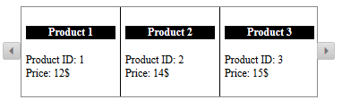
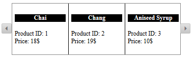

# Client-side Data Binding


This article introduces the client-side data binding feature of the __RadRotator__ control.

## Getting Started with Client-side Data Binding

The __RadRotator__ can be bound to various type of data sources to populate its items. To create a proper data binding you canuse the __RadClientDataSource__ control or fetch an already retrieved data via the__dataBind()__ method, available in the Rotator's	[Client-side API]().

The layout of the bound Rotator items should be defined in the __ClientTemplate__ inner tag.You can create their design with HTML code where the fetched data source fields should be set with this syntax - __#= datasourceField #__.

The following two sections will provide more details about the data binding.

## Simple Data Binding

Simple data binding is used when the desired data source is already retrieved from the web service or from another appropriate source.__Example 1__ demonstrates how a simple JS array can be used for data binding, by using the __dataBind()__ method in a function attached to the	[OnClientLoad event of the Rotator](). The result of this implementation is shown in __Figure 1__.
>caption Figure 1: RadRotator control bound to a simple JS array.



__Example 1:__ Simple data binding.


````ASPNET
		<telerik:RadRotator runat="server" ID="RadRotator1" RotatorType="Buttons" 
			Width="370" Height="100"  ItemWidth="100" ItemHeight="100" OnClientLoad="OnClientLoad">
			<ClientTemplate>
	            <h4 class="productName">#= ProductName #</h4>
				<div class="productId"><span>Product ID: </span>#= ProductID #</div>
				<div class="price"><span>Price: </span>#= UnitPrice #$</div>
			</ClientTemplate>
		</telerik:RadRotator>
	
		<script type="text/javascript">
			var datasource = [
				{ ProductID: 1, ProductName: "Product 1", UnitPrice: "12" },
				{ ProductID: 2, ProductName: "Product 2", UnitPrice: "14" },
				{ ProductID: 3, ProductName: "Product 3", UnitPrice: "15" },
				{ ProductID: 4, ProductName: "Product 4", UnitPrice: "11" }
			];
	
			function OnClientLoad(sender, args) {
				sender.set_dataSource(datasource);
				sender.dataBind();
			}
		</script>
````
````HTML
		<style type="text/css">
			.rrItem {
				border-right:1px solid black;
				padding:5px;
			}
	
			.rrItem .productName {
				text-align:center;
				background-color:black;
				color:white;
			}
		</style>
````


## Using RadClientDataSource for Data Binding

The __RadClientDataSource__ provides the ability to connect to a web service and fetch data to bind any appropriate Telerik control.	After configuring the ClientDataSource with the needed settings, all you need is to set its ID to the __ClientDataSourceID__ property	of the __RadRotator__ control. __Example 2__ demonstrates a sample implementation of such approach and the corresponding resultis shown in __Figure 2__.
>caption Figure 2: Data bound Rotator via RadClientDataSource control.



__Example 2:__ Using __RadClientDataSource__ control for Rotator data binding.


````ASPNET
		 <telerik:RadClientDataSource runat="server" ID="RadClientDataSource1" PageSize="5" AllowPaging="true">
		 	<DataSource>
		 		<WebServiceDataSourceSettings BaseUrl="http://demos.kendoui.com/service/">
		 			<Select Url="Products" DataType="JSONP" />
		 		</WebServiceDataSourceSettings>
		 	</DataSource>
		 </telerik:RadClientDataSource>
		 
		 <telerik:RadRotator runat="server" ID="Rotator" ClientDataSourceID="RadClientDataSource1"
		 	RotatorType="Buttons" Width="370" Height="100"  ItemWidth="100" ItemHeight="100">
		 	<ClientTemplate>
		         <h4 class="productName">#= ProductName #</h4>
		 		<div class="productId"><span>Product ID: </span>#= ProductID #</div>
		 		<div class="price"><span>Price: </span>#= UnitPrice #$</div>
		 	</ClientTemplate>
		 </telerik:RadRotator>
````
````HTML
		<style type="text/css">
			.rrItem {
				border-right:1px solid black;
				padding:5px;
			}
	
			.rrItem .productName {
				text-align:center;
				background-color:black;
				color:white;
			}
		</style>
````


# See Also

 * [RadRotator Client-Side API]()

 * [OnClientLoad]()

 * [OnClientDataBound Event]()

 * [OnClientItemDataBound Event]()

 * [OnClientTemplateDataBound Event]()
