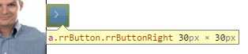

# How to Configure Size of Rotator with Buttons

This help article illustrates how to properly configure the size of a rotator with buttons so that the items are not cut or misaligned on initial showing or during animiation playing.

 * [RadRotator Dimensions Configuration](#radrotator-dimensions-configuration)
 
 * [Configure Rotator with Buttons](#configure-rotator-with-buttons)
 
 * [Example (RadRotatorSizeConfigurator Class Implementation)](#example-radrotatorsizeconfigurator-class-implementation)

## Configure Rotator with Buttons

To configure a rotator with buttons, you should do the following:
 * Define the proper dimensions for the rotator, its items and item template as per the [RadRotator Dimensions Configuration](#radrotator-dimensions-configuration) article.
 * Determine the size of the buttons and just add it to the rotator's width/height. 
 
For example, if we want to show four items (100x100 pixels) in a horizontal rotator with buttons for the black skin with Lightweight render mode, we can follow the steps below:

1. Set the single item's dimensions - `ItemWidth`="100" `ItemHeight`="100".
1. Set the item template dimensions - .itemTemplate {width: 100px; height: 100px;}.
1. Inspect the size of a single button - 30x30. 

	
	
1. Calculate and set the rotator's width - (4 items * 100) + 2 buttons * 30 = 400 + 60 = 460px.

>tip All of the explained logic stays the same if the `ScrollDirection`="Up, Down" is set, but it should be applied to the `Height` and `ItemHeight` properties, respectively.

>caption **Figure 1**: A snapshot of a rotator with buttons that has 4 items. The code that creates it is available in **Example 1**.


>caption **Example 1**: Configure rotator with button that will have 4 items.

````CSS
<style type="text/css">
	body {
		font-size: 14px;
	}

	.itemTemplate {
		width: 100px;
		height: 100px;
	}
</style>
````
 
````ASPX
<telerik:RadRotator ID="RadRotator1" runat="server" Width="460" ItemWidth="100" Height="100" RotatorType="Buttons" RenderMode="Lightweight" Skin="Black"
	ItemHeight="100" DataSourceID="SqlDataSource1" FrameDuration="1000">
	<ItemTemplate>
		<asp:Image CssClass="itemTemplate" ID="Image1" runat="server" ImageUrl='<%# Eval("CustomerID", "~/Img/Northwind/Customers/{0}.jpg") %>'
			AlternateText="IMAGE" />
	</ItemTemplate>
</telerik:RadRotator>

<asp:SqlDataSource ID="SqlDataSource1" runat="server" ConnectionString="<%$ ConnectionStrings:NorthwindConnectionString %>"
	SelectCommand="SELECT [CustomerID] FROM [Customers]"></asp:SqlDataSource>
````
 
You can find the list of the button sizes for the different skins in **Classic** and **Lightweight** render mode in **List 1** and **List 2**. The base is 14px font-size.

>caption **List 1**: RadRotator button sizes for all the skins with "Lightweight" render mode.
* **Bootstrap** - 34px
* **Material** - 38px
* The rest of the skins - 30px

>caption **List 2**: RadRotator button sizes for all the skins with "Classic" render mode.
* **Glow**, **Silk**, **MetroTouch**, **BlackMetroTouch** - 28px
* **Bootstrap** - 34px
* The rest of the skins - 20px

## Example (RadRotatorSizeConfigurator Class Implementation)

In the example below you can see a helper class (i.e., RadRotatorSizeConfigurator) that automatically calculates and sets the rotator's width based on the desired number of items, the set skin and render mode. The class accepts three parameters: the instance of the rotator, the number of the visible items in the view port and the skin (optional). 

>caption **Example 2**:  Configure rotator with buttons that has 4 items (100px x 100px) per view. The method that calculates the actual width is shown in **Example 3**.

````CSS
	<style type="text/css">
		body {
			font-size: 14px;
		}

		.itemTemplate {
			width: 100px;
			height: 100px;
		}
	</style>
````

````ASPX
<telerik:RadRotator ID="RadRotator1" runat="server" ItemWidth="100" Height="100" RotatorType="Buttons" RenderMode="Lightweight" Skin="Black"
	ItemHeight="100"  DataSourceID="SqlDataSource1" FrameDuration="1000">
	<ItemTemplate>
		<asp:Image CssClass="itemTemplate" ID="Image1" runat="server" ImageUrl='<%# Eval("CustomerID", "~/Img/Northwind/Customers/{0}.jpg") %>'
			AlternateText="IMAGE" />
	</ItemTemplate>
</telerik:RadRotator>

<asp:SqlDataSource ID="SqlDataSource1" runat="server" ConnectionString="<%$ ConnectionStrings:NorthwindConnectionString %>"
	SelectCommand="SELECT [CustomerID] FROM [Customers]"></asp:SqlDataSource>
````

````C#
protected void Page_Load(object sender, EventArgs e)
{
	RadRotatorSizeConfigurator.ConfigureSize(RadRotator1, 4);
}
````
````VB
Protected Sub Page_Load(sender As Object, e As EventArgs)
	RadRotatorSizeConfigurator.ConfigureSize(RadRotator1, 4)
End Sub
````

>caption **Example 3**: The implementation of the RadRotatorSizeConfigurator class that determines and sets the actual size of the rotator for the particular skin.

````C#
public static class RadRotatorSizeConfigurator
{
	const int classicButtonStandardSize = 20;
	const int liteButtonStandardSize = 30;

	static Dictionary<string, int> largeButtonsSkins = new Dictionary<string, int>()
	{
		{ "Glow", 28 },
		{ "Silk", 28 },
		{ "MetroTouch", 28 },
		{ "BlackMetroTouch", 28 },
		{ "Bootstrap", 34 },
		{ "LiteBootstrap", 34 },
		{ "LiteMaterial", 38 }
	};
	static RotatorType[] buttonModes = { RotatorType.Buttons, RotatorType.ButtonsOver, RotatorType.SlideShowButtons, RotatorType.CarouselButtons };
	static RotatorType[] animationModes = { RotatorType.Carousel, RotatorType.CarouselButtons, RotatorType.CoverFlow, RotatorType.CoverFlowButtons };

	public static void ConfigureSize(RadRotator rotator, int itemsPerView)
	{
		ConfigureSize(rotator, itemsPerView, GetCurrentSkin());
	}

	public static void ConfigureSize(RadRotator rotator, int itemsPerView, string selectedSkin)
	{
		if (Array.IndexOf(animationModes, rotator.RotatorType) != -1) return;

		int buttonsSize = GetButtonsSize(rotator, selectedSkin);

		bool isHorizontal = (rotator.ScrollDirection == (RotatorScrollDirection.Left | RotatorScrollDirection.Right) ||
					rotator.ScrollDirection == RotatorScrollDirection.Right ||
					rotator.ScrollDirection == RotatorScrollDirection.Left);

		if (isHorizontal)
		{
			rotator.Width = Unit.Pixel(Convert.ToInt32(rotator.ItemWidth.Value) * itemsPerView + buttonsSize);
			rotator.Height = rotator.ItemHeight;
		}
		else
		{
			rotator.Height = Unit.Pixel(Convert.ToInt32(rotator.ItemHeight.Value) * itemsPerView + buttonsSize);
			rotator.Width = rotator.ItemWidth;
		}
	}

	public static int GetButtonsSize(RadRotator rotator)
	{
		return GetButtonsSize(rotator, GetCurrentSkin());
	}

	public static int GetButtonsSize(RadRotator rotator, string selectedSkin)
	{
		int buttonStandardSize;
		if (rotator.ResolvedRenderMode == RenderMode.Lightweight) 
		{ 
			selectedSkin = "Lite" + selectedSkin;
			buttonStandardSize = liteButtonStandardSize;
		}
		else
		{
			buttonStandardSize = classicButtonStandardSize;
		}

		int buttonSize = (!largeButtonsSkins.ContainsKey(selectedSkin)) ? buttonStandardSize : largeButtonsSkins[selectedSkin];
		int buttonsCount = 1;
		if (Array.IndexOf(buttonModes, rotator.RotatorType) == -1)
		{
			buttonsCount = 0;
		}
		else if (rotator.ScrollDirection == (RotatorScrollDirection.Left | RotatorScrollDirection.Right) ||
				 rotator.ScrollDirection == (RotatorScrollDirection.Down | RotatorScrollDirection.Up))
		{
			buttonsCount = 2;
		}

		return buttonSize * buttonsCount;
	}

	private static string GetCurrentSkin()
	{
		return (string)((((Page)HttpContext.Current.Handler).FindControl("RadRotator1") as RadRotator).Skin ?? ConfigurationManager.AppSettings["Telerik.Skin"]);
	}
}
````
````VB
Public NotInheritable Class RadRotatorSizeConfigurator
	Private Sub New()
	End Sub
	Const classicButtonStandardSize As Integer = 20
	Const liteButtonStandardSize As Integer = 30

	Shared largeButtonsSkins As New Dictionary(Of String, Integer)() From { _
		{"Glow", 28}, _
		{"Silk", 28}, _
		{"MetroTouch", 28}, _
		{"BlackMetroTouch", 28}, _
		{"Bootstrap", 34}, _
		{"LiteBootstrap", 34}, _
		{"LiteMaterial", 38} _
	}
	Shared buttonModes As RotatorType() = {RotatorType.Buttons, RotatorType.ButtonsOver, RotatorType.SlideShowButtons, RotatorType.CarouselButtons}
	Shared animationModes As RotatorType() = {RotatorType.Carousel, RotatorType.CarouselButtons, RotatorType.CoverFlow, RotatorType.CoverFlowButtons}

	Public Shared Sub ConfigureSize(rotator As RadRotator, itemsPerView As Integer)
		ConfigureSize(rotator, itemsPerView, GetCurrentSkin())
	End Sub

	Public Shared Sub ConfigureSize(rotator As RadRotator, itemsPerView As Integer, selectedSkin As String)
		If Array.IndexOf(animationModes, rotator.RotatorType) <> -1 Then
			Return
		End If

		Dim buttonsSize As Integer = GetButtonsSize(rotator, selectedSkin)

		Dim isHorizontal As Boolean = (rotator.ScrollDirection = (RotatorScrollDirection.Left Or RotatorScrollDirection.Right) OrElse rotator.ScrollDirection = RotatorScrollDirection.Right OrElse rotator.ScrollDirection = RotatorScrollDirection.Left)

		If isHorizontal Then
			rotator.Width = Unit.Pixel(Convert.ToInt32(rotator.ItemWidth.Value) * itemsPerView + buttonsSize)
			rotator.Height = rotator.ItemHeight
		Else
			rotator.Height = Unit.Pixel(Convert.ToInt32(rotator.ItemHeight.Value) * itemsPerView + buttonsSize)
			rotator.Width = rotator.ItemWidth
		End If
	End Sub

	Public Shared Function GetButtonsSize(rotator As RadRotator) As Integer
		Return GetButtonsSize(rotator, GetCurrentSkin())
	End Function

	Public Shared Function GetButtonsSize(rotator As RadRotator, selectedSkin As String) As Integer
		Dim buttonStandardSize As Integer
		If rotator.ResolvedRenderMode = RenderMode.Lightweight Then
			selectedSkin = "Lite" & selectedSkin
			buttonStandardSize = liteButtonStandardSize
		Else
			buttonStandardSize = classicButtonStandardSize
		End If

		Dim buttonSize As Integer = If((Not largeButtonsSkins.ContainsKey(selectedSkin)), buttonStandardSize, largeButtonsSkins(selectedSkin))
		Dim buttonsCount As Integer = 1
		If Array.IndexOf(buttonModes, rotator.RotatorType) = -1 Then
			buttonsCount = 0
		ElseIf rotator.ScrollDirection = (RotatorScrollDirection.Left Or RotatorScrollDirection.Right) OrElse rotator.ScrollDirection = (RotatorScrollDirection.Down Or RotatorScrollDirection.Up) Then
			buttonsCount = 2
		End If

		Return buttonSize * buttonsCount
	End Function

	Private Shared Function GetCurrentSkin() As String
		Return DirectCast(If(TryCast(DirectCast(HttpContext.Current.Handler, Page).FindControl("RadRotator1"), RadRotator).Skin, ConfigurationManager.AppSettings("Telerik.Skin")), String)
	End Function
End Class
````

# See Also

 * [RadRotator Dimensions Configuration](#radrotator-dimensions-configuration)
 
