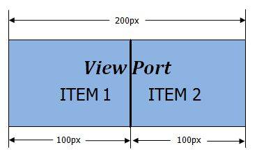

# Getting Started Overview

This help article illustrates how to configure a RadRotator control.

* [RadRotator Basic Configuration](#radrotator-basic-configuration)

* [RadRotator Dimensions Configuration](#radrotator-dimensions-configuration)

## RadRotator Basic Configuration

To configure a rotator control you can follow the steps below:

* Add the control on the page. You can simply drag and drop it from the Visual Studio Toolbox. Please note that it requires an asp:ScriptManager to be declared on the page as well.

* Add a data source control and set the RadRotator's DataSourceID property to its ID.

* Declare the ItemTemplate's content.

* It is recommended that if you want to declare multiple elements inside the rotator's ItemTemplate, you should add a div that wraps the content in the ItemTemplate and set a class to that div. The *width* and *height* CSS properties applied through this class should be synchronized with the values set to the RadRotator's `ItemWidth` and `ItemHeight` properties. The margin and padding of the elements declared inside the `ItemTemplate` should be taken into account as well.

* Set the [Width, ItemWidth, Height and ItemHeight]() properties. You can refer to the next section, ([RadRotator Dimensions Configuration](#radrotator-dimensions-configuration)), for details on the matter.


## RadRotator Dimensions Configuration

**RadRotator** is a dynamic control that moves its content. To do that the control should be "aware" of its item's size. The `ItemWidth` and `ItemHeight` properties are intended to provide this information to the control. If these properties are not set accordingly in the ItemTemplate's *size*, then the **RadRotator** may behave inconsistently in different browsers.

* The items are not shown when the control is first loaded. After clicking the "Refresh" button the items become visible.

* Rotator shows only a part of a loaded item (the items are not synchronized).

* A gap occurs between the item like an empty item.

* Rotator does not rotate its content.

This example below demonstrates the purpose of the [Width, ItemWidth, Height and ItemHeight]() properties:

````XML
<telerik:RadRotator RenderMode="Lightweight" ID="RadRotator1" runat="server" Width="200" ItemWidth="100" Height="100"
	ItemHeight="100" DataSourceID="XmlDataSource1" FrameDuration="1000">
	<ItemTemplate>
		<asp:Image CssClass="itemTemplate" ID="Image1" runat="server" ImageUrl='<%# XPath("ImageURL") %>'
			AlternateText="IMAGE" />
	</ItemTemplate>
</telerik:RadRotator>
````

* This is the implementation of the itemTemplate class:

````XML
.itemTemplate
{
	width: 100px;
	height: 100px;
}
````

After implementing the above steps, two items will be shown in the **RadRotator**'s viewport, because of the `Width="200"` and `ItemWidth="100"` properties.



In the case that the requirement is to show 3 items in the viewport, then the `Width` property should be changed to "300". Also, if one of the **RadRotator**'s buttons' type is used, then the buttons' size should be added to the rotator's `Width` property. For example if the button is 30x30 then the width should be 360. You can find more information in the article, [How To Configure Size of Rotator with Buttons]().

All of the explained logic stays the same if the `ScrollDirection="Up, Down"` is set, but it should be applied to the `Height` and `ItemHeight` properties, respectively.

# See Also

 * [How To Configure Size of Rotator with Buttons]()
 
 * [Width, ItemWidth, Height and ItemHeight]()
