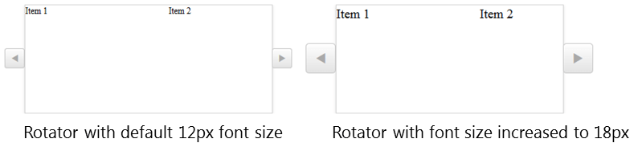

# Elastic Capabilities

This article explains the **elastic capabilities RadRotator offers**. The control supports **elastic design since Q2 2014**.

@[template](/_templates/common/render-mode.md#resp-design-desc "slug-el: no, slug-fl: rotator/mobile-support/fluid-capabilities")

>caption **Figure 1**: Comparison between appearance of a RadRotator with regular font size and with increased font size.



**RadRotator** supports changing the font size without breaking the control's appearance - if the new size is larger than the original, the elements of the rotator's control buttons will simply increase their size as well to accommodate the element inside. This fluid layout is achieved by using em units for setting dimensions and paddings in the control, instead of px because em units are tied to the font size. This allows dimensions and sizes to scale with the font size. The elastic capabilities of **RadRotator are supported by IE10+ and all modern browsers**.

@[template](/_templates/common/font-size-notes.md#note-and-example "control: RadRotator")

>tip The size of **RadRotator** remains the same when the control buttons are resized. As a result the rotator changes the width of its view port (the area in which the items are visible), which means that most probably the first or/and last item will be cut off.

**Example 1** shows how to increase the font size of a **RadRotator** control and the effect can be seen in comparison in **Figure 1**.

>caption **Example 1**: The font size of **RadRotator** is set to 18px.

````ASP.NET
<style type="text/css">
	div.RadRotator {
		font-size: 18px;
	}
</style>
<telerik:RadRotator RenderMode="Lightweight" runat="server" ID="RadRotator1" Skin="Silk" RotatorType="Buttons" Width="400px" ItemWidth="200px" Height="150px">
	<Items>
		<telerik:RadRotatorItem ID="RadRotatorItem1" runat="server">
			<ItemTemplate>
				Item 1
			</ItemTemplate>
		</telerik:RadRotatorItem>
		<telerik:RadRotatorItem ID="RadRotatorItem2" runat="server">
			<ItemTemplate>
				Item 2
			</ItemTemplate>
		</telerik:RadRotatorItem>
		<telerik:RadRotatorItem ID="RadRotatorItem3" runat="server">
			<ItemTemplate>
				Item 3
			</ItemTemplate>
		</telerik:RadRotatorItem>
		<telerik:RadRotatorItem ID="RadRotatorItem4" runat="server">
			<ItemTemplate>
				Item 4
			</ItemTemplate>
		</telerik:RadRotatorItem>
	</Items>
</telerik:RadRotator>
````

These elastic capabilities also allow you to easily modify the appearance of the rotator's control buttons. They are defined using CSS3 in the browsers, mentioned above, which means that editing a sprite image is not needed to create a different appearance for the buttons. You can find more information about configuring the control buttons in the help article [Creating a Custom Skin from an Existing One]().

# See Also

 * [RadRotator - Responsive capabilities]()

 * [RadRotator - How to configure RadRotator]()

 * [RadRotator - RadRotator types]()

 * [RadRotator - Creating a Custom Skin from an Existing One]()

@[template](/_templates/common/font-size-notes.md#related-resources)