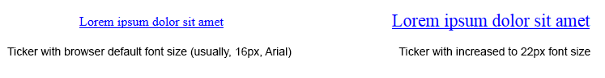

# RadTicker Elastic Capabilities

This article explains the **elastic capabilities RadTicker offers**. The control supports **elastic design since Q1 2015**.

Generally, elastic design means that the page and its content are able to adapt to different font size by scaling the elements properly depending on the chosen font-size.

>caption **Figure 1**: Comparison between appearance of a RadTicker with regular font size and with increased font size.



**RadTicker** supports changing the font size without breaking the control's appearance - if the new size is larger than the original, the ticker items' text will increase in size as well. This fluid layout is achieved by using em units for setting dimensions and paddings in the control, instead of px because em units are tied to the font size. This allows dimensions and sizes to scale with the font size of the page.

**Example 1** shows how to increase the font size of a **RadTicker** control and the effect can be seen in comparison in **Figure 1**.

>tip  **RadTicker** does not render additional HTML elements or apply any CSS to the text it shows.	Thus, it inherits the font settings of the browser (usually 16px Arial) or the page (defined by the developer).	This means that you can use any appropriate selector for its parent element to change the ticker items' font-size.	This can be a the CSS class of its parent and it is not mandatory to use the body element for the cascade.

**Example 1**: The font size of RadTicker is set to 22px.

````ASP.NET
<html xmlns="http://www.w3.org/1999/xhtml">
<head runat="server">
	<title></title>
	<style type="text/css">
		body
		{
			font-size: 22px;
		}
	</style>
</head>
<body>
	<form id="form1" runat="server">
		<asp:ScriptManager ID="ScriptManager1" runat="server"></asp:ScriptManager>
		<telerik:RadTicker runat="server" AutoStart="true" LineDuration="5000" TickSpeed="100">
			<Items>
				<telerik:RadTickerItem Text="Lorem ipsum dolor sit amet" NavigateUrl="www.google.com"></telerik:RadTickerItem>
			</Items>
		</telerik:RadTicker>
	</form>
</body>
</html>
````

