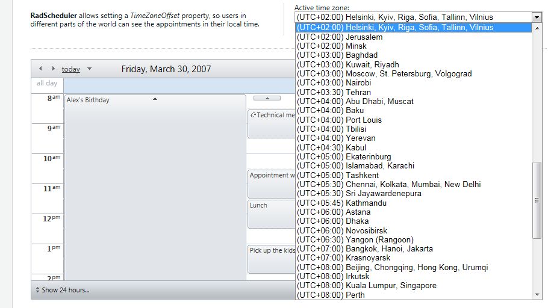
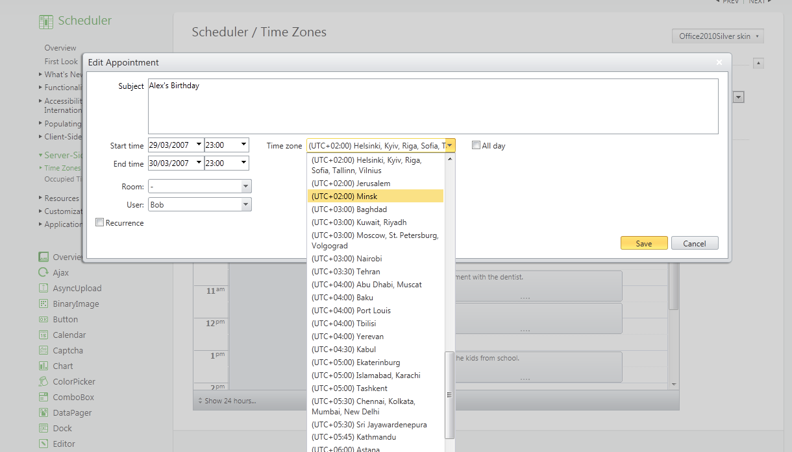

# Handling Time Zones


In order to properly handle time zones, **RadScheduler** uses the **TimeZoneInfo** object, which comes together with **.NET 3.5** . This places some additional overhead, but is essential for solving the following problems:

* Displaying correct times for the appointments when the clients and/or the server are in different time zones.

* Correctly evaluating recurrence rules with respect to Daylight Saving Time.

To overcome these problems **RadScheduler** defines the **TimeZoneID** property. It uses **TimeZoneInfoProvider** capable of returning correct **LocalToUTC** and **UTCToLocal** information depending on the **TimeZone RadScheduler** should be operating under. If **TimeZoneID** is not set initially, the default time zone is (UTC). In addition to this a **DataTimeZone** field is added to enable eachAppointment to be set in different timezone. The provider and the specific settings in each TimeZone are responsible for all **DateTime** related calculations.



>note In order to allow selecting individual timezone for each Appointment in the Advanced Form the "EnableCustomTimeZones" property can be set. If it is set to "True"all the appointments inherit the **TimeZone of RadScheduler** 
>




>note If **TimeZoneID** property is not set the **TimeZoneOffset** property is applied. In this case during data binding **RadScheduler** assumes all dates to be UTC.If you use a custom provider or create the Appointment objects programmatically you should take care to convert the date-times to UTC by calling DateTime.ToUniversalTime() or by other appropriate means.
>


## TimeZoneInfo Ids
| Timezone IDs | Timezone IDs | Timezone IDs | Timezone IDs |
| ------ | ------ | ------ | ------ |
|DatelineStandardTime|ArgentinaStandardTime|IsraelStandardTime|ChinaStandardTime|
|UTC-11|SAEasternStandardTime|E.EuropeStandardTime|NorthAsiaEastStandardTime|
|SamoaStandardTime|GreenlandStandardTime       |ArabicStandardTime       |SingaporeStandardTime|
|HawaiianStandardTime|MontevideoStandardTime      |ArabStandardTime         |W.AustraliaStandardTime|
|AlaskanStandardTime|UTC-02                      |RussianStandardTime      |TaipeiStandardTime|
|PacificStandardTime(Mexico)|Mid-AtlanticStandardTime    |E.AfricaStandardTime     |UlaanbaatarStandardTime|
|PacificStandardTime|AzoresStandardTime          |IranStandardTime         |TokyoStandardTime|
|USMountainStandardTime|CapeVerdeStandardTime       |ArabianStandardTime      |KoreaStandardTime|
|MountainStandardTime(Mexico)|MoroccoStandardTime         |AzerbaijanStandardTime   |YakutskStandardTime|
|MountainStandardTime|UTC|MauritiusStandardTime|Cen.AustraliaStandardTime|
|CentralAmericaStandardTime|GMTStandardTime|GeorgianStandardTime     |AUSCentralStandardTime|
|CentralStandardTime|GreenwichStandardTime|CaucasusStandardTime     |E.AustraliaStandardTime|
|CentralStandardTime(Mexico)|W.EuropeStandardTime|AfghanistanStandardTime  |AUSEasternStandardTime|
|CanadaCentralStandardTime|CentralEuropeStandardTime|EkaterinburgStandardTime |WestPacificStandardTime|
|SAPacificStandardTime|RomanceStandardTime|PakistanStandardTime     |TasmaniaStandardTime|
|EasternStandardTime          |CentralEuropeanStandardTime |WestAsiaStandardTime     |VladivostokStandardTime|
|USEasternStandardTime        |W.CentralAfricaStandardTime |IndiaStandardTime        |MagadanStandardTime|
|VenezuelaStandardTime        |NamibiaStandardTime         |SriLankaStandardTime     |CentralPacificStandardTime|
|ParaguayStandardTime         |JordanStandardTime          |NepalStandardTime        |NewZealandStandardTime|
|AtlanticStandardTime         |GTBStandardTime             |CentralAsiaStandardTime  |UTC+12|
|CentralBrazilianStandardTime |MiddleEastStandardTime      |BangladeshStandardTime   |FijiStandardTime|
|SAWesternStandardTime        |EgyptStandardTime           |N.CentralAsiaStandardTime|KamchatkaStandardTime|
|PacificSAStandardTime        |SyriaStandardTime           |MyanmarStandardTime      |TongaStandardTime|
|NewfoundlandStandardTime     |SouthAfricaStandardTime     |SEAsiaStandardTime|
|E.SouthAmericaStandardTime   |FLEStandardTime             |NorthAsiaStandardTime|
                                                           

## Example

>note This excample is showing how the **TimeZoneOffset** can be used in custom scenario without TimeZoneID and DataTimeZone properties.
>


You can allow the user to manually set the preferred time zone or use JavaScript and asynchronous AJAX requests to discover the time zone on the client. This example demonstrates both approaches.

1. Drag a **RadAjaxLoadingPanel** from the toolbox onto your Web page. On the body of the loading panel, type the literal "Loading..."

1. Drag a **Panel** onto your Web page.

1. Set its **ID** property to **TimeZonePanel**.

1. Inside the panel, type the literal string "Active Time Zone:"

1. Following the literal string, drag a **Label** into the panel. Set its **ID** to "PleaseWaitLabel" and its text to "[Looking up time zone...]"

1. Following the label, drag a **DropDownList** into the panel. Set its **ID** to "TimeZoneDropDown". Add the following items to the drop-down list:

````ASPNET
	     
	
	<asp:DropDownList runat="server" ID="TimeZoneDropDown" AutoPostBack="true">
	 <asp:ListItem Text="GMT -12" Value="-12:00:00"></asp:ListItem>
	 <asp:ListItem Text="GMT -11" Value="-11:00:00"></asp:ListItem>
	 <asp:ListItem Text="GMT -10" Value="-10:00:00"></asp:ListItem>
	 <asp:ListItem Text="GMT -9" Value="-09:00:00"></asp:ListItem>
	 <asp:ListItem Text="GMT -8" Value="-08:00:00"></asp:ListItem>
	 <asp:ListItem Text="GMT -7" Value="-07:00:00"></asp:ListItem>
	 <asp:ListItem Text="GMT -6" Value="-06:00:00"></asp:ListItem>
	 <asp:ListItem Text="GMT -5" Value="-05:00:00"></asp:ListItem>
	 <asp:ListItem Text="GMT -4" Value="-04:00:00"></asp:ListItem>
	 <asp:ListItem Text="GMT -3" Value="-03:00:00"></asp:ListItem>
	 <asp:ListItem Text="GMT -2" Value="-02:00:00"></asp:ListItem>
	 <asp:ListItem Text="GMT -1" Value="-01:00:00"></asp:ListItem>
	<asp:ListItem Text="GMT +0" Value="0:00:00"></asp:ListItem>
	 <asp:ListItem Text="GMT +1" Value="01:00:00"></asp:ListItem>
	 <asp:ListItem Text="GMT +2" Value="02:00:00"></asp:ListItem>
	 <asp:ListItem Text="GMT +3" Value="03:00:00"></asp:ListItem>
	 <asp:ListItem Text="GMT +4" Value="04:00:00"></asp:ListItem>
	 <asp:ListItem Text="GMT +5" Value="05:00:00"></asp:ListItem>
	 <asp:ListItem Text="GMT +6" Value="06:00:00"></asp:ListItem>
	 <asp:ListItem Text="GMT +7" Value="07:00:00"></asp:ListItem>
	 <asp:ListItem Text="GMT +8" Value="08:00:00"></asp:ListItem>
	 <asp:ListItem Text="GMT +9" Value="09:00:00"></asp:ListItem>
	 <asp:ListItem Text="GMT +10" Value="10:00:00"></asp:ListItem>
	 <asp:ListItem Text="GMT +11" Value="11:00:00"></asp:ListItem>
	 <asp:ListItem Text="GMT +12" Value="12:00:00"></asp:ListItem>
	</asp:DropDownList>
				
````


1. Drag a **RadScheduler** control from the toolbox onto your Web page. [Bind it to a data source]() of your choice.

1. Add an event handler to the **SelectedIndexChanged** event of the drop-down list (**TimeZoneDropDown**):


````C#
	
	    protected void TimeZoneDropDown_SelectedIndexChanged(object sender, EventArgs e)
	    {
	        RadScheduler1.TimeZoneOffset = TimeSpan.Parse(TimeZoneDropDown.SelectedValue);
	    }
	
````
````VB.NET
	
	    Protected Sub TimeZoneDropDown_SelectedIndexChanged(ByVal sender As Object, ByVal e As EventArgs) Handles TimeZoneDropDown.SelectedIndexChanged
	        RadScheduler1.TimeZoneOffset = TimeSpan.Parse(TimeZoneDropDown.SelectedValue)
	    End Sub
	
````
The drop-down list now allows the user to manually set the time zone of the scheduler.

1. Drag a **RadAjaxManager** from the toolbox onto your Web page. In the **RadAjaxManager** Smart Tag, choose"**Configure Ajax Manager**". In the property builder that appears, indicate that both the scheduler and the time zone drop-down controls caninitiate requests and thatthe scheduler will be updated by requests. Assign the **RadAjaxLoadingPanel** as the loading panel when the**RadScheduler gets** updated.
>caption 


1. Give the **RadAjaxManager** a handler for the **AjaxRequest** event to update the scheduler and time zone drop-down given an offset:


````C#
	
	    protected void RadAjaxManager1_AjaxRequest(object sender, AjaxRequestEventArgs e)
	    {
	        RadScheduler1.TimeZoneOffset = TimeSpan.FromMinutes(int.Parse(e.Argument));
	        TimeZoneDropDown.SelectedValue = RadScheduler1.TimeZoneOffset.ToString();
	    }
	
````
````VB.NET
	
	
	    Protected Sub RadAjaxManager1_AjaxRequest(ByVal sender As Object, ByVal e As AjaxRequestEventArgs) Handles RadAjaxManager1.AjaxRequest
	        RadScheduler1.TimeZoneOffset = TimeSpan.FromMinutes(Integer.Parse(e.Argument))
	        TimeZoneDropDown.SelectedValue = RadScheduler1.TimeZoneOffset.ToString()
	    End Sub
	
````


1. Drag a **RadCodeBlock** component from the toolbox onto your Web page. Switch to the Source view, and add the following script to the code block:

````ASPNET
	     
	<telerik:RadCodeBlock ID="RadCodeBlock1" runat="server">
	 <script type="text/javascript">
	   var syncComplete = false;
	   
	   function SynchronizeClientTimeZoneOffset()
	   {
	     if (!syncComplete)
	     {
	       var ajaxPanel = <%= RadAjaxLoadingPanel1.ClientID %>;
	       var schedulerId = '<%= RadScheduler1.ClientID %>';
	       ajaxPanel.Show(schedulerId);
	     
	       var now = new Date();
	       var offset = now.getTimezoneOffset()
	       InitiateAsyncRequest(-offset);
	     
	       ajaxPanel.Hide(schedulerId);
	     
	       syncComplete = true;
	     }
	   }
	   
	   function InitiateAsyncRequest(argument)
	   {
	      var ajaxManager = <%= RadAjaxManager1.ClientID %>;
	      ajaxManager.AjaxRequest(argument);
	   }
	   
	   Sys.Application.add_load(SynchronizeClientTimeZoneOffset);
	  </script>       
	</telerik:RadCodeBlock> 
	
````

This defines a global variable, syncComplete, to track when the asynchronous function that looks up and sets the client time zone is complete. It defines two functions:**InitiateAsyncRequest**, which passes an asynchronous request to the **RadAjaxManager** with a time zone offset,and **SynchronizeClientTimeZoneOffset**, which displays the loading panel while it looks up the client time zone and then calls **InitiateAxyncRequest** to pass that time zone to the AJAX manager so that the appropriate controls are updated. **SynchronizeClientTimeZoneOffset** is added to handle the loading event of the application.

1. Finally, in the **Page_Load** event handler for your Web Page, add code to show or hide the PleaseWaitLabel (note that DataSourceID should be set appropriately for your scheduler):


````C#
	
	
	    private void Page_Load(object sender, System.EventArgs e)
	    {
	        if (!IsPostBack)
	        {
	            PleaseWaitLabel.Visible = true;
	            TimeZoneDropDown.Visible = false;
	            RadScheduler1.DataSourceID = "";
	        }
	        else
	        {
	            PleaseWaitLabel.Visible = false;
	            TimeZoneDropDown.Visible = true;
	            RadScheduler1.DataSourceID = "AppointmentsDataSource";
	            RadAjaxLoadingPanel1.InitialDelayTime = 500;
	        }
	    }
	
````
````VB.NET
	
	
	    Private Sub Page_Load(ByVal sender As Object, _
	                      ByVal e As System.EventArgs) Handles MyPage.Load
	        If Not IsPostBack Then
	            PleaseWaitLabel.Visible = True
	            TimeZoneDropDown.Visible = False
	            RadScheduler1.DataSourceID = ""
	        Else
	            PleaseWaitLabel.Visible = False
	            TimeZoneDropDown.Visible = True
	            RadScheduler1.DataSourceID = _
	                                   "AppointmentsDataSource"
	            RadAjaxLoadingPanel1.InitialDelayTime = 500
	        End If
	    End Sub
	
	
	
````


# See Also

 * [Working with Time Values]()
 
 * [Scheduler - Time Zones demo](http://demos.telerik.com/aspnet-ajax/scheduler/examples/timezones/defaultcs.aspx)
 
 
