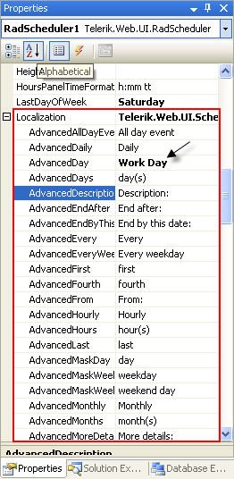
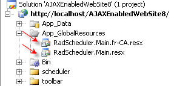
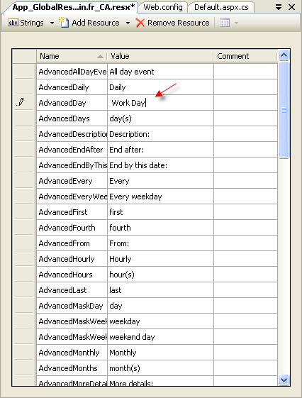
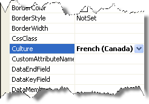

# Translating Strings


The localization support for RadScheduler lets you completely translate the user interface, or simply adapt a few strings.In addition to the strings you can also customize the [date and time format]().

## Localization Property

The **Localization** property specifies the strings that appear in the runtime user interface of the scheduler, including the message pop-up dialogs and edit forms.By changing the values of each named sub-property, you change the appearance of the string the scheduler uses:

````ASPNET
	
<telerik:RadScheduler RenderMode="Lightweight" ID="RadScheduler1" runat="server">
  <Localization AdvancedDay="Work Day" />
</telerik:RadScheduler>     
							
````



>tip This technique is useful when customizing some of the messages of a particular instance. The messages are not shared between scheduler instances.A complete translation using this approach is not appropriate.
>


## Global Resource Files

The primary means for localization in ASP.NET is to use resource files. Resource files are simple XML files that can be easily edited and transferred to other applications. You can use resource files to change the default (English) localization for RadScheduler that is stored in the Telerik.Web.UI assembly.

To create a global resource file to localize the scheduler:

1. Create the **App_GlobalResources** folder in the root of your web application.

1. Copy the default resource **RadScheduler.Main.resx** file into it. This file can be found in the App_GlobalResources folder of the directory where you installed the RadControls.

1. Make a copy of the file and rename the copy so that its name contains the Culture Identifier. The resource files used by RadScheduler follow a strict naming convention:**RadScheduler.Main.<Culture Identifier>.resx**
>tip The **Culture Identifier** consists of a language code followed by a dash and the country code.Example: “en-US”, “fr-CA” and so on.
>For example RadScheduler.Main.fr-CA.resx. Both files should be present in the App_GlobalResources folder:

1. Edit the strings using the Visual Studio editor or your favorite text editor. Customize strings just as you would set the **Localization** property .

>caution Make sure that the **ReservedResource** message is preserved. It is used for identification purposes and is never displayed.
>


You can now switch the scheduler so that it uses your new resource file by setting the active culture:

# See Also

 * [Handling Time Zones]()
