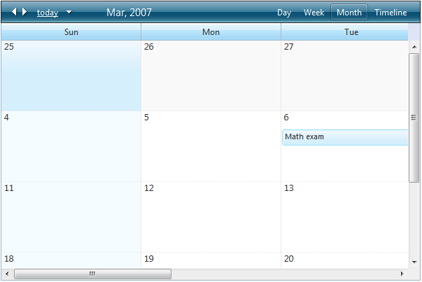

# Horizontal Scrolling


## 

You can use the horizontal scrolling feature of RadScheduler to maintain a constant column width without changing the overall size of the control.

To enable it, assign a value to the **ColumnWidth** property:

````ASPNET
	     
<telerik:RadScheduler RenderMode="Lightweight" ... ColumnWidth="200px" />
				
````


