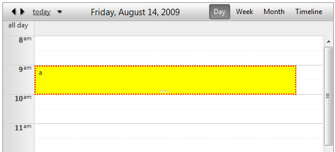
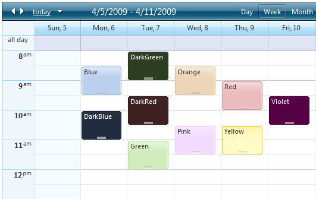

# Setting Styles for Appointments


The following Appointment properties allow you to customize their appearance:

* __BackColor__

* __BorderColor__

* __BorderStyle__

* __BorderWidth__

For example:




>tabbedCode

````C#
	
	    protected void RadScheduler1_AppointmentDataBound(object sender, SchedulerEventArgs e)
	    {
	        e.Appointment.BackColor = System.Drawing.Color.Yellow;
	        e.Appointment.BorderColor = System.Drawing.Color.Red;
	        e.Appointment.BorderStyle = BorderStyle.Dotted;
	        e.Appointment.BorderWidth = Unit.Pixel(2);
	    }
	
````
````VB.NET
	
	    Protected Sub RadScheduler1_AppointmentDataBound(ByVal sender As Object, ByVal e As SchedulerEventArgs)
	        e.Appointment.BackColor = System.Drawing.Color.Yellow
	        e.Appointment.BorderColor = System.Drawing.Color.Red
	        e.Appointment.BorderStyle = BorderStyle.Dotted
	        e.Appointment.BorderWidth = Unit.Pixel(2)
	    End Sub
	
````
>end

Alternatively, you can take advantage of the 10 predefined, skin-independent CSS styles that we offer with Q1 2009 SP1.RadScheduler will automatically recognize the following class names:

* rsCategoryDarkBlue

* rsCategoryBlue

* rsCategoryDarkGreen

* rsCategoryGreen

* rsCategoryDarkRed

* rsCategoryOrange

* rsCategoryPink

* rsCategoryRed

* rsCategoryViolet

* rsCategoryYellow

Here is how each style looks like:



You can handle the __AppointmentDataBound__ event and use a custom condition based on attributes, resources or any other property of theAppointment object to set the appointment __CssClass__ property. For example, the above screenshot can be replicated with the following code:


>tabbedCode

````C#
	
	
	    protected void RadScheduler1_AppointmentDataBound(object sender, Telerik.Web.UI.SchedulerEventArgs e)
	    {
	        e.Appointment.CssClass = "rsCategory" + e.Appointment.Subject;
	    }
	
````
````VB.NET
	
	    Protected Sub RadScheduler1_AppointmentDataBound(ByVal sender As Object, ByVal e As Telerik.Web.UI.SchedulerEventArgs) Handles RadScheduler1.AppointmentDataBound
	        e.Appointment.CssClass = "rsCategory" + e.Appointment.Subject
	    End Sub
				
````
>end

This code causes RadScheduler to render the value of the CssClass property that you set in the__AppointmentDataBound__ event to the __rsApt__ div of the appointments. Here is the resulting html output for the "Green" appointment:

````HTML
	 
	 <div class="rsWrap" style="z-index: 14;">
	   <div id="RadScheduler1_22_0" class="rsApt rsCategoryGreen" style="height: 46px; width: 90%;
	       left: 0%;" title="Green">
	       <div class="rsAptOut">
	           <div class="rsAptMid">
	               <div class="rsAptIn">
	                   <div class="rsAptContent">
	                       Green <a class="rsAptDelete" href="#" style="visibility: hidden;">delete</a>
	                   </div>
	               </div>
	               <div class="rsAptResize" style="z-index: 80;">
	               </div>
	           </div>
	       </div>
	   </div>
	</div> 
			
````


## Appointment style modes

The AppointmentStyleMode property of RadScheduler determines the rendering style of the appointments with customized background and border colors. The possible values are:

* __Auto__- Appointments with set background or border color are rendered using the Simple style - without rounded corners or gradiented background.All others are rendered using their default style - with rounded corners and gradiented background.

* __Simple__- Appointments are rendered using the simple style - without rounded corners or gradiented background.

* __Default__- Appointments rendered with rounded corners and gradiented background. Custom background and border colorsare supported. Gradiented backgrounds for custom colors are not available in IE6.

It's recommended to explicitly set __AppointmentStyleMode="Default"__ unless you have legacy custom skins. This willforce the use of the default rendering (with rounded corners and gradients) even to appointments with custom colors.

## Resource style mapping

The BackColor, BorderColor and CssClass properties can be set based on the resources that the appointment is associated with.

````ASPNET
	     
	<ResourceStyles>
	     <telerik:ResourceStyleMapping Type="User" Text="Alex" BackColor="Blue" />
	     <telerik:ResourceStyleMapping Type="User" Text="Bob" BackColor="Orange" />
	     <telerik:ResourceStyleMapping Type="User" Text="Charlie" ApplyCssClass="rsCategoryGreen" />
	</ResourceStyles>  
		
````


An illustration of this method can be seen in the [Defining Resources](http://demos.telerik.com/aspnet-ajax/scheduler/examples/resources/defaultcs.aspx) demo.This is just a neater way of setting the CssClass property from code-behind and it is equivalent to the following:


>tabbedCode

````C#
	
	    protected void RadScheduler1_AppointmentDataBound(object sender, Telerik.Web.UI.SchedulerEventArgs e)
	    {
	        if (e.Appointment.Resources.GetResourceByType("User") != null)
	        {
	            switch (e.Appointment.Resources.GetResourceByType("User").Text)
	            {
	                case "Alex":
	                    e.Appointment.BackColor = Color.Blue;
	                    break;
	                case "Bob":
	                    e.Appointment.BackColor = Color.Orange;
	                    break;
	                case "Charlie":
	                    e.Appointment.CssClass = "rsCategoryGreen";
	                    break;
	                default:
	                    break;
	            }
	        }
	    }  
	
````
````VB.NET
	
	    Protected Sub RadScheduler1_AppointmentDataBound(ByVal sender As Object, ByVal e As Telerik.Web.UI.SchedulerEventArgs)
	        If e.Appointment.Resources.GetResourceByType("User") <> Nothing Then
	            Select Case e.Appointment.Resources.GetResourceByType("User").Text
	                Case "Alex"
	                    e.Appointment.BackColor = Color.Blue
	                    Exit Select
	                Case "Bob"
	                    e.Appointment.BackColor = Color.Orange
	                    Exit Select
	                Case "Charlie"
	                    e.Appointment.CssClass = "rsCategoryGreen"
	                    Exit Select
	                Case Else
	                    Exit Select
	            End Select
	        End If
	    End Sub
	
````
>end

## Using custom background image

If you need to use your own custom style for the appointments, here is how to proceed:

1. Create your custom background image and add it to your application. Let's assume you have used a folder called "Scheduler".

2. Include the following css rule in the head of your page:

````ASPNET
	     
	<style type="text/css">
	   .RadScheduler .MyCustomAppointmentStyle .rsAptContent,
	   .RadScheduler .MyCustomAppointmentStyle .rsAptMid .rsAptIn,
	   .RadScheduler .MyCustomAppointmentStyle .rsAptMid,
	   .RadScheduler .MyCustomAppointmentStyle .rsAptOut
	   {
	    background-image: url('Scheduler/MyCustomBackgroundImage.png');
	   }
	   .RadScheduler .MyCustomAppointmentStyle .rsAptContent
	   {
	    /*font style*/
	    color: Blue;
	   }
	</style>  
				
````


3. Set the appointment __CssClass__ property:


>tabbedCode

````C#
	
	    protected void RadScheduler1_AppointmentDataBound(object sender, Telerik.Web.UI.SchedulerEventArgs e) 
	    { 
	        e.Appointment.CssClass = "MyCustomAppointmentStyle"; 
	    }
	
````
````VB.NET
	
	    Protected Sub RadScheduler1_AppointmentDataBound(ByVal sender As Object, ByVal e As Telerik.Web.UI.SchedulerEventArgs) Handles RadScheduler1.AppointmentDataBound
	        e.Appointment.CssClass = "MyCustomAppointmentStyle"
	    End Sub
				
````
>end

The background images for the appointment styles can be found in your local installation of the Telerik.Web.UIsuit -> *Skins\Common\Scheduler* and the css rules are defined in __Scheduler.css__ in the Skins folder.
