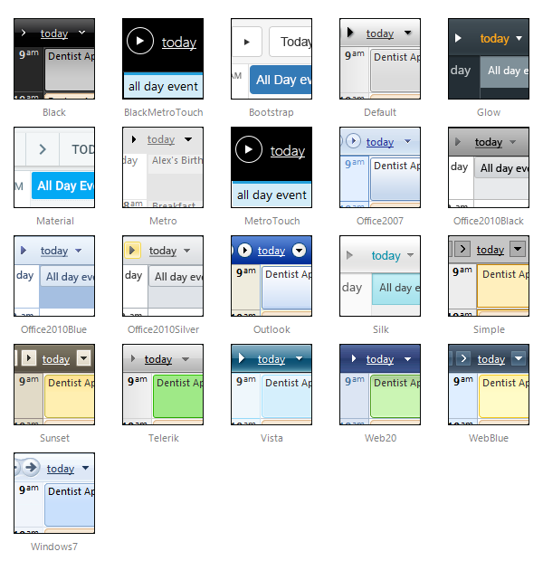

# Skins

The visual appearance of **RadScheduler** can be changed by applying different skins.Specify a skin for the scheduler by setting the **Skin** property. **RadScheduler** supports a number of built-in skins:

## Customizing Skins

You can tweak the existing skins, or create your own. Each skin has two main elements: images and a stylesheet. When creating your own, it is a good idea to start by copyingthe stylesheet of an existing skin and alter the copy. To use your own skin:

1. Add the new CSS file to your project.

1. Drag and drop the CSS file from the Project Explorer onto your Web page.

1. Set the **EnableEmbeddedSkins** property of the **RadScheduler** to **False**.

The stylesheet for a **RadScheduler** skin has the name **Scheduler.[SkinName].css** and can be found in the **...Skins/[SkinName]** directory.The images are found in the **...Skins/[SkinName]/Scheduler** directory. For example, the stylesheet for the "Black" skin is called Scheduler.Black.cssand is located in the ...Skins/Black directory.The images are found in the ...Skins/Black/Scheduler directory. The images are referenced by name from within the stylesheet.

# See Also

 * [Controlling Appearance]()
