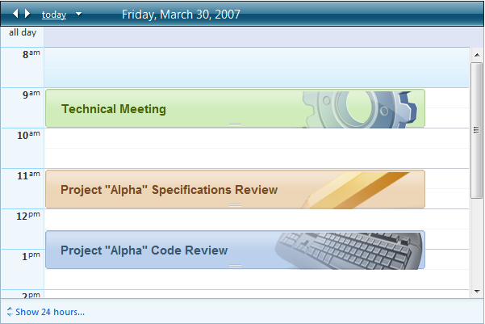
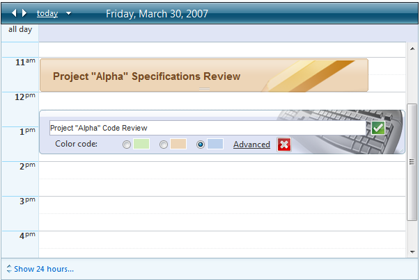
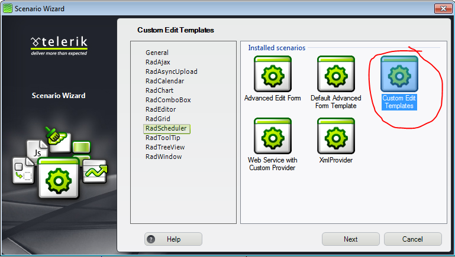

# Templates


**RadScheduler** lets you change the appearance of appointments and of the in-line editor using templates. The **RadScheduler** templates are powerfulenough to accommodate any content you want to embed, including HTML markup, ASP.NET server controls, and other third-party controls.

>caution When the advanced form is **modal** (<AdvancedForm Modal="true" />), it relies on a special CSS class to be displayed properly- **rsAdvancedEdit** . When using the advanced templates, you need to make sure that you wrap your content within a container which has this class.You can find an example[here]().
>


There are five types of templates that can be used with **RadScheduler**:

* **AppointmentTemplate** - determines how appointments are rendered within the scheduler's view.

* **InlineInsertTemplate** - determines how the in-line editor appears for inserting a new appointment.

* **InlineEditTemplate** - determines how the in-line editor appears for editing an existing appointment.

* **AdvancedInsertTemplate** - determines how the advanced edit form appears for inserting a new appointment.

* **AdvancedEditTemplate** - determines how the advanced edit form appears for editing an existing appointment.

## AppointmentTemplate

````JavaScript
	 
 <AppointmentTemplate>
   <div class="rsCustomAppointmentContainer <%# Eval("AppointmentType.Text") %>">
	   <h2><%# Eval("Subject") %></h2>
   </div>
</AppointmentTemplate>    
	     	
````




## InlineInsertTemplate

````ASPNET
	     
<InlineInsertTemplate>
   <div id="InlineInsertTemplate" class="rsCustomAppointmentContainer <%# Eval("AppointmentType.Text") %>">
	   <asp:TextBox ID="TextBox1" runat="server" Text='<%# Bind("Subject") %>' Width="90%" TextMode="MultiLine" Height="20px"></asp:TextBox>
 
	   <asp:LinkButton ID="LinkButton1" runat="server" CommandName="Insert">
		   <asp:Image runat="server" ID="Image1" ImageUrl="Images/ok.gif" AlternateText="insert" />
	   </asp:LinkButton>
 
	   <asp:LinkButton ID="LinkButton2" runat="server" CausesValidation="False" CommandName="Cancel">
	   <asp:Image runat="server" ID="Image6" ImageUrl="Images/cancel.gif" AlternateText="cancel" />
	   </asp:LinkButton>
 
	   <div class="inline-label">Color code:</div>
 
	   <asp:RadioButtonList runat="server" ID="RadioButtonList1" DataValueField="ID" CssClass="AppointmentTypeSelectorTable"
  DataSourceID="AppointmentTypesDataSource" SelectedValue='<%# Bind("AppointmentTypeID") %>' DataTextField="Keyword"
  RepeatDirection="Horizontal" DataTextFormatString="<span class='AppointmentTypeSelector rsAptType_{0}' onclick='onAppointmentTypeSelectorClick'></span>">
	   </asp:RadioButtonList>
 
	   <asp:LinkButton ID="LinkButton3" runat="server" CommandName="More" CssClass="rsAdvancedEditLink">Advanced</asp:LinkButton>
   </div>
</InlineInsertTemplate>  
		
````


This template is more complicated, including a text box for entering the appointment subject, insert and cancel buttons that call client-side functions to insert or cancel,a link button to bring up the edit form, and a radio button list with color codes. To initialize the radio button list, use the **FormCreated** event:


````C#
	
protected void RadScheduler1_FormCreated(object sender, SchedulerFormCreatedEventArgs e)
{
	if (e.Container.Mode == SchedulerFormMode.Insert)
	{
		RadioButtonList list =
		  (RadioButtonList)e.Container.FindControl("AppointmentTypeRadioButtonList");
		list.SelectedIndex = 0;
	}
}  
	    
````
````VB.NET
	
Protected Sub RadScheduler1_FormCreated(ByVal sender As Object, _
						   ByVal e As SchedulerFormCreatedEventArgs)
	If e.Container.Mode = SchedulerFormMode.Insert Then
		Dim list As RadioButtonList = _
			DirectCast(e.Container.FindControl("AppointmentTypeRadioButtonList"),  _
												RadioButtonList)
		list.SelectedIndex = 0
	End If
End Sub
	
````


The result of the above code is shown below:


## InlineEditTemplate

````ASPNET
	
<InlineEditTemplate>
   <div id="InlineEditTemplate" class="rsCustomAppointmentContainer <%# Eval("AppointmentType.Text") %>">
	   <asp:TextBox ID="TitleTextBox" runat="server" Text='<%# Bind("Subject") %>' Width="90%" TextMode="MultiLine" Height="20px"></asp:TextBox>
 
	   <asp:LinkButton ID="LinkButton4" runat="server" CommandName="Update">
		   <asp:Image runat="server" ID="Image3" ImageUrl="Images/ok.gif" AlternateText="update" />
	   </asp:LinkButton>
 
	   <asp:LinkButton ID="LinkButton5" runat="server" CausesValidation="False" CommandName="Cancel">
		   <asp:Image runat="server" ID="Image7" ImageUrl="Images/cancel.gif" AlternateText="cancel" />
	   </asp:LinkButton>
 
	   <div class="inline-label">Color code:</div>
 
	   <asp:RadioButtonList runat="server" ID="RadioButtonList2" DataValueField="ID" CssClass="AppointmentTypeSelectorTable"
  DataSourceID="AppointmentTypesDataSource" SelectedValue='<%# Bind("AppointmentTypeID") %>' DataTextField="Keyword"
  RepeatDirection="Horizontal" DataTextFormatString="<span class='AppointmentTypeSelector rsAptType_{0}' onclick='onAppointmentTypeSelectorClick'></span>">
	   </asp:RadioButtonList>
 
	   <asp:LinkButton ID="InsertMoreButton" runat="server" CommandName="More" CssClass="rsAdvancedEditLink">Advanced</asp:LinkButton>
   </div>
</InlineEditTemplate>     
			
````


The edit template is similar to the insert template, except that it does not need to initialize controls because they can get initial values from the bound fields:



## AdvancedInsertTemplate

````ASPNET
	
<AdvancedInsertTemplate>
   <div id="Div1">
	   <div id="Div2" class="technical">
		   <div class="qsfexAdvEditControlWrapper">
			   <asp:Label ID="Label1" AssociatedControlID="TitleTextBox" runat="server" CssClass="inline-label">Description</asp:Label>
			   <asp:TextBox ID="TextBox2" Rows="5" Columns="20" runat="server" Text='<%# Bind("Subject") %>' Width="95%" TextMode="MultiLine"></asp:TextBox><br />
		   </div>
   
		   <div class="qsfexAdvEditControlWrapper">
			   <asp:Label ID="Label2" AssociatedControlID="StartInput" runat="server" CssClass="inline-label">Start time:</asp:Label>
			   <telerik:RadDateInput ID="StartInput" SelectedDate='<%# Bind("Start") %>' runat="server"></telerik:RadDateInput><br />
		   </div>
  
		   <div class="qsfexAdvEditControlWrapper">
			   <asp:Label ID="Label3" AssociatedControlID="EndInput" runat="server" CssClass="inline-label">End time:</asp:Label>
			   <telerik:RadDateInput ID="EndInput" SelectedDate='<%# Bind("End") %>' runat="server"></telerik:RadDateInput><br />
		   </div>
  
		   <div class="qsfexAdvEditControlWrapper">
			   <div class="inline-label">Color code:</div>
			   <div id="Div3">
				   <asp:RadioButtonList runat="server" ID="RadioButtonList3" DataValueField="ID" CssClass="AppointmentTypeSelectorTable"
	 DataSourceID="AppointmentTypesDataSource" SelectedValue='<%# Bind("AppointmentTypeID") %>' DataTextField="Keyword"
	 RepeatDirection="Horizontal" DataTextFormatString="<span class='AppointmentTypeSelector rsAptType_{0}' onclick='onAppointmentTypeSelectorClick'></span>">
				   </asp:RadioButtonList>
			   </div>
		   </div>
  
		   <div class="qsfexAdvEditControlWrapper">
			   <asp:CheckBox ID="CheckBox1" runat="server" Text="Repeat for 10 days" />
		   </div>
  
		   <div class="qsfexAdvEditControlWrapper" style="text-align: right">
			   <asp:LinkButton ID="InsertButton" runat="server" CommandName="Insert">
			   <asp:Image runat="server" ID="Image4" ImageUrl="Images/ok.gif" AlternateText="update" /></asp:LinkButton>
			   <asp:LinkButton ID="InsertCancelButton" runat="server" CausesValidation="False" CommandName="Cancel">
			   <asp:Image runat="server" ID="Image5" ImageUrl="Images/cancel.gif" AlternateText="cancel" /></asp:LinkButton>
		   </div>
	   </div>
   </div>
</AdvancedInsertTemplate>
		
````


**FormCreated**


````C#
	
protected void RadScheduler1_FormCreated(object sender, SchedulerFormCreatedEventArgs e)
{
	RadScheduler scheduler = (RadScheduler)sender;
	if (e.Container.Mode == SchedulerFormMode.Insert ||
	e.Container.Mode == SchedulerFormMode.AdvancedInsert)
	{
		RadioButtonList list = (RadioButtonList)e.Container.FindControl("AppointmentTypeRadioButtonList");
		list.SelectedIndex = 0;
	}
	if (e.Container.Mode == SchedulerFormMode.AdvancedInsert)
	{
		TextBox subjectBox = (TextBox)e.Container.FindControl("SubjectTextBox");
		subjectBox.Text = e.Appointment.Subject;
		RadDateInput startInput = (RadDateInput)e.Container.FindControl("StartInput");
		startInput.DateFormat = scheduler.EditFormDateFormat + " " + scheduler.EditFormTimeFormat;
		startInput.SelectedDate = RadScheduler1.DisplayToUtc(e.Appointment.Start);
		RadDateInput endInput = (RadDateInput)e.Container.FindControl("EndInput");
		endInput.DateFormat = scheduler.EditFormDateFormat + " " + scheduler.EditFormTimeFormat;
		endInput.SelectedDate = RadScheduler1.DisplayToUtc(e.Appointment.End);
	}
} 
	
````
````VB.NET
	
Protected Sub RadScheduler1_FormCreated(ByVal sender As Object, ByVal e As SchedulerFormCreatedEventArgs)
	Dim scheduler As RadScheduler = CType(sender, RadScheduler)
	If ((e.Container.Mode = SchedulerFormMode.Insert) _
	   OrElse (e.Container.Mode = SchedulerFormMode.AdvancedInsert)) Then
		Dim list As RadioButtonList = CType(e.Container.FindControl("AppointmentTypeRadioButtonList"), RadioButtonList)
		list.SelectedIndex = 0
	End If
	If ((e.Container.Mode = SchedulerFormMode.AdvancedInsert) _
	   OrElse (e.Container.Mode = SchedulerFormMode.AdvancedEdit)) Then
		Dim subjectBox As TextBox = CType(e.Container.FindControl("SubjectTextBox"), TextBox)
		subjectBox.Text = e.Appointment.Subject
		Dim startInput As RadDateInput = CType(e.Container.FindControl("StartInput"), RadDateInput)
		startInput.DateFormat = (scheduler.EditFormDateFormat + (" " + scheduler.EditFormTimeFormat))
		startInput.SelectedDate = RadScheduler1.DisplayToUtc(e.Appointment.Start)
		Dim endInput As RadDateInput = CType(e.Container.FindControl("EndInput"), RadDateInput)
		endInput.DateFormat = (scheduler.EditFormDateFormat + (" " + scheduler.EditFormTimeFormat))
		endInput.SelectedDate = RadScheduler1.DisplayToUtc(e.Appointment.End)
	End If
End Sub
	
````


In addition, we need to add an **AppointmentCommand** event handler to create the recurrence rule if the Repeat CheckBox is checked:


````C#
	
protected void RadScheduler1_AppointmentCommand(object sender, AppointmentCommandEventArgs e)
{
	if (e.CommandName == "Insert")
	{
		CheckBox repeatCheck = (CheckBox)e.Container.FindControl("RepeatCheckBox");
		if (repeatCheck != null && repeatCheck.Checked)
		{
			RecurrenceRange range = new RecurrenceRange();
			range.Start = RadScheduler1.DisplayToUtc(e.Container.Appointment.Start);
			range.EventDuration = e.Container.Appointment.Duration;
			range.MaxOccurrences = 10;
			DailyRecurrenceRule rule = new DailyRecurrenceRule(1, range);
			e.Container.Appointment.RecurrenceRule = rule.ToString();
		}
	}
}
	    
````
````VB.NET
	
Protected Sub RadScheduler1_AppointmentCommand(ByVal sender As Object, _
 ByVal e As AppointmentCommandEventArgs) _
		Handles RadScheduler1.AppointmentCommand
	If e.CommandName = "Insert" Then
		Dim repeatCheck As CheckBox = DirectCast(e.Container.FindControl("RepeatCheckBox"), CheckBox)
		If repeatCheck <> Nothing AndAlso repeatCheck.Checked Then
			Dim range As New RecurrenceRange()
			range.Start = RadScheduler1.DisplayToUtc(e.Container.Appointment.Start)
			range.EventDuration = e.Container.Appointment.Duration
			range.MaxOccurrences = 10
			Dim rule As New DailyRecurrenceRule(1, range)
			e.Container.Appointment.RecurrenceRule = rule.ToString()
		End If
	End If
End Sub
	
````


The result of the above code is shown below:

## AdvancedEditTemplate

````ASPNET
	
<AdvancedEditTemplate>
<div id="qsfexAdvEditWrapper">
 <div id="qsfexAdvEditInnerWrapper" class='<%# Eval("AppointmentType.Text") %>'>
  <div class="qsfexAdvEditControlWrapper">
   <asp:Label ID="Label4" AssociatedControlID="TitleTextBox" runat="server" CssClass="inline-label">Description</asp:Label>
   <asp:TextBox ID="SubjectTextBox" Rows="5" Columns="20" runat="server" Text='<%# Bind("Subject") %>' Width="95%" TextMode="MultiLine"></asp:TextBox><br />
  </div>
   
  <div class="qsfexAdvEditControlWrapper">
   <asp:Label ID="Label5" AssociatedControlID="StartInput" runat="server" CssClass="inline-label">Start time:</asp:Label>
   <telerik:RadDateInput ID="StartInput" SelectedDate='<%# Bind("Start") %>' runat="server"></telerik:RadDateInput><br />
  </div>
  
  <div class="qsfexAdvEditControlWrapper">
   <asp:Label ID="Label6" AssociatedControlID="EndInput" runat="server" CssClass="inline-label">End time:</asp:Label>
   <telerik:RadDateInput ID="EndInput" SelectedDate='<%# Bind("End") %>' runat="server"></telerik:RadDateInput><br />
  </div>
  
  <div class="qsfexAdvEditControlWrapper">
   <div class="inline-label">Color code:</div>
   <div id="qsfexAdvEditColorCodeChooser">
	<asp:RadioButtonList runat="server" ID="AppointmentTypeRadioButtonList" DataValueField="ID" CssClass="AppointmentTypeSelectorTable"
	 DataSourceID="AppointmentTypesDataSource" SelectedValue='<%# Bind("AppointmentTypeID") %>' DataTextField="Keyword"
	 RepeatDirection="Horizontal" DataTextFormatString="<span class='AppointmentTypeSelector rsAptType_{0}' onclick='onAppointmentTypeSelectorClick'></span>">
	</asp:RadioButtonList>
   </div>
  </div>
  
  <div class="qsfexAdvEditControlWrapper">
   <asp:CheckBox ID="RepeatCheckBox" runat="server" Text="Repeat for 10 days" />
  </div>
  
  <div class="qsfexAdvEditControlWrapper" style="text-align: right">
   <asp:LinkButton ID="UpdateButton" runat="server" CommandName="Update">
	<asp:Image runat="server" ID="insertImage" ImageUrl="Images/ok.gif" AlternateText="update" /></asp:LinkButton>
   <asp:LinkButton ID="UpdateCancelButton" runat="server" CausesValidation="False" CommandName="Cancel">
	<asp:Image runat="server" ID="Image2" ImageUrl="Images/cancel.gif" AlternateText="cancel" /></asp:LinkButton>
  </div>
 </div>
</div>
</AdvancedEditTemplate>     
			
````


**FormCreated**


````C#
	
protected void RadScheduler1_FormCreated(object sender, SchedulerFormCreatedEventArgs e)
{
	if (e.Container.Mode == SchedulerFormMode.Insert ||
		e.Container.Mode == SchedulerFormMode.AdvancedInsert)
	{
		RadioButtonList list =
				  (RadioButtonList)e.Container.FindControl("UsersRadioButtonList");
		list.SelectedIndex = 0;
	}
	if (e.Container.Mode == SchedulerFormMode.AdvancedInsert ||
		e.Container.Mode == SchedulerFormMode.AdvancedEdit)
	{
		TextBox subjectBox = (TextBox)e.Container.FindControl("SubjectTextBox");
		subjectBox.Text = e.Appointment.Subject;
		RadDateInput startInput = (RadDateInput)e.Container.FindControl("StartInput");
		startInput.DateFormat = RadScheduler1.EditFormDateFormat + " " + RadScheduler1.EditFormTimeFormat;
		startInput.SelectedDate = RadScheduler1.DisplayToUtc(e.Appointment.Start);
		RadDateInput endInput = (RadDateInput)e.Container.FindControl("EndInput");
		endInput.DateFormat = RadScheduler1.EditFormDateFormat + " " + RadScheduler1.EditFormTimeFormat;
		endInput.SelectedDate = RadScheduler1.DisplayToUtc(e.Appointment.End);
	}
}
	
````
````VB.NET
	
Protected Sub RadScheduler1_FormCreated(ByVal sender As Object, _
					 ByVal e As SchedulerFormCreatedEventArgs) _
					 Handles RadScheduler1.FormCreated
	If e.Container.Mode = SchedulerFormMode.Insert _
	   OrElse e.Container.Mode = SchedulerFormMode.AdvancedInsert Then
		Dim list As RadioButtonList = _
		  DirectCast(e.Container.FindControl("UsersRadioButtonList"), RadioButtonList)
		list.SelectedIndex = 0
	End If
	If e.Container.Mode = SchedulerFormMode.AdvancedInsert _
		OrElse e.Container.Mode = SchedulerFormMode.AdvancedEdit Then
		Dim subjectBox As TextBox = _
		  DirectCast(e.Container.FindControl("SubjectTextBox"), TextBox)
		subjectBox.Text = e.Appointment.Subject
		Dim startInput As RadDateInput = _
		  DirectCast(e.Container.FindControl("StartInput"), RadDateInput)
		startInput.DateFormat = RadScheduler1.EditFormDateFormat + " " + _
		  RadScheduler1.EditFormTimeFormat
		startInput.SelectedDate = _
		  RadScheduler1.DisplayToUtc(e.Appointment.Start)
		Dim endInput As RadDateInput = _
		  DirectCast(e.Container.FindControl("EndInput"), RadDateInput)
		endInput.DateFormat = RadScheduler1.EditFormDateFormat + " " + _
		  RadScheduler1.EditFormTimeFormat
		endInput.SelectedDate = RadScheduler1.DisplayToUtc(e.Appointment.[End])
	End If
End Sub

````


>note We do not need to make any changes to the **AppointmentCommand** event handler for handling the recurring event check box.The existing event handler that we added for the **AdvancedInsertTemplate** already handles the "Insert" command.
>


The result of the above code is shown below:

In addition you can find a full sample project for "Custom Edit Templates" by adding a Scenario Template. In this exampleproject you can also learn how to display appointments by resources. Follow these steps to add the scenario:

1. Right-click on the Web site name in Solution Explorer window. Select "RadControls for ASP.NET AJAX". From the submenu choose "Add RadScheduler Scenario".

1. **Scenario Wizard** appears with different scenarios. Choose **"Custom Edit Templates"**:

1. Follow the wizard by pressing**"Next"** button and finally press **"Finish"**. A new .aspx page will be added to your project, depending on your choice in the Scenario Wizard. All necessary references will be added toyour project.

1. Press **Ctrl+F5** and run the application.

# See Also

 * [AppointmentCommand]()

 * [AppointmentCreated]()

 * [FormCreated]()

 * [Replace the Edit Form]()
