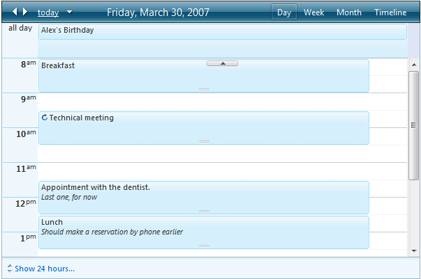
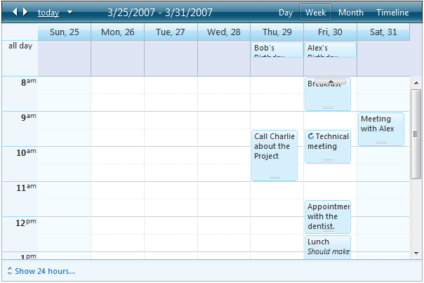
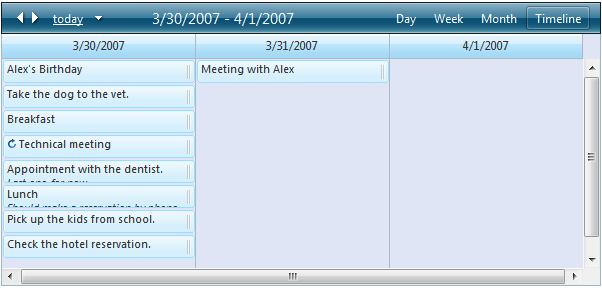
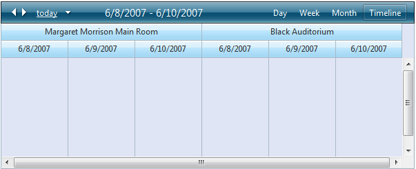
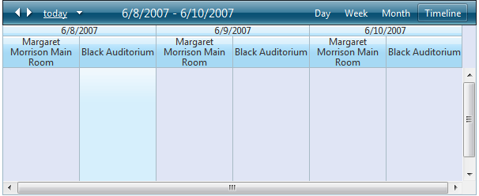
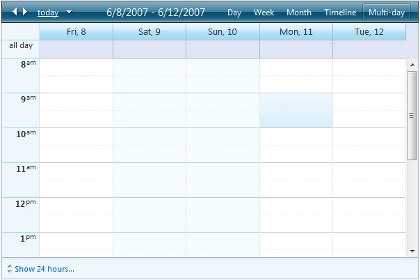
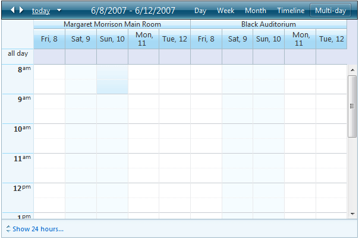

# Views

## Overview

RadScheduler displays appointments in five basic views: Day view, Week view, Month view, Timelineview, and Multi-Day view. The __SelectedView__ property specifies which of theseviews the scheduler uses when it first appears. By default, the user can move between Day, Week, Month,Timeline, and Multi-Day views using the view tabs. You can remove these controls, preventing the userfrom changing the view, by setting the __ShowViewTabs__ property to __False__. You can remove specific view tab bysetting the __UserSelectable__ property to __False__.

>caution If you try to restrict the scheduler to Month view, be aware that it allows the user to toggleinto Day View using the __more...__ link when the number of appointments in a dayexceeds the limit set by the __MonthVisibleAppointmentsPerDay__ property. You canprevent this using the[NavigationCommand]()event.
>

## Resource Grouping

If custom [Resources]() are defined, the data shown in RadScheduler can be grouped by Resources. Resource Grouping is available in __all views__.To enable it you must set the __GroupBy__ property to the name of the Resource by whichyou want data to be grouped. Grouping is available only by one Resource with an exception for the special 'Date' Resource. If you set the __GroupBy__ property to __"Date,[ResourceName]"__, data will be grouped by the specified Resource as well as by Date.

In addition, you can set the __GroupingDirection__propertyto __Horizontal__or __Vertical__ to specify the direction of thegrouping (as the property name implies). This functionality is also available in __all views__.

## Day View

## Week View

## Month View

## Timeline View

## Timeline View Grouped by Resource

## Timeline View Grouped by Date and Resource

__Multi-Day View__

__Multi-Day View grouped by Resource__

# See Also

 * [Navigating RadScheduler]()
