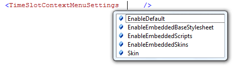
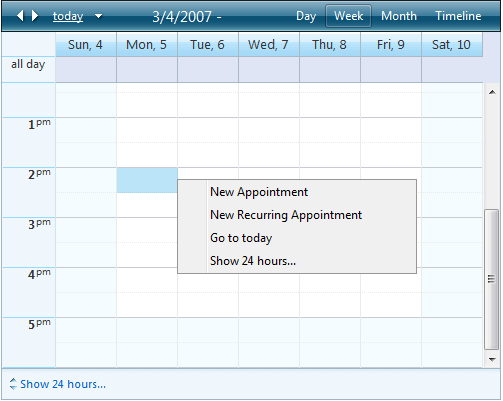
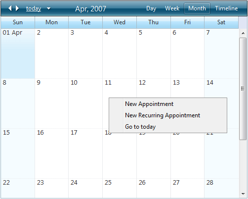
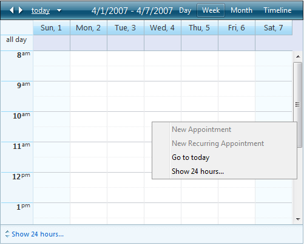

# Time Slot Context Menu


With Q3 2009, RadScheduler gives you the option to enable a default time slot context menu.

If **TimeSlotContextMenuSettings-EnableDefault** is set to **true**, right-clicking on a time slot will display a context menu.The default time slot context menu is disabled by default.

You can use the TimeSlotContextMenuSettings to also style the menu through a [skin registration](), or to [disable its embedded resources]():



If not specified, the above settings will be inherited from those of the RadScheduler instance.

The items of the default time slot context menu depend on the currently selected view.

For **Day** and **Week** view the context menu has four items as shown below:



For **Month** and **Timeline** view the context menu has three items:



The default time slot context menu can be customized declaratively:

````ASPNET
	
<TimeSlotContextMenus>
   <telerik:RadSchedulerContextMenu ID="SchedulerTimeSlotContextMenu" runat="server">
	   <Items>
		   <telerik:RadMenuItem Text="New Appointment" Value="CommandAddAppointment" />
		   <telerik:RadMenuItem Text="New All Day Event" />
		   <telerik:RadMenuItem IsSeparator="True" />
		   <telerik:RadMenuItem Text="New Recurring Appointment" Value="CommandAddRecurringAppointment" />
		   <telerik:RadMenuItem Text="New Recurring Event" />
		   <telerik:RadMenuItem IsSeparator="True" />
		   <telerik:RadMenuItem Text="Go to today" Value="CommandGoToToday" />
		   <telerik:RadMenuItem Text="Show 24 hours..." Value="CommandShow24Hours" />
	   </Items>
   </telerik:RadSchedulerContextMenu>
</TimeSlotContextMenus>     
	
````


The functionality of the default menu items such as adding an appointment or navigating to today's date can be achieved by setting the **Value** property of the menu item to a command name. RadScheduler's time slot context menu will recognize the following commands:

* CommandAddAppointment

* CommandAddRecurringAppointment

* CommandGoToToday

* CommandShow24Hours

To allow associating other functionality to a menu item, RadScheduler exposes the following events:

**Client Side**

* [OnClientTimeSlotContextMenuItemClicking]()

* [OnClientTimeSlotContextMenuItemClicked]()

**Server Side**

* [OnTimeSlotContextMenuItemClicking]()

* [OnTimeSlotContextMenuItemClicked]()

If the RadScheduler is read-only (via the **ReadOnly** property) or the **AllowInsert**property is set to **“False”**– then you will not be able to insert appointments. The two menu items **“New Appointment”** and **“New Recurring Appointment”** will be disabled:



For more information, please see the [Context menu](https://demos.telerik.com/aspnet-ajax/scheduler/examples/contextmenu/defaultcs.aspx) online demo.


