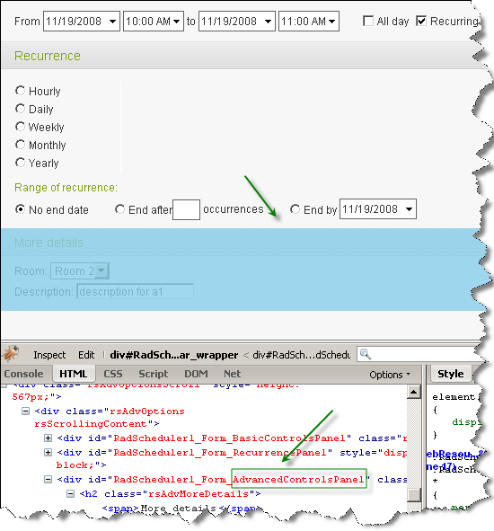

# Handling FormCreated


RadScheduler's FormCreated event allows you to access elements on the advanced form. This is achieved using the FindControl method of e.Container and passing as an argumentthe last part of the renderedcontrol's ID. For example, to access the advanced controls' panel, you need to use e.Container.FindControl("AdvancedControlsPanel").



To find a resource RadCombobox, use the following convention - **Res**[NameOfResourceType]. For example -*e.Container.FindControl("ResUser")*.

To find a custom attributes RadTextBox, use the following convention - **Attr**[CustomAttributeName].For example - *e.Container.FindControl("AttrAnnotations")*.

Here are some examples:

## Change the start time picker options


````C#
	    protected void RadScheduler1_FormCreated(object sender, SchedulerFormCreatedEventArgs e)
	    {
	        if ((e.Container.Mode == SchedulerFormMode.AdvancedEdit) || (e.Container.Mode == SchedulerFormMode.AdvancedInsert))
	        {
	            RadTimePicker startTime = e.Container.FindControl("StartTime") as RadTimePicker;
	            startTime.TimeView.StartTime = new TimeSpan(5, 0, 0);
	            startTime.TimeView.Interval = new TimeSpan(0, 15, 0);
	            startTime.TimeView.EndTime = new TimeSpan(22, 0, 0);
	            startTime.TimeView.Columns = 4;
	            startTime.TimeView.DataList.DataSource = null;
	            startTime.DataBind();        
	        }
	    }
````
````VB.NET
	    Protected Sub RadScheduler1_FormCreated(sender As Object, e As SchedulerFormCreatedEventArgs)
	        If (e.Container.Mode = SchedulerFormMode.AdvancedEdit) OrElse (e.Container.Mode = SchedulerFormMode.AdvancedInsert) Then
	            Dim startTime As RadTimePicker = TryCast(e.Container.FindControl("StartTime"), RadTimePicker)
	            startTime.TimeView.StartTime = New TimeSpan(5, 0, 0)
	            startTime.TimeView.Interval = New TimeSpan(0, 15, 0)
	            startTime.TimeView.EndTime = New TimeSpan(22, 0, 0)
	            startTime.TimeView.Columns = 4
	            startTime.TimeView.DataList.DataSource = Nothing
	            startTime.DataBind()
	        End If
	    End Sub
````


## Update the end date picker when the start date picker is changed


````C#
	    protected void RadScheduler1_FormCreated(object sender, SchedulerFormCreatedEventArgs e)
	    {
	        if ((e.Container.Mode == SchedulerFormMode.AdvancedEdit) || (e.Container.Mode == SchedulerFormMode.AdvancedInsert))
	        {
	            RadDatePicker startDate = e.Container.FindControl("StartDate") as RadDatePicker;
	            if (startDate != null)
	            {
	                startDate.ClientEvents.OnDateSelected = "changeEndDate";
	            }
	        }
	    }
````
````VB.NET
	    Protected Sub RadScheduler1_FormCreated(sender As Object, e As SchedulerFormCreatedEventArgs)
	        If (e.Container.Mode = SchedulerFormMode.AdvancedEdit) OrElse (e.Container.Mode = SchedulerFormMode.AdvancedInsert) Then
	            Dim startDate As RadDatePicker = TryCast(e.Container.FindControl("StartDate"), RadDatePicker)
	            If startDate <> Nothing Then
	                startDate.ClientEvents.OnDateSelected = "changeEndDate"
	            End If
	        End If
	    End Sub
````


````JavaScript
	     <script type="text/javascript">    
	        
	        function changeEndDate(sender, e) {
	            var endDatePickerID = sender.get_id().replace("StartDate", "EndDate");
	            var endDatePicker = $find(endDatePickerID);
	            endDatePicker.set_selectedDate(sender.get_selectedDate());
	        }
	
	     </script>
````


## UPDATE THE END TIME PICKER WHEN THE START TIME PICKER IS CHANGED


````C#
	    protected void RadScheduler1_FormCreated(object sender, SchedulerFormCreatedEventArgs e)
	    {
	        if ((e.Container.Mode == SchedulerFormMode.AdvancedEdit) || (e.Container.Mode == SchedulerFormMode.AdvancedInsert))
	        {
	            RadTimePicker startTimePicker = e.Container.FindControl("StartTime") as RadTimePicker;
	            if (startTimePicker != null)
	            {
	                startTimePicker.ClientEvents.OnDateSelected = "changeEndTime";
	            }
	        }
	    }
````
````VB.NET
	    Protected Sub RadScheduler1_FormCreated(sender As Object, e As SchedulerFormCreatedEventArgs)
	        If (e.Container.Mode = SchedulerFormMode.AdvancedEdit) OrElse (e.Container.Mode = SchedulerFormMode.AdvancedInsert) Then
	            Dim startTimePicker As RadTimePicker = TryCast(e.Container.FindControl("StartTime"), RadTimePicker)
	            If startTimePicker <> Nothing Then
	                startTimePicker.ClientEvents.OnDateSelected = "changeEndTime"
	            End If
	        End If
	    End Sub
````


````JavaScript
	     <script type="text/javascript">
	      
	        function changeEndTime(sender, e) {
	            var endTimePickerID = sender.get_id().replace("StartTime", "EndTime");
	            var endTimePicker = $find(endTimePickerID);
	            var startTime = sender.get_selectedDate();
	            startTime.setHours(startTime.getHours() + 1);
	            endTimePicker.set_selectedDate(startTime);
	        }
	     </script>
````


## Find the textbox for the annotations custom attribute and change its label


````C#
	    protected void RadScheduler1_FormCreated(object sender, SchedulerFormCreatedEventArgs e)
	    {
	        if ((e.Container.Mode == SchedulerFormMode.AdvancedEdit) || (e.Container.Mode == SchedulerFormMode.AdvancedInsert))
	        {
	            RadTextBox attrAnnotationsTextbox = (RadTextBox)e.Container.FindControl("AttrAnnotations");
	            attrAnnotationsTextbox.Label = "Notes: ";
	        }
	    }
````
````VB.NET
	    Protected Sub RadScheduler1_FormCreated(sender As Object, e As SchedulerFormCreatedEventArgs)
	        If (e.Container.Mode = SchedulerFormMode.AdvancedEdit) OrElse (e.Container.Mode = SchedulerFormMode.AdvancedInsert) Then
	            Dim attrAnnotationsTextbox As RadTextBox = DirectCast(e.Container.FindControl("AttrAnnotations"), RadTextBox)
	            attrAnnotationsTextbox.Label = "Notes: "
	        End If
	    End Sub
````


## Add a new combobox that updates the subject field


````C#
	    protected void RadScheduler1_FormCreated(object sender, SchedulerFormCreatedEventArgs e)
	    {
	        if ((e.Container.Mode == SchedulerFormMode.AdvancedEdit) || (e.Container.Mode == SchedulerFormMode.AdvancedInsert))
	        {
	            RadComboBox subjectChanger = new RadComboBox();
	            subjectChanger.Items.Add(new RadComboBoxItem("-"));
	            subjectChanger.Items.Add(new RadComboBoxItem("Homework"));
	            subjectChanger.Items.Add(new RadComboBoxItem("Test"));
	            subjectChanger.Items.Add(new RadComboBoxItem("Final exam"));
	            subjectChanger.Label = "Update subject:";
	            subjectChanger.OnClientSelectedIndexChanging = "OnClientSelectedIndexChanging";
	            RadTextBox subject = e.Container.FindControl("Subject") as RadTextBox;
	            subject.ClientEvents.OnLoad = "OnLoadSubjectTextBox";
	            subject.Parent.Controls.Add(subjectChanger);
	        }
	    }
````
````VB.NET
	    Protected Sub RadScheduler1_FormCreated(sender As Object, e As SchedulerFormCreatedEventArgs)
	        If (e.Container.Mode = SchedulerFormMode.AdvancedEdit) OrElse (e.Container.Mode = SchedulerFormMode.AdvancedInsert) Then
	            Dim subjectChanger As New RadComboBox()
	            subjectChanger.Items.Add(New RadComboBoxItem("-"))
	            subjectChanger.Items.Add(New RadComboBoxItem("Homework"))
	            subjectChanger.Items.Add(New RadComboBoxItem("Test"))
	            subjectChanger.Items.Add(New RadComboBoxItem("Final exam"))
	            subjectChanger.Label = "Update subject:"
	            subjectChanger.OnClientSelectedIndexChanging = "OnClientSelectedIndexChanging"
	            Dim subject As RadTextBox = TryCast(e.Container.FindControl("Subject"), RadTextBox)
	            subject.ClientEvents.OnLoad = "OnLoadSubjectTextBox"
	            subject.Parent.Controls.Add(subjectChanger)
	        End If
	    End Sub
````


````JavaScript
	    <script type="text/javascript">
	      
	        var subjectTextBox;
	        function OnLoadSubjectTextBox(sender) {
	            subjectTextBox = sender;
	        }
	        function OnClientSelectedIndexChanging(sender, args) {
	            subjectTextBox.set_value(args.get_item().get_text());
	        }
	     </script>
````


## Hide the "all day checkbox"


````C#
	    protected void RadScheduler1_FormCreated(object sender, SchedulerFormCreatedEventArgs e)
	    {
	        if ((e.Container.Mode == SchedulerFormMode.AdvancedEdit) || (e.Container.Mode == SchedulerFormMode.AdvancedInsert))
	        {
	            CheckBox allDayCheckbox = (CheckBox)e.Container.FindControl("AllDayEvent");
	            allDayCheckbox.Style.Add("visibility", "hidden");
	        }
	    }
````
````VB.NET
	    Protected Sub RadScheduler1_FormCreated(sender As Object, e As SchedulerFormCreatedEventArgs)
	        If (e.Container.Mode = SchedulerFormMode.AdvancedEdit) OrElse (e.Container.Mode = SchedulerFormMode.AdvancedInsert) Then
	            Dim allDayCheckbox As CheckBox = DirectCast(e.Container.FindControl("AllDayEvent"), CheckBox)
	            allDayCheckbox.Style.Add("visibility", "hidden")
	        End If
	    End Sub
````


## Change the selected index of a resource combobox so always one option is preselected


````C#
	    protected void RadScheduler1_FormCreated(object sender, SchedulerFormCreatedEventArgs e)
	    {
	        if ((e.Container.Mode == SchedulerFormMode.AdvancedEdit) || (e.Container.Mode == SchedulerFormMode.AdvancedInsert))
	        {
	            RadComboBox resourceRoomCombo = e.Container.FindControl("ResRoom") as RadComboBox;
	            if (resourceRoomCombo.SelectedIndex == 0)
	            {
	                resourceRoomCombo.SelectedIndex = 1;
	            }
	        }
	    }
````
````VB.NET
	    Protected Sub RadScheduler1_FormCreated(sender As Object, e As SchedulerFormCreatedEventArgs)
	        If (e.Container.Mode = SchedulerFormMode.AdvancedEdit) OrElse (e.Container.Mode = SchedulerFormMode.AdvancedInsert) Then
	            Dim resourceRoomCombo As RadComboBox = TryCast(e.Container.FindControl("ResRoom"), RadComboBox)
	            If resourceRoomCombo.SelectedIndex = 0 Then
	                resourceRoomCombo.SelectedIndex = 1
	            End If
	        End If
	    End Sub
````


## Make changes in the recurrence editor


````C#
	    protected void RadScheduler1_FormCreated(object sender, SchedulerFormCreatedEventArgs e)
	    {
	        if (e.Container.Mode == SchedulerFormMode.AdvancedInsert)
	        {
	            //To find controls in the recurrence editor, you need to first find the recurrence editor.
	            RecurrenceEditor recurrenceEditor = e.Container.FindControl("RecurrenceEditor") as RecurrenceEditor;
	
	            //Checks the recurrence checkbox so that the recurrence editor is expanded.
	            CheckBox recurreceCheckbox = (CheckBox)recurrenceEditor.FindControl("RecurrentAppointment");
	            recurreceCheckbox.Checked = true;
	
	            //Preselects the weekly option.
	            RadioButton weeklyRadioButton = (RadioButton)recurrenceEditor.FindControl("RepeatFrequencyWeekly");
	            weeklyRadioButton.Checked = true;
	            weeklyRadioButton.Style.Add("color", "red");
	
	            //Preselects Sunday for the weekly recurrence rule in addtion to the day for which the appointment will be scheduled.
	            CheckBox sundayCheckbox = (CheckBox)recurrenceEditor.FindControl("WeeklyWeekDaySunday");
	            sundayCheckbox.Checked = true;
	            sundayCheckbox.Style.Add("color", "red");
	
	            //Preselects the 'End after' option
	            RadioButton repeatGivenOccurrences = (RadioButton)recurrenceEditor.FindControl("RepeatGivenOccurrences");
	            repeatGivenOccurrences.Checked = true;
	            repeatGivenOccurrences.Style.Add("color", "red");
	
	            //Sets the 'End after' option to 3. 
	            RadNumericTextBox endAfterInput = (RadNumericTextBox)recurrenceEditor.FindControl("RangeOccurrences");
	            endAfterInput.Value = 3;
	        }
	    }
````
````VB.NET
	    Protected Sub RadScheduler1_FormCreated(sender As Object, e As SchedulerFormCreatedEventArgs)
	        If e.Container.Mode = SchedulerFormMode.AdvancedInsert Then
	            'To find controls in the recurrence editor, you need to first find the recurrence editor.
	            Dim recurrenceEditor As RecurrenceEditor = TryCast(e.Container.FindControl("RecurrenceEditor"), RecurrenceEditor)
	
	            'Checks the recurrence checkbox so that the recurrence editor is expanded.
	            Dim recurreceCheckbox As CheckBox = DirectCast(recurrenceEditor.FindControl("RecurrentAppointment"), CheckBox)
	            recurreceCheckbox.Checked = True
	
	            'Preselects the weekly option.
	            Dim weeklyRadioButton As RadioButton = DirectCast(recurrenceEditor.FindControl("RepeatFrequencyWeekly"), RadioButton)
	            weeklyRadioButton.Checked = True
	            weeklyRadioButton.Style.Add("color", "red")
	
	            'Preselects Sunday for the weekly recurrence rule in addtion to the day for which the appointment will be scheduled.
	            Dim sundayCheckbox As CheckBox = DirectCast(recurrenceEditor.FindControl("WeeklyWeekDaySunday"), CheckBox)
	            sundayCheckbox.Checked = True
	            sundayCheckbox.Style.Add("color", "red")
	
	            'Preselects the 'End after' option
	            Dim repeatGivenOccurrences As RadioButton = DirectCast(recurrenceEditor.FindControl("RepeatGivenOccurrences"), RadioButton)
	            repeatGivenOccurrences.Checked = True
	            repeatGivenOccurrences.Style.Add("color", "red")
	
	            'Sets the 'End after' option to 3. 
	            Dim endAfterInput As RadNumericTextBox = DirectCast(recurrenceEditor.FindControl("RangeOccurrences"), RadNumericTextBox)
	            endAfterInput.Value = 3
	        End If
	    End Sub
````


## Add a new custom validator for the description field


````C#
	    protected void RadScheduler1_FormCreated(object sender, SchedulerFormCreatedEventArgs e)
	    {
	        if ((e.Container.Mode == SchedulerFormMode.AdvancedEdit) || (e.Container.Mode == SchedulerFormMode.AdvancedInsert))
	        {
	            CustomValidator validatorForDescription = new CustomValidator();
	            RadScheduler scheduler = (RadScheduler)sender;
	            validatorForDescription.ValidationGroup = scheduler.ValidationGroup;
	            validatorForDescription.ControlToValidate = "Description";
	            validatorForDescription.ErrorMessage = "Description should be more than 20 characters!";
	            validatorForDescription.ClientValidationFunction = "validationFunction";
	            e.Container.Controls.Add(validatorForDescription);
	            
	        }
	    }
````
````VB.NET
	    Protected Sub RadScheduler1_FormCreated(sender As Object, e As SchedulerFormCreatedEventArgs)
	        If (e.Container.Mode = SchedulerFormMode.AdvancedEdit) OrElse (e.Container.Mode = SchedulerFormMode.AdvancedInsert) Then
	            Dim validatorForDescription As New CustomValidator()
	            Dim scheduler As RadScheduler = DirectCast(sender, RadScheduler)
	            validatorForDescription.ValidationGroup = scheduler.ValidationGroup
	            validatorForDescription.ControlToValidate = "Description"
	            validatorForDescription.ErrorMessage = "Description should be more than 20 characters!"
	            validatorForDescription.ClientValidationFunction = "validationFunction"
	
	            e.Container.Controls.Add(validatorForDescription)
	        End If
	    End Sub
````


````JavaScript
	      <script type="text/javascript">
	        function validationFunction(source, arguments) {
	            if (arguments.Value.length > 20) {
	                arguments.IsValid = true;
	            } else {
	                arguments.IsValid = false;
	            }
	        }
	    </script>
````


# See Also

 * [Code library sample](http://www.telerik.com/community/code-library/aspnet-ajax/scheduler/customize-the-advanced-form-in-formcreated-event.aspx)

 * [KB article](http://www.telerik.com/support/kb/aspnet-ajax/scheduler/how-to-access-controls-in-the-advanced-form.aspx)
