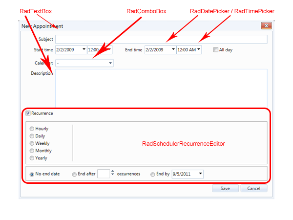

# Customizing the Advanced Form Overview

The advanced form of RadScheduler allows you to specify additional information about an appointment such as custom attributes, resources, reminders, recurrence rule, etc. The advanced form is opened by double clicking on a time slot which opens the inline form and then clicking on the 'options' button. Alternatively, you can right-click on a time slot to open the context menu and choose 'New appointment' or 'Edit'.

The advanced form consists of various Telerik controls - RadTextBox for subject, RadComboBox for resources, RadDatePicker and RadTimPicker for Start and End times, etc. Those controls can be accessed Server Side in FormCreated or Client Side in OnClientFormCreated. The first two topics from this chapter show in more details how to achieve this.

## 

There are several ways to customize the advanced form:

* [ Handling FormCreated event ]()

* [ Using javascript/jQueery and CSS ]()

* [Using the Advanced Templates ]()

* External edit by replacing the advanced form - [External Edit with RadDock demo]( https://demos.telerik.com/aspnet-ajax/scheduler/examples/raddock/defaultcs.aspx)

For some light-weight, minor tweaks, such as changing the style of the Subject's label, hiding the all-day checkbox,or adding some custom validation, we recommend using the first two methods - handling FormCreated and using javascriptand CSS. For heavy-weight customization, it is best to use the Advanced Templates or replace the advanced form with acustom one using the approach from the External Edit with RadDock demo.

