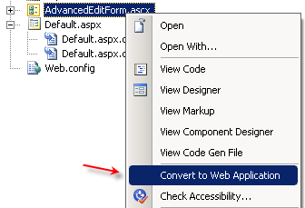
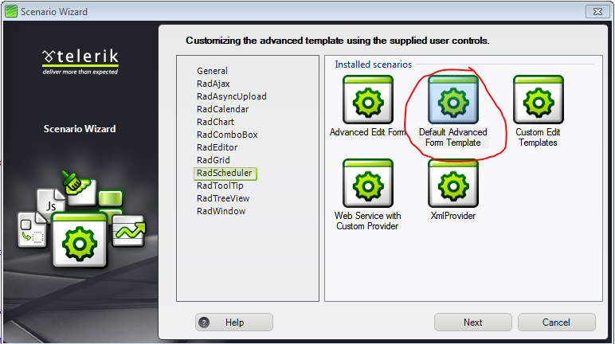

# Using the Advanced Templates


## Overview

The Advanced Templates provide great flexibility for customizing the Advanced Form. However, a common problem when using the **AdvancedInsertTemplate** or the **AdvancedEditTemplate** is that the functionality related to recurrence and resources is lost. In other words, if you chose to customize the advanced form you will not be able to insert or edit recurring appointments or appointments with resources, unless you implement this functionality from scratch. For instance, consider the [ Templates online example ](http://demos.telerik.com/aspnet-ajax/Scheduler/Examples/Templates/DefaultCS.aspx).

The solution which we offer is a set of user controls that recreates the default advanced form, yet allowing for unrestricted customization.We will show how to use the advanced form controls in both **Server Side** and **Client Side** binding scenarios.

Here is the structure of the advanced form with each user control outlined with different border style:


Legend:

* **AdvancedForm**.ascx

* **ResourceControl**.ascx

* **MultipleValuesResourceControl**.ascx

* **BooleanAttributeControl**.ascx is not shown here, but it can be used in AdvancedForm.ascx just like ResourceControl.ascx

The above user controls can be found in the folder of your local installation of Telerik.Web.UI suite ->

* Live Demos\Scheduler\Examples\ **AdvancedFormTemplate**

For an online demo, please see the [Advanced Templates](http://demos.telerik.com/aspnet-ajax/scheduler/examples/advancedformtemplate/defaultcs.aspx) example.

You can also download a [code library sample](http://www.telerik.com/community/code-library/aspnet-ajax/scheduler/customize-the-advanced-form-with-the-advanced-template-user-controls.aspx) of customizing the advanced form with RadScheduler popultated with various data sources:

* CustomDbProvider

* ObjectDataSource

* SqlDataSource

* WebServiceBinding

* XmlSchedulerProvider

## How to use the advanced user controls in Server Side binding mode


Our task in this tutorial will be to understand how the RadColorPicker control was added to allow to save the selected color in a custom attribute and apply it to the appointment in the AppointmentDataBound event.

The advanced form looks like this:


1. Open the [Advanced Templates]( http://demos.telerik.com/aspnet-ajax/scheduler/examples/advancedformtemplate/defaultcs.aspx ) demo locally.

2. In **AdvancedForm**.**ascx** add the following code right above the Custom Attributes panel:

	**ASP.NET**
		
		<label>Color: </label>
		<telerik:RadColorPicker RenderMode="Lightweight" ID="AppointmentColorPicker" CssClass="rsAdvResourceValue" NoColorText="transparent" ShowIcon="true" PaletteModes="HSV"
		   runat="server">
		</telerik:RadColorPicker>     	
		
	
3. Expose an **AppointmentColor** property using the RadColorpicker control added in step 2 above.

	In code behind of **AdvancedForm**.ascx add the following code in the "Attributes and resources" region:

	**C#**
	
		// Attributes and resources
		[Bindable(BindableSupport.Yes, BindingDirection.TwoWay)]
		public string AppointmentColor
		{
			get
			{
				return AppointmentColorPicker.SelectedColor.ToArgb().ToString();
			}
			set
			{
				int argbValue;
				if (int.TryParse(value, out argbValue))
					AppointmentColorPicker.SelectedColor = Color.FromArgb(argbValue);
			}
		} 
	
	**VB**
	
		' Attributes and resources
		<Bindable(BindableSupport.Yes, BindingDirection.TwoWay)> _
		Public Property AppointmentColor() As String
			Get
				Return AppointmentColorPicker.SelectedColor.ToArgb().ToString()
			End Get
			Set(ByVal value As String)
				Dim argbValue As Integer
				If Integer.TryParse(value, argbValue) Then
					AppointmentColorPicker.SelectedColor = Color.FromArgb(argbValue)
				End If
			End Set
		End Property
	

4. In **DefaultCS**.aspx or **DefaultVB**.aspx
	* set CustomAttributeName="AppointmentColor"
	* bind the AppointmentColor property you have exposed in the AdvancedForm user control
	* add css style to fix the RadColopicker's label
	optionally -
	* set Localization-AdvancedDescription="Subject"
	* add AppointmentTemplate to display the subject and description
	* add .rsAptSubject css class

	**JavaScript**
	
		<telerik:RadScheduler RenderMode="Lightweight" runat="server" ID="RadScheduler1" Width="750px" SelectedDate="2009-03-30"
		   DayStartTime="08:00:00" DayEndTime="18:00:00" CustomAttributeNames="AppointmentColor" Localization-AdvancedDescription="Subject"
		   TimeZoneOffset="03:00:00" OnDataBound="RadScheduler1_DataBound" OnAppointmentDataBound="RadScheduler1_AppointmentDataBound"
		   OnClientFormCreated="schedulerFormCreated">
		   <AdvancedForm Modal="true" />
		   <AppointmentTemplate>
		  <div class="rsAptSubject">
		   <%# Eval("Subject") %>
		  </div>
		  <%# Eval("Description") %>
		 </AppointmentTemplate>
		   <AdvancedEditTemplate>
			   <scheduler:AdvancedForm runat="server" ID="AdvancedEditForm1" Mode="Edit" Subject='<%# Bind("Subject") %>'
				   Start='<%# Bind("Start") %>' End='<%# Bind("End") %>' AppointmentColor='<%# Bind("AppointmentColor") %>'
				   RecurrenceRuleText='<%# Bind("RecurrenceRule") %>' UserID='<%# Bind("User") %>'
				   RoomID='<%# Bind("Room") %>' />
		   </AdvancedEditTemplate>
		   <AdvancedInsertTemplate>
			   <scheduler:AdvancedForm runat="server" ID="AdvancedInsertForm1" Mode="Insert" Subject='<%# Bind("Subject") %>'
				   Start='<%# Bind("Start") %>' End='<%# Bind("End") %>' AppointmentColor='<%# Bind("AppointmentColor") %>'
				   RecurrenceRuleText='<%# Bind("RecurrenceRule") %>' UserID='<%# Bind("User") %>'
				   RoomID='<%# Bind("Room") %>' />
		   </AdvancedInsertTemplate>
		</telerik:RadScheduler>      
	

	**CSS**
	     
		<style type="text/css">
		   .RadScheduler .rsAptSubject
		   {
			   text-align: left;
			   padding: 4px 0 1px;
			   margin: 0 0 3px;
			   font-size: 12px;
			   font-weight: bold;
			   color: #369;
			   height: 17px;
			   border-bottom: 1px solid #99DEFD;
			   width: 100%;
		   }  
		.RadScheduler .rsAdvancedEdit .RadColorPicker label
		{
			 text-align: left;
			 display: block;
			 padding: 0;
		}   
		  
		</style>  
				

5. In code behind of **Default**.aspx, handle **AppointmentDataBound** like this to set the color of the appointments:

	**C#**
	
		protected void RadScheduler1_AppointmentDataBound(object sender, SchedulerEventArgs e)
		{
			int AppointmentArgbColorValue;
			if (int.TryParse(e.Appointment.Attributes["AppointmentColor"], out AppointmentArgbColorValue))
			{
				e.Appointment.BackColor = Color.FromArgb(AppointmentArgbColorValue);
				e.Appointment.BorderColor = Color.Black;
				e.Appointment.BorderStyle = BorderStyle.Solid;
				e.Appointment.BorderWidth = Unit.Pixel(1);
			}
			e.Appointment.ToolTip = e.Appointment.Subject + ": " + e.Appointment.Description;
		}
			
		
		**VB**
			
				Protected Sub RadScheduler1_AppointmentDataBound(ByVal sender As Object, ByVal e As SchedulerEventArgs)
					Dim AppointmentArgbColorValue As Integer
					If Integer.TryParse(e.Appointment.Attributes("AppointmentColor"), AppointmentArgbColorValue) Then
						e.Appointment.BackColor = Color.FromArgb(AppointmentArgbColorValue)
						e.Appointment.BorderColor = Color.Black
						e.Appointment.BorderStyle = BorderStyle.Solid
						e.Appointment.BorderWidth = Unit.Pixel(1)
					End If
					e.Appointment.ToolTip = e.Appointment.Subject + ": " + e.Appointment.Description
				End Sub
	

6. Register **AdvancedForm**.**js** with the script manager for the page and handle RadScheduler's **OnClientFormCreated**event.

	>note This is actually already done in the sample demo. This step is to serve just as a reminder.
	
	**ASP.NET**
	     
		<asp:ScriptManager ID="ScriptManager1" runat="server">
		   <Scripts>
			   <asp:ScriptReference Path="~/Modified_AddedDescription/CS/AdvancedForm.js" />
		   </Scripts>
		</asp:ScriptManager>
		
		<script type="text/javascript">
		   //<![CDATA[
			 // Dictionary containing the advanced template client object
			 // for a given RadScheduler instance (the control ID is used as key).
			 var schedulerTemplates = {};
		 
			 function schedulerFormCreated(scheduler, eventArgs) {
				 // Create a client-side object only for the advanced templates
				 var mode = eventArgs.get_mode();
				 if (mode == Telerik.Web.UI.SchedulerFormMode.AdvancedInsert ||
			mode == Telerik.Web.UI.SchedulerFormMode.AdvancedEdit) {
					 // Initialize the client-side object for the advanced form
					 var formElement = eventArgs.get_formElement();
					 var templateKey = scheduler.get_id() + "_" + mode;             
					 var advancedTemplate = schedulerTemplates[templateKey];                      
					 if (!advancedTemplate)
					 {
						 // Initialize the template for this RadScheduler instance
						 // and cache it in the schedulerTemplates dictionary
							var schedulerElement = scheduler.get_element();
							var isModal = scheduler.get_advancedFormSettings().modal;
							advancedTemplate = new window.SchedulerAdvancedTemplate(schedulerElement, formElement, isModal);
							advancedTemplate.initialize();
							
							schedulerTemplates[templateKey] = advancedTemplate;
					 }
					 // Are we using Web Service data binding?
					 if (!scheduler.get_webServiceSettings().get_isEmpty()) {
						 // Populate the form with the appointment data
						 var apt = eventArgs.get_appointment();
						 var isInsert = mode == Telerik.Web.UI.SchedulerFormMode.AdvancedInsert;
						 var editSeries = eventArgs.get_editingRecurringSeries();
						 advancedTemplate.populate(apt, isInsert, editSeries);
					 }
				 }
			 }
		
		   //]]>
		</script>
		<telerik:RadScheduler RenderMode="Lightweight" runat="server" ID="RadScheduler1"
		 OnClientFormCreated="schedulerFormCreated" .../>
					
7. Run and test the application. If you experience problems, please refer to the **Modified_AddedDescription** folder for a solution.

## How to use the advanced user controls in Client Side binding mode (Web Services)

The AdvancedForm.js will automatically handle resources and custom attributes defined in AdvancedForm.ascx, as long as you follow a certain naming convention.

* **Resource** controls should follow the convention Res[Resource Name] for ID. For example:

````ASPNET
	     
	<scheduler:ResourceControl runat="server" ID="ResRoom" Type="Room" Label="Room:" Skin='<%# Owner.Skin %>' />
				
````


* **Attribute** controls should follow the convention Attr[Attribute Name] for ID. For example:

````ASPNET
	     
	<telerik:RadTextBox RenderMode="Lightweight" runat="server" ID="AttrDescription"  Label='Annotation:' Width="100%" Skin='<%# Owner.Skin %>' />
				
````


In this tutorial, we will show how to add to the advanced form a RadColorPicker which will allow you to save the selected color in a custom attribute and apply it to the appointment in the OnClientAppointmentDataBound event. Since it will not be a RadTextBox control, we cannot use the built-in logic of AdvancedForm.js that recognizes custom attributes. So, there will be some extra code to be added to AdvancedForm.js

1. Download a sample project from [here](http://www.telerik.com/support/kb/aspnet-ajax/scheduler/sample-project-of-customizing-the-advanced-form-in-client-side-binding-mode-web-services.aspx).

2. In **RadSchedulerAdvancedForm**.**aspx** add AppointmentColor custom attribute for RadScheduler -CustomAttributeNames="**AppointmentColor**"

3. In **AdvancedForm**.**ascx** add the following code right above the Custom Attributes panel:

	**ASP.NET**
	
		<label>Color: </label>
		<telerik:RadColorPicker RenderMode="Lightweight" ID="AppointmentColorPicker" CssClass="rsAdvResourceValue" NoColorText="transparent" ShowIcon="true" PaletteModes="HSV"
		   runat="server">
		</telerik:RadColorPicker>     
	


4. In code-behind of the **AdvancedForm** user control add the following code:

	**C#**
	
	    // Attributes and resources
	    [Bindable(BindableSupport.Yes, BindingDirection.TwoWay)]
	    public string AppointmentColor
	    {
	        get
	        {
	            return AppointmentColorPicker.SelectedColor.ToArgb().ToString();
	        }
	        set
	        {
	            int argbValue;
	            if (int.TryParse(value, out argbValue))
	                AppointmentColorPicker.SelectedColor = Color.FromArgb(argbValue);
	        }
	    } 
	

	**VB**
	
	    ' Attributes and resources
	    <Bindable(BindableSupport.Yes, BindingDirection.TwoWay)> _
	    Public Property AppointmentColor() As String
	        Get
	            Return AppointmentColorPicker.SelectedColor.ToArgb().ToString()
	        End Get
	        Set(ByVal value As String)
	            Dim argbValue As Integer
	            If Integer.TryParse(value, argbValue) Then
	                AppointmentColorPicker.SelectedColor = Color.FromArgb(argbValue)
	            End If
	        End Set
	    End Property
	


5. In **AdvancedForm.js** add a method to get the client object of RadColorPicker:

	**JavaScript**
		
		_getAppointmentColorPicker: function() {
			   return $find(this._templateId + "_AppointmentColorPicker");
		   }      
			

6. Add a method to save the RadColorPicker's selected color to the AppointmentColor custom attribute.

	**JavaScript**
	
		_saveAppointmentColor: function(apt) {
		   var template = this;
		   var aptAttributes = apt.get_attributes();
		   var appointmentColorPicker = this._getAppointmentColorPicker();       
		   if (!appointmentColorPicker)
			   return;
		   aptAttributes.removeAttribute("AppointmentColor");
		   aptAttributes.setAttribute("AppointmentColor",   appointmentColorPicker.get_selectedColor());
		}       
		
7. In the populate method, set the RadColorPicker'sselected color to the value of the AppointmentColor custom attribute:

	**JavaScript**
	     
		populate: function(apt, isInsert, editSeries) {
		 * * *
		  this._getAppointmentColorPicker().set_selectedColor(apt.get_attributes().getAttribute("AppointmentColor"));
			   
		 * * *
		}
				
8. In the saveClicked method, call saveAppointmentColor():

	**JavaScript**
	
		_saveClicked : function ()
		{
		 * * *    
		   this._saveAppointmentColor(apt);
		 * * *
		}       
			
9. In **Default.aspx** handle **OnClientAppointmentDataBound** like this to apply the selected color to the appointment:

	**JavaScript**
	
		function OnClientAppointmentDataBound(sender, eventArgs) {
		   var app = eventArgs.get_appointment();
		   //debugger;
		   var backColor = app.get_attributes().getAttribute("AppointmentColor");
		   
		   if (backColor)
			   app.set_backColor(backColor);
			   
		   app.set_borderColor("black");
		   app.set_borderWidth("1");
		 }
		//]]>
		</script>
		<telerik:RadScheduler RenderMode="Lightweight" runat="server" ID="RadScheduler1"      
			OnClientAppointmentDataBound="OnClientAppointmentDataBound">
		</telerik:RadScheduler>     
	
10. In **Default.aspx** add the following css fix for RadColorPicker:

	**ASP.NET**
	 
		 .RadScheduler .rsAdvancedEdit .RadColorPicker label
		{
		   text-align: left;
		   display: block;
		   padding: 0;
		}
				
11. Run and test the application. If you experience problem, please refer to the sample in the **Modified_AddColorPicker** folder.


With Q3 2008 we provide both C# and VB.NET versions of the user controls. Note that the user controls are created for a web site. If you need to integrate them in a web application, select the user controls, right-click on them and choose "Convert to Web Application":



In addition you can find a full sample project for "Default Advanced Form Template" by adding a Scenario Template. Follow these steps to add the scenario:

1. Right-click on the Web site name in Solution Explorer window. Select "RadControls for ASP.NET AJAX". From the submenu choose "Add RadScheduler Scenario".

1. **Scenario Wizard** appears with different scenarios. Choose **"Default Advanced Form Template"** :

1. Follow the wizard by pressing**"Next"** button and finally press **"Finish"**. A new .aspx page will be added to your project, depending on your choice in the Scenario Wizard. All necessary references will be added to your project.

1. Press **Ctrl+F5** and run the application.

# See Also

 * [Code library project of the Customizing the Advanced Template with RadScheduler populated with various data sources.](http://www.telerik.com/community/code-library/aspnet-ajax/scheduler/customize-the-advanced-form-with-the-advanced-template-user-controls.aspx)

 * [Sample project of the Customizing the Advanced Template example](http://www.telerik.com/support/kb/aspnet-ajax/scheduler/sample-project-of-the-customizing-the-advanced-template-example.aspx)

 * [Sample project of customizing the advanced form in Client Side binding mode (Web Services)](http://www.telerik.com/support/kb/aspnet-ajax/scheduler/sample-project-of-customizing-the-advanced-form-in-client-side-binding-mode-web-services.aspx)
