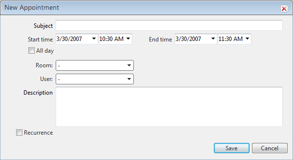

# Adding a Description Field

## 

With Q3 2009, RadScheduler supports an integrated description field.

To enable the description field, you need to set the DataDescriptionField property. For example -__DataDescriptionField__="Description", where "Description" is a field or column name in the data source used to bind RadScheduler.

If using a provider, then you need to set __EnableDescriptionField__="true".
