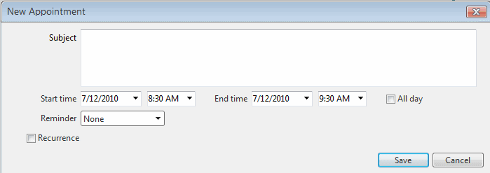

# Adding a Reminder Field

## 

Starting with the 2010 Q2 release RadScheduler offers integrated support for appointment reminders.

In order to enable this support you need to create an additional column in your data table of type nvarchar(256) or compatible. Set the **DataReminderField**property to the name of the column.

You should be able set the appointment reminder from the advanced form afterwards.

