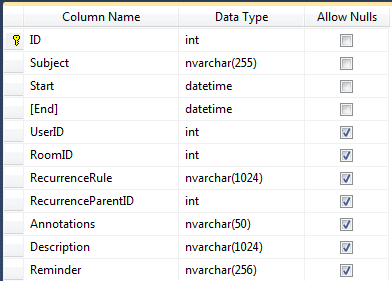

# Database Structure


## 

>note A sample SQL 2005 database for RadScheduler can be found in your local installation of theTelerik.Web.UI suite - Live Demos\App_Data\ **Telerik.mdf** 
>


The sample database for RadScheduler contains various tables which can be used to bind the control to store appointments' info, resources or custom attributes. Here is the structure of the **Appointments** table:




>note Note that the required fields for RadScheduler are **ID** , **Subject** , **Start** and **End.** These fields cannot contain null values.
>


You can use the following script to add the Scheduler data tables to an existing database:

````XML
	
USE [DBName]
GO
SET ANSI_NULLS ON
GO
SET QUOTED_IDENTIFIER ON
GO
CREATE TABLE [Rooms]
(
   [ID]        INT                IDENTITY(1,1)   NOT NULL,
   [RoomName]  nvarchar(255)                    NOT NULL,
   CONSTRAINT [PK_Rooms] PRIMARY KEY CLUSTERED
   ([ID])
)
GO
CREATE TABLE [Users]
(
   [ID]        INT                NOT NULL,
   [UserName]  nvarchar(255)      NOT NULL,

   CONSTRAINT [PK_Users] PRIMARY KEY CLUSTERED
   ([ID])
)
GO

CREATE TABLE [dbo].[Appointments]  
(  
   [ID]                    INT IDENTITY(1,1)   NOT NULL,  
   [Subject]               nvarchar(255)       NOT NULL,  
   [Description]           nvarchar(1024)      NULL,  
   [Start]                 datetime            NOT NULL,  
   [End]                   datetime            NOT NULL,
   [RoomID]                INT                 NULL,
   [UserID]                INT                 NULL,
   [RecurrenceRule]        nvarchar(1024)      NULL,  
   [RecurrenceParentID]    INT                 NULL,  
   [Reminder]              nvarchar(255)       NULL,  
   [Annotations]           nvarchar(50)        NULL,  

   CONSTRAINT [PK_Appointments] PRIMARY KEY CLUSTERED   
	   ([ID]),  

   CONSTRAINT [FK_Appointments_ParentAppointments] FOREIGN KEY  
	   ([RecurrenceParentID])  
   REFERENCES  
	   [Appointments] ([ID]),

   CONSTRAINT [FK_Appointments_Rooms] FOREIGN KEY  
	   ([RoomID])  
   REFERENCES  
	   [Rooms] ([ID]),

   CONSTRAINT [FK_Appointments_Users] FOREIGN KEY  
	   ([UserID])  
   REFERENCES  
	   [Users] ([ID])  
)  
GO 
	
````


Here is a simpler example without support for resources:

````XML
	     
CREATE TABLE [dbo].[Appointments]   
(   
   [ID]                    INT IDENTITY(1,1)   NOT NULL,   
   [Subject]               nvarchar(255)       NOT NULL,   
   [Description]           nvarchar(1024)      NULL,  
   [Start]                 datetime            NOT NULL,   
   [End]                   datetime            NOT NULL,   
   [RecurrenceRule]        nvarchar(1024)      NULL,   
   [RecurrenceParentID]    INT                 NULL,   
   [Reminder]              nvarchar(255)       NULL,  
   [Annotations]           nvarchar(50)        NULL,   
 
   CONSTRAINT [PK_Appointments] PRIMARY KEY CLUSTERED    
	   ([ID]),   
 
   CONSTRAINT [FK_Appointments_ParentAppointments] FOREIGN KEY   
	   ([RecurrenceParentID])   
   REFERENCES   
	   [dbo].[Appointments] ([ID])   
)   
GO    
			
````


