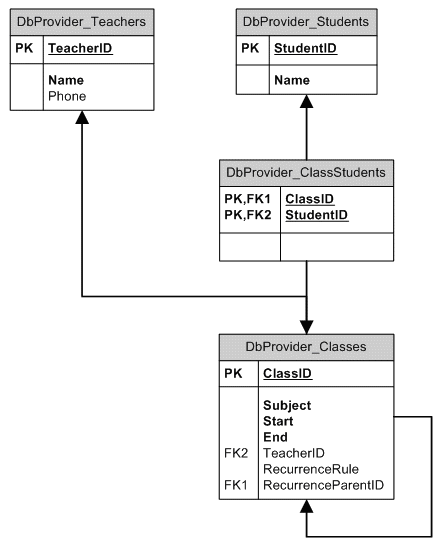

# Implementing a Provider That Supports Multi-Valued Resources


Although they are more difficult to implement, custom providers are more powerful than using data sources because you have more control over every detail of data access operations. Only custom providers can provide the support to allow multi-valued resources (resources that can have multiple values assigned to a single appointment).

>caution The provider is instantiated once per application domain and is shared across threads. __RadScheduler__ ensures basic thread safety by encapsulating each provider in a wrapper that provides locks around each of its public methods. However, you should take care of synchronizing access to instance field members where appropriate.
>


This example walks through the steps required to build a custom database-driven provider that supports multi-valued resources. The complete source code of the sample provider can be found in the App_Code directory of the Quick Start Framework.(C:\Program Files (x86)\Telerik\RadControls for ASP.NET AJAX Q3 2011\Live Demos\App_Code\Scheduler))

## Database Schema

This example uses a database containing student classes, teachers and students. Each class has one teacher and multiple students. Any student can attend any class. The complete schema for the database is shown below:



Each class is treated by the scheduler as an appointment. Teachers and students are treated as resource types. Note that we keep a cross-link table, __ClassStudents__, to store the many-to-many relationships between classes and students.

## The base class

To make the implementation of database-driven RadScheduler providers easier, Telerik.Web.UI includes an abstract base class - __DbSchedulerProviderBase__. This base class takes care of common configuration and initialization tasks. When initialization is complete, you can use the DbFactory object or the shortcut methods to create connections, parameters, etc. An outline of __DbSchedulerProviderBase__ is shown below:


>tabbedCode

````C#
	     
	public abstract class DbSchedulerProviderBase : SchedulerProviderBase
	{
	  protected DbProviderFactory DbFactory { get { ... }; set { ... }; }
	  protected bool PersistChanges { get { ... }; set { ... }; }
	  protected string ConnectionString { get { ... }; set { ... }; }
	  public override void Initialize(string name, NameValueCollection config) { ... }
	  protected virtual DbConnection OpenConnection() { ... }
	  protected virtual DbParameter CreateParameter(string name, object value) { ... }
	}  
				
````
````VB.NET
	
	Public MustInherit Class DbSchedulerProviderBase
	    Inherits SchedulerProviderBase
	    Protected Property DbFactory As DbProviderFactory
	        Get
	      ...
	        End Get
	        Set(ByVal value As DbProviderFactory)
	      ...
	        End Set
	    End Property
	    Protected Property PersistChanges As Boolean
	        Get
	      ...
	        End Get
	        Set(ByVal value As Boolean)
	      ...
	        End Set
	    End Property
	    Protected Property ConnectionString As String
	        Get
	      ...
	        End Get
	        Set(ByVal value As String)
	      ...
	        End Set
	    End Property
	    Public Overloads Overrides Sub Initialize( _
	                       ByVal name As String, _
	                       ByVal config As NameValueCollection)
	     ...
	    End Sub
	  Protected Virtual Function OpenConnection As DbConnection
	     ...
	  End Function
	  Protected Virtual Function CreateParameter( _
	                     ByVal name As String, _
	                     ByVal value As Object) As DbParameter
	     ...
	  End Function
	End Class
````
>end

## Implementing the provider

1. Declare the provider class, inheriting from __DbSchedulerProviderBase__:

>tabbedCode

````C#
	     
	public class MyDbSchedulerProvider : DbSchedulerProviderBase
	{
	  // ...
	}
				
````
````VB.NET
	
	Public MustInherit Class MyDbSchedulerProvider
	    Inherits DbSchedulerProviderBase
	    ' ...
	End Class
	
````
>endBoth __SchedulerProviderBase__ and __DbSchedulerProviderBase__ are abstract classes. The new provider class must provide an implementation for the abstract methods __GetAppointments__, __Insert__, __Update__, __Delete__, __GetResourceTypes__, and __GetResourcesByType__.

1. Before implementing the methods that deal with appointments, lay the groundwork by implementing the support for custom resources. The first step is to implement __GetResourceTypes__ to supply the scheduler with a list of available resource types. __GetResourceTypes__ returns only basic information: the name of the resource and a boolean value indicating whether the provider supports multiple resource values for that type. Because this provider supports multiple values of the Student resource, we indicate that now:

>tabbedCode

````C#
	
	public override IEnumerable<ResourceType> GetResourceTypes(RadScheduler owner)
	{
	  ResourceType[] resourceTypes = new ResourceType[2];
	  resourceTypes[0] = new ResourceType("Teacher", false);
	  resourceTypes[1] = new ResourceType("Student", true);
	  return resourceTypes;
	}
				
````
````VB.NET
	
	Public Overloads Overrides Function GetResourceTypes( _
	     ByVal owner As RadScheduler) As IEnumerable(Of ResourceType)
	    Dim resourceTypes As ResourceType() = New ResourceType(2) {}
	    resourceTypes(0) = New ResourceType("Teacher", False)
	    resourceTypes(1) = New ResourceType("Student", True)
	    Return resourceTypes
	End Function
	
````
>end

1. Implement the __GetResourcesByType__ method to supply the scheduler with a list of possible values given a resource type. This requires a query to the database to obtain the list of values. Once retrieved, the resources are cached. The base class, DbSchedulerProviderBase, provides the infrastructure for querying the database: The connection is established by calling __OpenConnection()__ and database commands are created using the __DbFactory__ object:

>tabbedCode

````C#
	     
	public override IEnumerable<Resource> GetResourcesByType(RadScheduler owner, string resourceType)
	{
	  switch (resourceType)
	  {
	     case "Teacher" :
	         return Teachers.Values;
	     case "Student" :
	         return Students.Values;
	     default:
	         throw new InvalidOperationException( "Unknown resource type: " + resourceType);
	  }
	}
	private IDictionary<int, Resource> Teachers
	{
	   get
	   {
	       if (_teachers == null)
	       {
	           _teachers = new Dictionary<int, Resource>();
	           foreach (Resource teacher in LoadTeachers())
	           {
	               _teachers.Add((int)teacher.Key, teacher);
	           }
	       }
	       return _teachers;
	   }
	}
	private IDictionary<int, Resource> Students
	{
	   get
	   {
	       _students = new Dictionary<int, Resource>();
	       foreach (Resource student in LoadStudents())
	       {
	           _students.Add((int)student.Key, student);
	       }
	       return _students;
	   }
	}
	private IEnumerable<Resource> LoadTeachers()
	{
	  List<Resource> resources = new List<Resource>();
	  using (DbConnection conn = OpenConnection())
	  {
	      DbCommand cmd = DbFactory.CreateCommand();
	      cmd.Connection = conn;
	      cmd.CommandText = "SELECT [TeacherID], [Name], [Phone] FROM [DbProvider_Teachers]";
	      using (DbDataReader reader = cmd.ExecuteReader())
	      {
	         while (reader.Read())
	         {
	            Resource res = new Resource();
	            res.Type = "Teacher";
	            res.Key = reader["TeacherID"];
	            res.Text = Convert.ToString(reader[ "Name" ]);
	            res.Attributes["Phone"] = Convert.ToString(reader["Phone"]);
	            resources.Add(res);
	         }
	      }
	  }
	  return resources;
	}
	
	private IEnumerable<Resource> LoadStudents()
	{
	  List<Resource> resources = new List<Resource>();
	  using (DbConnection conn = OpenConnection())
	  {
	      DbCommand cmd = DbFactory.CreateCommand();
	      cmd.Connection = conn;
	      cmd.CommandText = "SELECT [StudentID], [Name] FROM [DbProvider_Students]";
	      using (DbDataReader reader = cmd.ExecuteReader())
	      {
	          while (reader.Read())
	          {
	              Resource res = new Resource();
	              res.Type = "Student";
	              res.Key = reader["StudentID"];
	              res.Text = Convert.ToString(reader[ "Name" ]);
	              resources.Add(res);
	          }
	      }
	  }
	  return resources;
	}
				
````
````VB.NET
	
	Public Overloads Overrides Function GetResourcesByType(ByVal owner As RadScheduler, ByVal resourceType As String) As IEnumerable(Of Resource)
	    Select Case resourceType
	        Case "Teacher"
	            Return Teachers.Values
	        Case "Student"
	            Return Students.Values
	        Case Else
	            Throw New InvalidOperationException("Unknown resource type: " + resourceType)
	    End Select
	End Function
	Private ReadOnly Property Teachers() As IDictionary(Of Integer, Resource)
	    Get
	        If _teachers = Nothing Then
	            _teachers = New Dictionary(Of Integer, Resource)()
	            For Each teacher As Resource In LoadTeachers()
	                _teachers.Add(DirectCast(teacher.Key, Integer), teacher)
	            Next
	        End If
	        Return _teachers
	    End Get
	End Property
	Private ReadOnly Property Students() As IDictionary(Of Integer, Resource)
	    Get
	        _students = New Dictionary(Of Integer, Resource)()
	        For Each student As Resource In LoadStudents()
	            _students.Add(DirectCast(student.Key, Integer), student)
	        Next
	        Return _students
	    End Get
	End Property
	Private Function LoadTeachers() As IEnumerable(Of Resource)
	    Dim resources As New List(Of Resource)()
	    Using conn As DbConnection = OpenConnection()
	        Dim cmd As DbCommand = DbFactory.CreateCommand()
	        cmd.Connection = conn
	        cmd.CommandText = "SELECT [TeacherID], [Name], [Phone] FROM [DbProvider_Teachers]"
	        Using reader As DbDataReader = cmd.ExecuteReader()
	            While reader.Read()
	                Dim res As New Resource()
	                res.Type = "Teacher"
	                res.Key = reader("TeacherID")
	                res.Text = Convert.ToString(reader("Name"))
	                res.Attributes("Phone") = Convert.ToString(reader("Phone"))
	                resources.Add(res)
	            End While
	        End Using
	    End Using
	    Return resources
	End Function
	
	Private Function LoadStudents() As IEnumerable(Of Resource)
	    Dim resources As New List(Of Resource)()
	    Using conn As DbConnection = OpenConnection()
	        Dim cmd As DbCommand = DbFactory.CreateCommand()
	        cmd.Connection = conn
	        cmd.CommandText = "SELECT [StudentID], [Name] FROM [DbProvider_Students]"
	        Using reader As DbDataReader = cmd.ExecuteReader()
	            While reader.Read()
	                Dim res As New Resource()
	                res.Type = "Student"
	                res.Key = reader("StudentID")
	                res.Text = Convert.ToString(reader("Name"))
	                resources.Add(res)
	            End While
	        End Using
	    End Using
	    Return resources
	End Function
	
````
>end

1. While we are working with resources, create a private helper method to read the resources for an appointment and assign them to the appointment object. This method will be useful when the provider reads appointments from the database. Note that the resource objects are read from cache.

>tabbedCode

````C#
	
	private void LoadResources(Appointment apt)
	{
	   using (DbConnection conn = OpenConnection())
	   {
	       DbCommand cmd = DbFactory.CreateCommand();
	       cmd.Connection = conn;
	       cmd.Parameters.Add(CreateParameter("@ClassID", apt.ID));
	       cmd.CommandText = "SELECT [TeacherID] FROM [DbProvider_Classes] WHERE [ClassID] = @ClassID AND [TeacherID] IS NOT NULL";
	       using (DbDataReader reader = cmd.ExecuteReader())
	       {
	           if (reader.Read())
	           {
	               Resource teacher = Teachers[Convert.ToInt32(reader["TeacherID"])];
	               apt.Resources.Add(teacher);
	           }
	       }
	       cmd.Parameters.Clear();
	       cmd.Parameters.Add(CreateParameter("@ClassID", apt.ID));
	       cmd.CommandText = "SELECT [StudentID] FROM [DbProvider_ClassStudents] WHERE [ClassID] = @ClassID";
	       using (DbDataReader reader = cmd.ExecuteReader())
	       {
	           while (reader.Read())
	           {
	               Resource student = Students[Convert.ToInt32(reader["StudentID"])];
	               apt.Resources.Add(student);
	           }
	       }
	   }
	}  
				
````
````VB.NET
	
	Private Sub LoadResources(ByVal apt As Appointment)
	    Using conn As DbConnection = OpenConnection()
	        Dim cmd As DbCommand = DbFactory.CreateCommand()
	        cmd.Connection = conn
	        cmd.Parameters.Add(CreateParameter("@ClassID", apt.ID))
	        cmd.CommandText = "SELECT [TeacherID] FROM [DbProvider_Classes] WHERE [ClassID] = @ClassID AND [TeacherID] IS NOT NULL"
	        Using reader As DbDataReader = cmd.ExecuteReader()
	            If reader.Read() Then
	                Dim teacher As Resource = Teachers(Convert.ToInt32(reader("TeacherID")))
	                apt.Resources.Add(teacher)
	            End If
	        End Using
	        cmd.Parameters.Clear()
	        cmd.Parameters.Add(CreateParameter("@ClassID", apt.ID))
	        cmd.CommandText = "SELECT [StudentID] FROM [DbProvider_ClassStudents] WHERE [ClassID] = @ClassID"
	        Using reader As DbDataReader = cmd.ExecuteReader()
	            While reader.Read()
	                Dim student As Resource = Students(Convert.ToInt32(reader("StudentID")))
	                apt.Resources.Add(student)
	            End While
	        End Using
	    End Using
	End Sub
	
````
>end

1. Provide the implementation for __GetAppointments__ to supply the scheduler with a list of all the appointments in the database. Note that this assigns an owner and a class ID before calling LoadResources to load the resources for the appointment:

>tabbedCode

````C#
	     
	public override IEnumerable<Appointment> GetAppointments(RadScheduler owner)
	{
	  List<Appointment> appointments = new List<Appointment>();
	  using (DbConnection conn = OpenConnection())
	  {
	     DbCommand cmd = DbFactory.CreateCommand();
	     cmd.Connection = conn;
	     cmd.CommandText = "SELECT [ClassID], [Subject], [Start], [End], [RecurrenceRule], [RecurrenceParentId] FROM [DbProvider_Classes]";
	     using (DbDataReader reader = cmd.ExecuteReader())
	     {
	        while (reader.Read())
	        {
	           Appointment apt = new Appointment();
	           apt.Owner = owner;
	           apt.ID = reader["ClassID"];
	           apt.Subject = Convert.ToString(reader["Subject"]);
	           apt.Start = DateTime.SpecifyKind(Convert.ToDateTime(reader["Start"]), DateTimeKind.Utc);
	           apt.End = DateTime.SpecifyKind(Convert.ToDateTime(reader["End"]), DateTimeKind.Utc);
	           apt.RecurrenceRule = Convert.ToString(reader["RecurrenceRule"]);
	           apt.RecurrenceParentID = reader["RecurrenceParentId"] == DBNull.Value ? null : reader["RecurrenceParentId" ];
	           if (apt.RecurrenceParentID != null)
	           {
	              apt.RecurrenceState = RecurrenceState.Exception;
	           }
	           else if (apt.RecurrenceRule != string.Empty)
	           {
	              apt.RecurrenceState = RecurrenceState.Master;
	           }
	           LoadResources(apt);
	           appointments.Add(apt);
	        }
	     }
	  }
	  return appointments;
	}  
				
````
````VB.NET
	
	Public Overloads Overrides Function GetAppointments( _
	            ByVal owner As RadScheduler) As IEnumerable(Of Appointment)
	    Dim appointments As New List(Of Appointment)()
	    Using conn As DbConnection = OpenConnection()
	        Dim cmd As DbCommand = DbFactory.CreateCommand()
	        cmd.Connection = conn
	        cmd.CommandText = "SELECT [ClassID], [Subject], [Start], [End]," + _
	           "[RecurrenceRule], [RecurrenceParentId] FROM [DbProvider_Classes]"
	        Using reader As DbDataReader = cmd.ExecuteReader()
	            While reader.Read()
	                Dim apt As New Appointment()
	                apt.Owner = owner
	                apt.ID = reader("ClassID")
	                apt.Subject = Convert.ToString(reader("Subject"))
	                apt.Start = DateTime.SpecifyKind(Convert.ToDateTime(reader("Start")), _
	                                               DateTimeKind.Utc)
	                apt.[End] = DateTime.SpecifyKind(Convert.ToDateTime(reader("End")), _
	                                               DateTimeKind.Utc)
	                apt.RecurrenceRule = Convert.ToString(reader("RecurrenceRule"))
	                apt.RecurrenceParentID = IIf(reader("RecurrenceParentId") = _
	                                DBNull.Value, Nothing, reader("RecurrenceParentId"))
	                If apt.RecurrenceParentID <> Nothing Then
	                    apt.RecurrenceState = RecurrenceState.Exception
	                ElseIf apt.RecurrenceRule <> String.Empty Then
	                    apt.RecurrenceState = RecurrenceState.Master
	                End If
	                LoadResources(apt)
	                appointments.Add(apt)
	            End While
	        End Using
	    End Using
	    Return appointments
	End Function
	
````
>end

>note Note that this method reads UTC dates from the database. To make this clear to __RadScheduler__ it calls __DateTime.SpecifyKind()__ . You should store dates in UTC format to ensure proper handling of[time zones]().
>
This method gets a reference to the scheduler as a parameter (owner). You can use the RadScheduler properties to optimize your query. For example, the __VisibleRangeStart__ and __VisibleRangeEnd__ properties can be used to limit the number of records that the query retrieves. Recurring appointments are evaluated in-memory, however, so they should be always retrieved regardless of __VisibleRangeStart__ and __VisibleRangeEnd__.

1. Before proceeding to the __Insert__, __Update__, and __Delete__ commands, the provider needs a few more helper functions. Because the provider is supporting multiple students for each class, it needs helper functions to add and delete these many-to-many relationships in the cross-link table (__ClassStudents__):

>tabbedCode

````C#
	     
	private void FillClassStudents(Appointment appointment, DbCommand cmd, object classId)
	{
	  foreach (Resource student in appointment.Resources.GetResourcesByType("Student"))
	  {
	      cmd.Parameters.Clear();
	      cmd.Parameters.Add(CreateParameter("@ClassID", classId));
	      cmd.Parameters.Add(CreateParameter("@StudentID", student.Key));
	      cmd.CommandText = "INSERT INTO [DbProvider_ClassStudents] ([ClassID], [StudentID]) VALUES (@ClassID, @StudentID)";
	      cmd.ExecuteNonQuery();
	  }
	}
	private void ClearClassStudents(object classId, DbCommand cmd)
	{
	  cmd.Parameters.Clear();
	  cmd.Parameters.Add(CreateParameter("@ClassID", classId));
	  cmd.CommandText = "DELETE FROM [DbProvider_ClassStudents] WHERE [ClassID] = @ClassID";
	  cmd.ExecuteNonQuery();
	}  
				
````
````VB.NET
	
	Private Sub FillClassStudents(ByVal appointment As Appointment, _
	                        ByVal cmd As DbCommand, ByVal classId As Object)
	    For Each student As Resource In _
	        appointment.Resources.GetResourcesByType("Student")
	        cmd.Parameters.Clear()
	        cmd.Parameters.Add(CreateParameter("@ClassID", classId))
	        cmd.Parameters.Add(CreateParameter("@StudentID", student.Key))
	        cmd.CommandText = "INSERT INTO [DbProvider_ClassStudents] " +
	                  "([ClassID], [StudentID]) VALUES (@ClassID, @StudentID)"
	        cmd.ExecuteNonQuery()
	    Next
	End Sub
	Private Sub ClearClassStudents(ByVal classId As Object, ByVal cmd As DbCommand)
	    cmd.Parameters.Clear()
	    cmd.Parameters.Add(CreateParameter("@ClassID", classId))
	    cmd.CommandText = "DELETE FROM [DbProvider_ClassStudents]" + _
	             "WHERE [ClassID] = @ClassID"
	    cmd.ExecuteNonQuery()
	End Sub
	
````
>end

1. To simplify creating parameters in the Insert and Update methods, add another helper function:

>tabbedCode

````C#
	     
	private void PopulateAppointmentParameters(DbCommand cmd, Appointment apt)
	{
	  cmd.Parameters.Add(CreateParameter("@Subject", apt.Subject));
	  cmd.Parameters.Add(CreateParameter("@Start", apt.Start));
	  cmd.Parameters.Add(CreateParameter("@End", apt.End));
	  Resource teacher = apt.Resources.GetResourceByType("Teacher");
	  object teacherId = null;
	  if (teacher != null)
	  {
	      teacherId = teacher.Key;
	  }
	  cmd.Parameters.Add(CreateParameter("@TeacherID", teacherId));
	  string rrule = null;
	  if (apt.RecurrenceRule != string.Empty)
	  {
	      rrule = apt.RecurrenceRule;
	  }
	  cmd.Parameters.Add(CreateParameter("@RecurrenceRule" , rrule));
	  object parentId = null;
	  if (apt.RecurrenceParentID != null)
	  {
	      parentId = apt.RecurrenceParentID;
	  }
	  cmd.Parameters.Add(CreateParameter("@RecurrenceParentId" , parentId));
	} 
				
````
````VB.NET
	
	Private Sub PopulateAppointmentParameters(ByVal cmd As DbCommand, _
	                                          ByVal apt As Appointment)
	    cmd.Parameters.Add(CreateParameter("@Subject", apt.Subject))
	    cmd.Parameters.Add(CreateParameter("@Start", apt.Start))
	    cmd.Parameters.Add(CreateParameter("@End", apt.[End]))
	    Dim teacher As Resource = apt.Resources.GetResourceByType("Teacher")
	    Dim teacherId As Object = Nothing
	    If teacher <> Nothing Then
	        teacherId = teacher.Key
	    End If
	    cmd.Parameters.Add(CreateParameter("@TeacherID", teacherId))
	    Dim rrule As String = Nothing
	    If apt.RecurrenceRule <> String.Empty Then
	        rrule = apt.RecurrenceRule
	    End If
	    cmd.Parameters.Add(CreateParameter("@RecurrenceRule", rrule))
	    Dim parentId As Object = Nothing
	    If apt.RecurrenceParentID <> Nothing Then
	        parentId = apt.RecurrenceParentID
	    End If
	    cmd.Parameters.Add(CreateParameter("@RecurrenceParentId", parentId))
	End Sub
	
````
>end

1. Inserting appointments is a bit complicated as you need to retrieve the identity value. A stored procedure might be of help here. However, in order to target both MS SQL Server and MS Access, the provider uses normal queries. The __Insert__ method breaks abstraction for the sake of data integrity: MS SQL Server provides the SCOPE_IDENTITY() function to retrieve the identity value of the current transaction, unlike @@IDENTITY that is a global identity value. After inserting the new class and obtaining its identity value, the identity value is passed to the __FillClassStudents__ method, to create the many-to-many relationship between classes and students. The __Insert__ method works in a transaction to ensure data integrity.

>tabbedCode

````C#
	     
	public override void Insert(RadScheduler owner, Appointment appointmentToInsert)
	{
	  if (!PersistChanges)
	  {
	       return;
	  }
	  using (DbConnection conn = OpenConnection())
	  {
	      using (DbTransaction tran = conn.BeginTransaction())
	      {
	          DbCommand cmd = DbFactory.CreateCommand();
	          cmd.Connection = conn;
	          cmd.Transaction = tran;
	          PopulateAppointmentParameters(cmd, appointmentToInsert);
	          cmd.CommandText =
	               @" INSERT INTO [DbProvider_Classes]
	                           ([Subject], [Start], [End], [TeacherID],
	                          [RecurrenceRule], [RecurrenceParentID])
	                  VALUES (@Subject, @Start, @End, @TeacherID,
	                          @RecurrenceRule, @RecurrenceParentID)";
	          if (DbFactory is SqlClientFactory)
	          {
	              cmd.CommandText += Environment.NewLine + "SELECT SCOPE_IDENTITY()";
	          }
	          else
	          {
	              cmd.ExecuteNonQuery();
	              cmd.CommandText = "SELECT @@IDENTITY";
	          }
	          int identity = Convert.ToInt32(cmd.ExecuteScalar());
	          FillClassStudents(appointmentToInsert, cmd, identity);
	          tran.Commit();
	      }
	  }
	}  
	
	
				
````
````VB.NET
	
	Public Overloads Overrides Sub Insert(ByVal owner As RadScheduler, _
	                             ByVal appointmentToInsert As Appointment)
	    If Not PersistChanges Then
	        Return
	    End If
	    Using conn As DbConnection = OpenConnection()
	        Using tran As DbTransaction = conn.BeginTransaction()
	            Dim cmd As DbCommand = DbFactory.CreateCommand()
	            cmd.Connection = conn
	            cmd.Transaction = tran
	            PopulateAppointmentParameters(cmd, appointmentToInsert)
	     cmd.CommandText = " INSERT INTO [DbProvider_Classes]" & Chr(13) & _
	           "" & Chr(10) & " ([Subject], [Start], [End], [TeacherID]," & _
	           Chr(13) & "" & Chr(10) & _
	           "[RecurrenceRule], [RecurrenceParentID])" & Chr(13) & "" & _
	           Chr(10) & " VALUES (@Subject, @Start, @End, @TeacherID," & _
	           Chr(13) & "" & Chr(10) & @RecurrenceRule, @RecurrenceParentID)"
	            If TypeOf DbFactory Is SqlClientFactory Then
	                cmd.CommandText += Environment.NewLine + "SELECT SCOPE_IDENTITY()"
	            Else
	                cmd.ExecuteNonQuery()
	                cmd.CommandText = "SELECT @@IDENTITY"
	            End If
	            Dim identity As Integer = Convert.ToInt32(cmd.ExecuteScalar())
	            FillClassStudents(appointmentToInsert, cmd, identity)
	            tran.Commit()
	        End Using
	    End Using
	End Sub
	
	
````
>end

1. The most challenging part of the update operation is to manage the many-to-many relationship. The provider needs to clear the cross-link table entries for the appointment and recreate them from scratch:

>tabbedCode

````C#
	
	public override void Update(RadScheduler owner, Appointment appointmentToUpdate)
	{
	  if (!PersistChanges)
	  {
	       return;
	  }
	  using (DbConnection conn = OpenConnection())
	  {
	       using (DbTransaction tran = conn.BeginTransaction())
	      {
	          DbCommand cmd = DbFactory.CreateCommand();
	          cmd.Connection = conn;
	          cmd.Transaction = tran;
	          PopulateAppointmentParameters(cmd, appointmentToUpdate);
	          cmd.Parameters.Add(CreateParameter( "@ClassID", appointmentToUpdate.ID));
	          cmd.CommandText = "UPDATE [DbProvider_Classes] SET [Subject] = @Subject, [Start] = @Start, [End] = @End, [TeacherID] = @TeacherID, [RecurrenceRule] = @RecurrenceRule, [RecurrenceParentID] = @RecurrenceParentID WHERE [ClassID] = @ClassID";
	          cmd.ExecuteNonQuery();
	          ClearClassStudents(appointmentToUpdate.ID, cmd);
	          FillClassStudents(appointmentToUpdate, cmd, appointmentToUpdate.ID);
	          tran.Commit();
	      }
	  }
	} 
				
````
````VB.NET
	
	Public Overloads Overrides Sub Update(ByVal owner As RadScheduler, _
	                            ByVal appointmentToUpdate As Appointment)
	    If Not PersistChanges Then
	        Return
	    End If
	    Using conn As DbConnection = OpenConnection()
	        Using tran As DbTransaction = conn.BeginTransaction()
	            Dim cmd As DbCommand = DbFactory.CreateCommand()
	            cmd.Connection = conn
	            cmd.Transaction = tran
	            PopulateAppointmentParameters(cmd, appointmentToUpdate)
	            cmd.Parameters.Add(CreateParameter("@ClassID", appointmentToUpdate.ID))
	            cmd.CommandText = "UPDATE [DbProvider_Classes]" + _
	                 " SET [Subject] = @Subject, [Start] = @Start, " + _
	                 "[End] = @End, [TeacherID] = @TeacherID, " + _
	                 "[RecurrenceRule] = @RecurrenceRule, " + _
	                 "[RecurrenceParentID] = @RecurrenceParentID WHERE " + _
	                 "[ClassID] = @ClassID"
	            cmd.ExecuteNonQuery()
	            ClearClassStudents(appointmentToUpdate.ID, cmd)
	            FillClassStudents(appointmentToUpdate, cmd, appointmentToUpdate.ID)
	            tran.Commit()
	        End Using
	    End Using
	End Sub
	
````
>end

1. The __Delete__ method executes two queries: one to delete the entries for the appointment in the cross-link table and another to delete the appointment itself.

>tabbedCode

````C#
	     
	public override void Delete(RadScheduler owner, Appointment appointmentToDelete)
	{
	 if (!PersistChanges)
	 {
	   return;
	 }
	 using (DbConnection conn = OpenConnection())
	 {
	   DbCommand cmd = DbFactory.CreateCommand();
	   cmd.Connection = conn;
	   using (DbTransaction tran = conn.BeginTransaction())
	   {
	     cmd.Transaction = tran;
	     ClearClassStudents(appointmentToDelete.ID, cmd);
	     cmd.Parameters.Clear();
	     cmd.Parameters.Add(CreateParameter( "@ClassID", appointmentToDelete.ID));
	     cmd.CommandText = "DELETE FROM [DbProvider_Classes] WHERE [ClassID] = @ClassID";
	     cmd.ExecuteNonQuery();
	     tran.Commit();
	   }
	 }
	} 
				
````
````VB.NET
	
	Public Overloads Overrides Sub Delete(ByVal owner As RadScheduler, _
	                             ByVal appointmentToDelete As Appointment)
	    If Not PersistChanges Then
	        Return
	    End If
	    Using conn As DbConnection = OpenConnection()
	        Dim cmd As DbCommand = DbFactory.CreateCommand()
	        cmd.Connection = conn
	        Using tran As DbTransaction = conn.BeginTransaction()
	            cmd.Transaction = tran
	            ClearClassStudents(appointmentToDelete.ID, cmd)
	            cmd.Parameters.Clear()
	            cmd.Parameters.Add(CreateParameter("@ClassID", appointmentToDelete.ID))
	            cmd.CommandText = "DELETE FROM [DbProvider_Classes] WHERE " + _
	                              "[ClassID] = @ClassID"
	            cmd.ExecuteNonQuery()
	            tran.Commit()
	        End Using
	    End Using
	End Sub
	
	
````
>end

# See Also

 * [Using a Data Provider]()

 * [Implementing a Provider]()

 * [Custom Resources and Attributes]()
