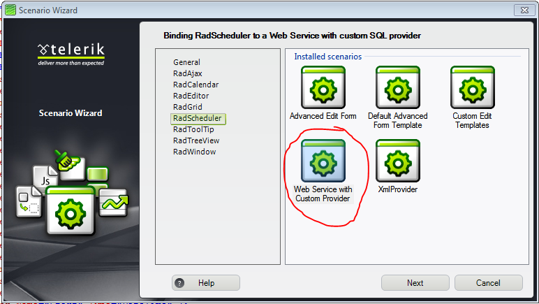

# Implementing a Provider


## 

To implement a __RadScheduler__ provider, you create a class that inherits from __SchedulerProviderBase__.It must implement the __GetAppointments__, __Insert__, __Update__, __Delete__, __GetResourceTypes__ and __GetResourcesByType__ methods.

>note The provider is instantiated once per application domain and is shared across threads. __RadScheduler__ ensures basic thread safety by encapsulating each provider in a wrapper that provides locks around each of its public methods.
>


This example shows how to create the XML-based provider that is already included in the Telerik.Web.UI assembly, along with __RadScheduler__ itself. It is a lightweight and easy to deploy alternative to using a full-blown database. The provider uses an XML file to store information about each appointment. The XML file also contains information about the custom resources and some implementation-specific details such as the next appointment identity key. The XML file looks like this:

````XML
	
	<?xml version="1.0" encoding="utf-8"?>
	<Appointments>
	  <NextID>3</NextID>
	  <Resources>
	      <Room>
	          <Key>1</Key>
	          <Text>Meeting room 101</Text>
	      </Room>
	      <Room>
	          <Key>2</Key>
	          <Text>Meeting room 201</Text>
	      </Room>
	      <User>
	          <Key>1</Key>
	          <Text>Alex</Text>
	      </User>
	      <User>
	          <Key>2</Key>
	          <Text>Bob</Text>
	      </User>
	      <User>
	          <Key>3</Key>
	          <Text>Charlie</Text>
	      </User>
	  </Resources>
	  <Appointment>
	      <ID>1</ID>
	      <Subject>Technical meeting</Subject>
	      <Start>2007-03-30T06:00Z</Start>
	      <End>2007-03-30T07:00Z</End>
	      <RecurrenceRule>
	          <![CDATA[
	          DTSTART:20070330T060000Z
	          DTEND:20070330T070000Z
	          RRULE:FREQ=DAILY;INTERVAL=1;BYDAY=MO,TU,WE,TH,FR;
	          ]]>
	      </RecurrenceRule>
	      <Resources>
	          <Room Key="1" />
	          <User Key="1" />
	      </Resources>
	      <Attribute Key="CustomAttribute" Value="1" />
	  </Appointment>
	  <Appointment>
	      <ID>2</ID>
	      <Subject>Lunch</Subject>
	      <Start>2007-03-30T09:00Z</Start>
	      <End>2007-03-30T10:00Z</End>
	      <Resources>
	          <User Key="1" />
	      </Resources>
	  </Appointment>
	</Appointments>      
	
````


1. The new provider class is called MyXmlSchedulerProvider, to distinguish it from the provider in the Telerik.Web.UI assembly that we are copying. It must be derived from SchedulerProviderBase. In order to implement it, we need to include a number of assemblies, including Telerik.Web.UI, System.Xml, System.IO, System.Configuration.Provider, System.Collections.Specialized, and System.Collections.Generic.

>tabbedCode

````C#
	     
	using System;
	using System.Collections.Generic;
	using System.Collections.Specialized;
	using System.Configuration.Provider;
	using System.IO;
	using System.Xml;
	using Telerik.Web.UI;
	namespace MyNamespace
	{
	 public class MyXmlSchedulerProvider : SchedulerProviderBase
	 {
	 }
	}  
	
````
````VB.NET
	
	Imports System
	Imports System.Collections.Generic
	Imports System.Collections.Specialized
	Imports System.Configuration.Provider
	Imports System.IO
	Imports System.Xml
	Imports Telerik.Web.UI
	Namespace MyNamespace
	        Public Class MyXmlSchedulerProvider
	            Inherits SchedulerProviderBase
	        End Class
	    End Namespace
	
````
>end

1. Add to the provider some private fields for holding basic information. These include an XmlDocument instance for manipulating the XML data file, a list of resources, and basic state and configuration information:

>tabbedCode

````C#
	     
	private const string DateFormatString = "yyyy-MM-ddTHH:mmZ";
	private XmlDocument _doc;
	private string _dataFileName;
	private int _nextID;
	private List<Resource> _resources;
	private bool _persistChanges;
	private bool _documentLoaded;
				
````
````VB.NET
	
	    Private Const DateFormatString As String = "yyyy-MM-ddTHH:mmZ"
	    Private _doc As XmlDocument
	    Private _dataFileName As String
	    Private _nextID As Integer
	    Private _resources As List(Of Resource)
	    Private _persistChanges As Boolean
	    Private _documentLoaded As Boolean
	    Private _resourceType As String
	
````
>end

1. Before implementing the constructors, we need two helper functions for reading from the XML document.__ReadNextID__() looks up the next appointment ID. __LoadResources__() loads the resource data from the XML document.

>tabbedCode

````C#
	     
	private int ReadNextID()
	{
	  return int.Parse(_doc.SelectSingleNode(
	                            "//Appointments/NextID").InnerText);
	}
	private void LoadResources()
	{
	  _resources = new List<Resource>();
	  foreach (XmlNode resourcesNode in _doc.SelectNodes(
	                                   "//Appointments/Resources"))
	  {
	     foreach (XmlNode resourceNode in resourcesNode.ChildNodes)
	     {
	        Resource resource = new Resource();
	        _resources.Add(resource);
	        resource.Type = resourceNode.Name;
	        foreach (XmlNode resourceData in resourceNode.ChildNodes)
	        {
	          switch (resourceData.Name)
	          {
	             case "Key":
	                resource.Key = resourceData.InnerText;
	                break;
	             case "Text":
	                resource.Text = resourceData.InnerText;
	                break;
	          }
	        }
	     }
	  }
	} 
				
````
````VB.NET
	
	    Private Function ReadNextID() As Integer
	        Return Integer.Parse( _
	            _doc.SelectSingleNode("//Appointments/NextID").InnerText)
	    End Function
	    Private Sub LoadResources()
	        _resources = New List(Of Resource)()
	        For Each resourcesNode As XmlNode _
	                      In _doc.SelectNodes("//Appointments/Resources")
	            For Each resourceNode As XmlNode In resourcesNode.ChildNodes
	                Dim resource As New Resource()
	                _resources.Add(resource)
	                resource.Type = resourceNode.Name
	                For Each resourceData As XmlNode In resourceNode.ChildNodes
	                    Select Case resourceData.Name
	                        Case "Key"
	                            resource.Key = resourceData.InnerText
	                            Exit Select
	                        Case "Text"
	                            resource.Text = resourceData.InnerText
	                            Exit Select
	                    End Select
	                Next
	            Next
	        Next
	    End Sub
	
````
>end

1. The constructor initializes the global fields to save the XML document that it uses to manipulate its data, the first ID to use for an appointment,the persistChanges flag, and a boolean indicating that the XML document has been loaded. For added flexibility, the providerimplements two additional constructors that allow it to be configured at run-time. They allow using a XmlDocument instance or a file as a data store:

>tabbedCode

````C#
	     
	public XmlSchedulerProvider()
	{
	   _doc = new XmlDocument();
	   _nextID = 1;
	   _persistChanges = false;
	   _documentLoaded = true;
	}
	public XmlSchedulerProvider(string dataFileName, bool persistChanges)
	{
	  _dataFileName = dataFileName;
	  _doc = new XmlDocument();
	  _doc.Load(_dataFileName);
	  _nextID = ReadNextID();
	  LoadResources();
	  _persistChanges = persistChanges;
	 _documentLoaded = true;
	}
	public XmlSchedulerProvider(XmlDocument doc)
	{
	  _doc = doc;
	  _nextID = ReadNextID();
	  LoadResources();
	  _persistChanges = false;
	  _documentLoaded = true;
	} 
				
````
````VB.NET
	
	    Public Sub New()
	        _doc = New XmlDocument()
	        _nextID = 1
	        _persistChanges = False
	        _documentLoaded = True
	    End Sub
	    Public Sub New(ByVal dataFileName As String, _
	                   ByVal persistChanges As Boolean)
	        _dataFileName = dataFileName
	        _doc = New XmlDocument()
	        _doc.Load(_dataFileName)
	        _nextID = ReadNextID()
	        LoadResources()
	        _persistChanges = persistChanges
	        _documentLoaded = True
	    End Sub
	    Public Sub New(ByVal doc As XmlDocument)
	        _doc = doc
	        _nextID = ReadNextID()
	        LoadResources()
	        _persistChanges = False >
	        _documentLoaded = True
	    End Sub
	
	
	
````
>end

1. In order to support declarative configuration by a Web.config section, the provider overrides the __Initialize__ method.After checking for valid parameters, __Initialize__ calls its base implementation and uses the config collectionto read the configuration values. The "persistChanges" attribute defaults to "true" if not specified. The actual loading of the documentis deferred for performance reasons.

>tabbedCode

````C#
	     
	public override void Initialize(string name, NameValueCollection config)
	{
	  if (config == null)
	  {
	      throw new ArgumentNullException("config");
	  }
	  if (string.IsNullOrEmpty(name))
	  {
	      name = "XmlSchedulerProvider";
	  }
	  base.Initialize(name, config);
	  _dataFileName = config["fileName"];
	  if (string.IsNullOrEmpty(_dataFileName))
	  {
	      throw new ProviderException("Missing XML data file name. Please specify it with the fileName property.");
	  }
	  string persistChanges = config["persistChanges"];
	  if (!string.IsNullOrEmpty(persistChanges))
	  {
	      if (!bool.TryParse(persistChanges, out _persistChanges))
	      {
	          throw new ProviderException("Invalid value for PersistChanges attribute. Use 'True' or 'False'.");
	      }
	  }
	  else
	  {
	      _persistChanges = true;
	  }
	  _documentLoaded = false;
	} 
				
````
````VB.NET
	
	    Public Overloads Overrides Sub Initialize( _
	                     ByVal name As String, _
	                     ByVal config As NameValueCollection)
	        If config = Nothing Then
	            Throw New ArgumentNullException("config")
	        End If
	        If String.IsNullOrEmpty(name) Then
	            name = "XmlSchedulerProvider"
	        End If
	        MyBase.Initialize(name, config)
	        _dataFileName = config("fileName")
	        If String.IsNullOrEmpty(_dataFileName) Then
	            Throw New ProviderException("Missing XML data file name." + _
	                        "Please specify it with the fileName property.")
	        End If
	        Dim persistChanges As String = config("persistChanges")
	        If Not String.IsNullOrEmpty(persistChanges) Then
	            If Not Boolean.TryParse(persistChanges, _persistChanges) Then
	                Throw New ProviderException("Invalid value for" + _
	                        "PersistChanges attribute. Use 'True' or 'False'.")
	            End If
	        Else
	            _persistChanges = True
	        End If
	        _documentLoaded = False
	    End Sub
	
````
>end

1. A provider must implement the __GetAppointments__, __Insert__,__Update__, __Delete__, __GetResourceTypes__, and__GetResourcesByTypes__ methods. However, before implementing these methods, we add some more helper functions. __SaveAppointmentResources__ adds the resources for an appointment to the XML node for that appointment. __SaveAppointmentAttributes__ adds any custom attributes for the appointment to its XML node.__CreateAppointmentNode__ adds a node to the XML document that gets its data from an __Appointment__ object.__LoadDataFile__ checks whether the XML document needs to be loaded from the file, and if so, loads it and initializesthe _nextID field. __SaveDataFile__ saves the XML document to the associated file.__EnsureFilePath__calls __Page.MapPath__ to resolve the XML file name.

>tabbedCode

````C#
	     
	private void SaveAppointmentResources(Appointment appointment, XmlNode appointmentNode)
	{
	  if (appointment.Resources.Count == 0)
	  {
	     return;
	  }
	  XmlNode resourcesGroupNode = _doc.CreateNode(XmlNodeType.Element, "Resources", string.Empty);
	  appointmentNode.AppendChild(resourcesGroupNode);
	  foreach (Resource res in appointment.Resources)
	  {
	     XmlNode resourceNode = _doc.CreateNode(XmlNodeType.Element, res.Type, string.Empty);
	     resourcesGroupNode.AppendChild(resourceNode);
	     XmlAttribute keyAttribute = _doc.CreateAttribute("Key");
	     resourceNode.Attributes.Append(keyAttribute);
	     keyAttribute.InnerText = res.Key.ToString();
	   }
	}
	private void SaveAppointmentAttributes(Appointment appointment, XmlNode appointmentNode)
	{
	  foreach (string attribute in appointment.Attributes.Keys)
	  {
	    if (appointment.Attributes[attribute] != string.Empty)
	    {
	      XmlNode attributeNode = _doc.CreateNode(XmlNodeType.Element, "Attribute", string.Empty);
	      appointmentNode.AppendChild(attributeNode);
	      XmlAttribute keyAttribute = _doc.CreateAttribute("Key");
	      attributeNode.Attributes.Append(keyAttribute);
	      keyAttribute.InnerText = attribute;
	      XmlAttribute valueAttribute = _doc.CreateAttribute("Value");
	      attributeNode.Attributes.Append(valueAttribute);
	      valueAttribute.InnerText = appointment.Attributes[attribute];
	    }
	  }
	}
	private XmlNode CreateAppointmentNode(Appointment appointment)
	{
	  XmlNode appointmentNode = _doc.CreateNode(XmlNodeType.Element, "Appointment", string.Empty);
	  XmlNode appointmentID = _doc.CreateNode(XmlNodeType.Element, "ID", string.Empty);
	  appointmentID.InnerText = appointment.ID.ToString();
	  appointmentNode.AppendChild(appointmentID);
	  XmlNode appointmentSubject = _doc.CreateNode(XmlNodeType.Element, "Subject", string.Empty);
	  appointmentSubject.InnerText = appointment.Subject;
	  appointmentNode.AppendChild(appointmentSubject);
	  XmlNode appointmentStart = _doc.CreateNode(XmlNodeType.Element, "Start", string.Empty);
	  appointmentStart.InnerText = appointment.Start.ToUniversalTime().ToString(DateFormatString);
	  appointmentNode.AppendChild(appointmentStart);
	  XmlNode appointmentEnd = _doc.CreateNode(XmlNodeType.Element, "End", string.Empty);
	  appointmentEnd.InnerText = appointment.End.ToUniversalTime().ToString(DateFormatString);
	  appointmentNode.AppendChild(appointmentEnd);
	  if (!string.IsNullOrEmpty(appointment.RecurrenceRule))
	  {
	    XmlNode appointmentRecurrenceRule = _doc.CreateNode(XmlNodeType.Element, "RecurrenceRule", string.Empty);
	    appointmentNode.AppendChild(appointmentRecurrenceRule);
	    XmlNode recurrenceRuleCdata = _doc.CreateNode(XmlNodeType.CDATA, string.Empty, string.Empty);
	    appointmentRecurrenceRule.AppendChild(recurrenceRuleCdata);
	    recurrenceRuleCdata.InnerText = appointment.RecurrenceRule;
	  }
	  if (appointment.RecurrenceState == RecurrenceState.Exception)
	  {
	     XmlNode appointmentRecurrenceParentID =
	       _doc.CreateNode(XmlNodeType.Element, "RecurrenceParentID", string.Empty);
	     appointmentRecurrenceParentID.InnerText = appointment.RecurrenceParentID.ToString();
	     appointmentNode.AppendChild(appointmentRecurrenceParentID);
	  }
	  SaveAppointmentResources(appointment, appointmentNode);
	  SaveAppointmentAttributes(appointment, appointmentNode);
	  return appointmentNode;
	}
	private void LoadDataFile()
	{
	  if (string.IsNullOrEmpty(_dataFileName) || _documentLoaded)
	  {
	      return;
	   }
	   _doc.Load(_dataFileName);
	   _nextID = ReadNextID();
	   LoadResources();
	   _documentLoaded = true;
	}
	private void SaveDataFile()
	{
	   if (_persistChanges && !string.IsNullOrEmpty(_dataFileName))
	   {
	       _doc.Save(_dataFileName);
	    }
	}
	private void EnsureFilePath(RadScheduler owner)
	{
	   if ((owner.Page == null) || File.Exists(_dataFileName))
	   {
	       return;
	    }
	    _dataFileName = owner.Page.MapPath(_dataFileName);
	} 
				
````
````VB.NET
	
	    Private Sub SaveAppointmentResources( _
	                   ByVal appointment As Appointment, _
	< ByVal appointmentNode As XmlNode)
	        If appointment.Resources.Count = 0 Then
	            Return
	        End If
	        Dim resourcesGroupNode As XmlNode = _doc.CreateNode( _
	                      XmlNodeType.Element, "Resources", String.Empty)
	        appointmentNode.AppendChild(resourcesGroupNode)
	        For Each res As Resource In appointment.Resources
	            Dim resourceNode As XmlNode = _
	               _doc.CreateNode(XmlNodeType.Element, res.Type, String.Empty)
	            resourcesGroupNode.AppendChild(resourceNode)
	            Dim keyAttribute As XmlAttribute = _doc.CreateAttribute("Key")
	            resourceNode.Attributes.Append(keyAttribute)
	            keyAttribute.InnerText = res.Key.ToString()
	        Next
	    End Sub
	    Private Sub SaveAppointmentAttributes( _
	                      ByVal appointment As Appointment, _
	                      ByVal appointmentNode As XmlNode)
	        For Each attribute As String In appointment.Attributes.Keys
	            If appointment.Attributes(attribute) <> String.Empty Then
	                Dim attributeNode As XmlNode = _
	                   _doc.CreateNode(XmlNodeType.Element, _
	                                   "Attribute", String.Empty)
	                appointmentNode.AppendChild(attributeNode)
	                Dim keyAttribute As XmlAttribute = _doc.CreateAttribute("Key")
	                attributeNode.Attributes.Append(keyAttribute)
	                keyAttribute.InnerText = attribute
	                Dim valueAttribute As XmlAttribute = _
	                     _doc.CreateAttribute("Value")
	                attributeNode.Attributes.Append(valueAttribute)
	                valueAttribute.InnerText = appointment.Attributes(attribute)
	            End If
	        Next
	    End Sub
	    Private Function CreateAppointmentNode( _
	                      ByVal appointment As Appointment) As XmlNode
	        Dim appointmentNode As XmlNode = _
	            _doc.CreateNode(XmlNodeType.Element, _
	                            "Appointment", String.Empty)
	        Dim appointmentID As XmlNode = _
	            _doc.CreateNode(XmlNodeType.Element, "ID", String.Empty)
	        appointmentID.InnerText = appointment.ID.ToString()
	        appointmentNode.AppendChild(appointmentID)
	        Dim appointmentSubject As XmlNode = _
	            _doc.CreateNode(XmlNodeType.Element, "Subject", String.Empty)
	        appointmentSubject.InnerText = appointment.Subject
	        appointmentNode.AppendChild(appointmentSubject)
	        Dim appointmentStart As XmlNode = _
	            _doc.CreateNode(XmlNodeType.Element, "Start", String.Empty)
	        appointmentStart.InnerText = _
	           appointment.Start.ToUniversalTime().ToString(DateFormatString)
	        appointmentNode.AppendChild(appointmentStart)
	        Dim appointmentEnd As XmlNode = _
	           _doc.CreateNode(XmlNodeType.Element, "End", String.Empty)
	        appointmentEnd.InnerText = _
	          appointment.[End].ToUniversalTime().ToString(DateFormatString)
	        appointmentNode.AppendChild(appointmentEnd)
	        If Not String.IsNullOrEmpty(appointment.RecurrenceRule) Then
	            Dim appointmentRecurrenceRule As XmlNode = _
	               _doc.CreateNode(XmlNodeType.Element, "RecurrenceRule", _
	                               String.Empty)
	            appointmentNode.AppendChild(appointmentRecurrenceRule)
	            Dim recurrenceRuleCdata As XmlNode = _
	              _doc.CreateNode(XmlNodeType.CDATA, String.Empty, _
	                              String.Empty)
	            appointmentRecurrenceRule.AppendChild(recurrenceRuleCdata)
	            recurrenceRuleCdata.InnerText = appointment.RecurrenceRule
	        End If
	        If appointment.RecurrenceState = RecurrenceState.Exception Then
	            Dim appointmentRecurrenceParentID As XmlNode = _
	                    _doc.CreateNode(XmlNodeType.Element, _
	                                    "RecurrenceParentID", String.Empty)
	            appointmentRecurrenceParentID.InnerText = _
	                   appointment.RecurrenceParentID.ToString()
	            appointmentNode.AppendChild(appointmentRecurrenceParentID)
	        End If
	        SaveAppointmentResources(appointment, appointmentNode)
	        SaveAppointmentAttributes(appointment, appointmentNode)
	        Return appointmentNode
	    End Function
	    Private Sub LoadDataFile()
	        If String.IsNullOrEmpty(_dataFileName) OrElse _documentLoaded Then
	            Return
	        End If
	        _doc.Load(_dataFileName)
	        _nextID = ReadNextID()
	        LoadResources()
	        _documentLoaded = True
	    End Sub
	    Private Sub SaveDataFile()
	        If _persistChanges AndAlso _
	           Not String.IsNullOrEmpty(_dataFileName) Then
	            _doc.Save(_dataFileName)
	        End If
	    End Sub
	    Private Sub EnsureFilePath(ByVal owner As RadScheduler)
	        If (owner.Page = Nothing) OrElse File.Exists(_dataFileName) Then
	            Return
	        End If
	        _dataFileName = owner.Page.MapPath(_dataFileName)
	    End Sub
	
````
>end

1. The provider must implement __GetAppointments__ to provide the scheduler with the appointment data currentlystored in the XML document. __GetAppointments__ reads the appointment nodes from the XML file, and for each one,generates an __Appointment__ object. These __Appointment__ objects are added to a list ofappointments, which __GetAppointments__ returns to the scheduler.

>tabbedCode

````C#
	     
	public override IEnumerable<Appointment> GetAppointments(RadScheduler owner)
	{
	 EnsureFilePath(owner);
	 LoadDataFile();
	 List<Appointment> appointmentsList = new List<Appointment>();
	 foreach (XmlNode appointmentNode in
	                  _doc.SelectNodes("//Appointments/Appointment"))
	 {
	   Appointment appointment = new Appointment();
	   appointmentsList.Add(appointment);
	   foreach (XmlNode appointmentData in appointmentNode.ChildNodes)
	   {
	     switch (appointmentData.Name)
	     {
	       case "ID":
	         appointment.ID = int.Parse(appointmentData.InnerText);
	         break;
	       case "Subject":
	         appointment.Subject = appointmentData.InnerText;
	         break;
	       case "Start":
	         appointment.Start = DateTime.Parse(appointmentData.InnerText);
	         break;
	       case "End":
	         appointment.End = DateTime.Parse(appointmentData.InnerText);
	         break;
	       case "RecurrenceRule":
	         appointment.RecurrenceRule = appointmentData.InnerText;
	         appointment.RecurrenceState = RecurrenceState.Master;
	         break;
	       case "RecurrenceParentID":
	         appointment.RecurrenceParentID = int.Parse(appointmentData.InnerText);
	         appointment.RecurrenceState = RecurrenceState.Exception;
	         break;
	       case "Resources":
	         LoadAppointmentResources(owner, appointment, appointmentData);
	         break;
	       case "Attribute":
	         appointment.Attributes.Add(
	               appointmentData.Attributes[ "Key"].Value,
	               appointmentData.Attributes["Value"].Value);
	         break;
	     }
	   }
	 }
	 return appointmentsList;
	} 
				
````
````VB.NET
	
	    Public Overloads Overrides Function GetAppointments(
	       ByVal owner As RadScheduler) As IEnumerable(Of Appointment)
	        EnsureFilePath(owner)
	        LoadDataFile()
	        Dim appointmentsList As New List(Of Appointment)()
	        For Each appointmentNode As XmlNode In _
	                 _doc.SelectNodes("//Appointments/Appointment")
	            Dim appointment As New Appointment()
	            appointmentsList.Add(appointment)
	            For Each appointmentData As XmlNode In _
	                      appointmentNode.ChildNodes
	                Select Case appointmentData.Name
	                    Case "ID"
	                        appointment.ID = Integer.Parse(appointmentData.InnerText)
	                        Exit Select
	                    Case "Subject"
	                        appointment.Subject = appointmentData.InnerText
	                        Exit Select
	                    Case "Start"
	                        appointment.Start = DateTime.Parse(appointmentData.InnerText)
	                        Exit Select
	                    Case "End"
	                        appointment.[End] = DateTime.Parse(appointmentData.InnerText)
	                        Exit Select
	                    Case "RecurrenceRule"
	                        appointment.RecurrenceRule = appointmentData.InnerText
	                        appointment.RecurrenceState = RecurrenceState.Master
	                        Exit Select
	                    Case "RecurrenceParentID"
	                        appointment.RecurrenceParentID = _
	                              Integer.Parse(appointmentData.InnerText)
	                        appointment.RecurrenceState = RecurrenceState.Exception
	                        Exit Select
	                    Case "Resources"
	                        LoadAppointmentResources(owner, appointment, appointmentData)
	                        Exit Select
	                    Case "Attribute"
	                        appointment.Attributes.Add( _
	                                   appointmentData.Attributes("Key").Value, _
	                                   appointmentData.Attributes("Value").Value)
	                        Exit Select
	                End Select
	            Next
	        Next
	        Return appointmentsList
	    End Function
	
````
>end

1. The provider must implement an __Insert__ method to add appointments to the XML document. __Insert__ assigns an ID to the new appointment, using the _nextID global field, and savesa new value for _nextID in the XML document as well as the data for the new appointment:

>tabbedCode

````C#
	     
	public override void Insert(RadScheduler owner, Appointment appointmentToInsert)
	{
	  appointmentToInsert.ID = _nextID;
	  XmlNode appointmentsNode = _doc.SelectSingleNode("//Appointments");
	  appointmentsNode.AppendChild(CreateAppointmentNode(appointmentToInsert));
	  _nextID++;
	  _doc.SelectSingleNode("//Appointments/NextID").InnerText = _nextID.ToString();
	 SaveDataFile();
	} 
				
````
````VB.NET
	
	    Public Overloads Overrides Sub Insert( _
	            ByVal owner As RadScheduler, _
	            ByVal appointmentToInsert As Appointment)
	        appointmentToInsert.ID = _nextID
	        Dim appointmentsNode As XmlNode = _
	                   _doc.SelectSingleNode("//Appointments")
	        appointmentsNode.AppendChild( _
	                   CreateAppointmentNode(appointmentToInsert))
	        _nextID = _nextID + 1
	        _doc.SelectSingleNode("//Appointments/NextID").InnerText = _
	        _nextID.ToString()
	        SaveDataFile()
	    End Sub
	
	
	
````
>end

1. The provider must implement the __Update__ method to apply changes from the scheduler:

>tabbedCode

````C#
	     
	public override void Update(RadScheduler owner, Appointment appointmentToUpdate)
	{
	  if (appointmentToUpdate.ID == null)
	  {
	     Insert(owner, appointmentToUpdate);
	  }
	  XmlNode appointmentNode = _doc.SelectSingleNode("//Appointments/Appointment[ID=" + appointmentToUpdate.ID + "]");
	  appointmentNode.ParentNode.ReplaceChild(CreateAppointmentNode(appointmentToUpdate), appointmentNode);
	  SaveDataFile();
	}  
	
				
````
````VB.NET
	
	    Public Overloads Overrides Sub Update( _
	               ByVal owner As RadScheduler, _
	               ByVal appointmentToUpdate As Appointment)
	        If appointmentToUpdate.ID = Nothing Then
	            Insert(owner, appointmentToUpdate)
	        End If
	        Dim appointmentNode As XmlNode = _
	          _doc.SelectSingleNode("//Appointments/Appointment[ID=" + _
	                       appointmentToUpdate.ID + "]")
	        appointmentNode.ParentNode.ReplaceChild( _
	            CreateAppointmentNode(appointmentToUpdate), appointmentNode)
	        SaveDataFile()
	    End Sub
	
	
````
>end

1. The provider implements the __Delete__ method to delete appointments from the XML document:

>tabbedCode

````C#
	
	public override void Delete(RadScheduler owner, Appointment appointmentToDelete)
	{
	  XmlNode appointmentNode = _doc.SelectSingleNode("//Appointments/Appointment[ID=" + appointmentToDelete.ID + "]");
	  appointmentNode.ParentNode.RemoveChild(appointmentNode);
	  SaveDataFile();
	} 
				
````
````VB.NET
	
	    Public Overloads Overrides Sub Delete( _
	          ByVal owner As RadScheduler, _
	          ByVal appointmentToDelete As Appointment)
	        Dim appointmentNode As XmlNode = _
	           _doc.SelectSingleNode("//Appointments/Appointment[ID=" + _
	                  appointmentToDelete.ID + "]")
	        appointmentNode.ParentNode.RemoveChild(appointmentNode)
	        SaveDataFile()
	    End Sub
	
````
>end

1. The provider implements the __GetResourceTypes__ method to tell the scheduler what custom resourcesare available. Note that is only needs to specify the names of the types:

>tabbedCode

````C#
	     
	public override IEnumerable<ResourceType> GetResourceTypes(RadScheduler owner)
	{
	  EnsureFilePath(owner);
	  LoadDataFile();
	  List<string> resourceTypeNames = new List<string>();
	  foreach (Resource res in _resources)
	  {
	    if (!resourceTypeNames.Contains(res.Type))
	    {
	       resourceTypeNames.Add(res.Type);
	    }
	  }
	  List<ResourceType> resourceTypes = new List<ResourceType>();
	  foreach (string resourceTypeName in resourceTypeNames)
	  {
	     resourceTypes.Add(new ResourceType(resourceTypeName));
	  }
	  return resourceTypes;
	}
				
````
````VB.NET
	
	    Public Overloads Overrides Function GetResourceTypes( _
	     ByVal owner As RadScheduler) As IEnumerable(Of ResourceType)
	        EnsureFilePath(owner)
	        LoadDataFile()
	        Dim resourceTypeNames As New List(Of String)()
	        For Each res As Resource In _resources
	            If Not resourceTypeNames.Contains(res.Type) Then
	                resourceTypeNames.Add(res.Type)
	            End If
	        Next
	        Dim resourceTypes As New List(Of ResourceType)()
	        For Each resourceTypeName As String In resourceTypeNames
	            resourceTypes.Add(New ResourceType(resourceTypeName))
	        Next
	        Return resourceTypes
	    End Function
	
````
>end

1. The provider implements __GetResourcesByType__ to supply the possible values for a specific resource type:

>tabbedCode

````C#
	     
	public override IEnumerable<Resource> GetResourcesByType(RadScheduler owner, string resourceType)
	{
	   EnsureFilePath(owner);
	   LoadDataFile();
	   return _resources.FindAll(delegate(Resource res) { return res.Type == resourceType; });
	} 
				
````
````VB.NET
	
	    Public Function Matches(ByVal res As Resource) As Boolean
	        Return res.Type = _resourceType
	    End Function
	    Public Overloads Overrides Function GetResourcesByType( _
	             ByVal owner As RadScheduler, _
	             ByVal resourceType As String) As IEnumerable(Of Resource)
	        EnsureFilePath(owner)
	        LoadDataFile()
	        _resourceType = resourceType
	        Return _resources.FindAll(AddressOf Matches)
	    End Function
	
	
````
>end

In addition you can find a full sample project for __"Web Services with Custom Provider"__ by adding a Scenario Template. Follow these steps to add the scenario:

1. Right-click on the Web site name in Solution Explorer window. Select "RadControls for ASP.NET AJAX". From the submenu choose"Add RadScheduler Scenario".

1. __Scenario Wizard__ appears with different scenarios. Choose __"Web Service with Custom Provider"__:

1. Follow the wizard by pressing__"Next"__ button and finally press __"Finish"__. A new .aspx page will be added to your project, depending on your choice in the Scenario Wizard. All necessary references will be added to your project.

1. Press __Ctrl+F5__ and run the application.

# See Also

 * [Using a Data Provider]()

 * [Implementing a Provider That Supports Multi-Valued Resources]()
