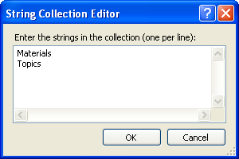

# Custom Resources and Attributes

For each appointment, **RadScheduler** requires the data to include an ID, subject, start time, and end time. In addition, **RadScheduler** includes support for recurring appointments. If your data permits, you can expand on these attributes of an appointment by adding your own, custom resources and attributes. Custom resources and attributes can include details such as location, users, materials needed, and so on.

## Custom Resources

Custom resources let you associate additional information with your appointments, where the information for each field can be selected from a limited number of possibilities. That is, a custom resource acts like an enumerated type. To add a custom resource in design time:

1. Add a DataSource component to your page that can supply the list of possible values for the custom resource.

1. In the **RadScheduler**'s properties pane of the designer, click the ellipsis button on the **ResourceTypes** property. This displays the [Resource Type Collection Editor]().

1. In the **Resource Type Collection Editor**, define your custom resource by supplying the information **RadScheduler** needs to bind to the list of resource type values.

1. You can customize the appearance of the resource in the edit form by **EnableResourceEditing** property of the **RadScheduler**. By default it is **"True"**.

>caution Be sure that your insert and update statements accept a parameter with the name of the custom resource.
>

>note The resources you define in the Resource Type Collection Editor are not used if the **RadScheduler** gets its data from a [data provider](). When using a data provider, **RadScheduler** gets information about the available data from the provider instead.
>

Because custom resources have a limited number of values, **RadScheduler** can group appointments based on the resources associated with them. To group appointments by a custom resource, set the **GroupBy** property to the name of the custom resource that you specified in the Resource Type Collection Editor.

## Custom Attributes

Custom attributes are simple text values that your data source stores with the appointment. The user can enter any string of text as the value of a custom attribute. To define custom attributes

1. In the **RadScheduler**'s properties pane of the designer, click the ellipsis button on the **CustomAttributeNames** property. This displays the string collection editor.

1. In the string collection editor, specify the names of the custom attributes you want to add. These are the names of the fields for the custom attributes in the data supplied by the Select statement of your data source. They are also the names of the parameters for the values that the scheduler passes to the Insert and Update statements of your data source.

1. Set the **AdvancedForm-EnableCustomAttributeEditing** property to **True**. This causes controls for the custom attributes to appear in the advanced edit form of the scheduler:

>caution If you enable custom attribute editing, be sure that your insert and update statements accept a parameter with the name of the custom attribute.
>

>note Unlike Custom Resources, Custom Attributes must still be defined declaratively, even when using a data provider instead of a DataSource.
>

# See Also

 * [Views]()

 * [Working with Resources]()
