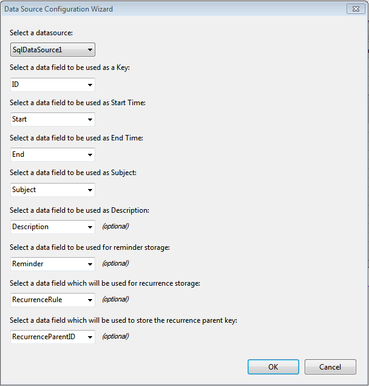

# Data Source Configuration Wizard

The Data Source Configuration Wizard helps you bind a **RadScheduler** control to a data source and specifythe fields that provide data for appointment properties. There are two ways to display the Data Source Configuration Wizard:

* Right click the **RadScheduler** and select **Choose Data Source...**

* Bring up the **RadScheduler** [Smart Tag]() and click on **Choose Data Source ...**

>note Clicking on the **DataSourceID** property of the scheduler does not start the scheduler'sData Source Configuration Wizard, only the standard Microsoft Data Source Configuration Wizard. If you choose to bind yourscheduler this way, you will need to enter the field bindings separately.
>

## Data Source Configuration Wizard

1. If you have already added a DataSource component to your page, you can select the DataSource from the **Select adatasource** drop-down list. If you do not have a DataSource component on the page, select<New data source...> from the list; the wizard will guide you through the steps of defining a new datasource. For more information on how to define a new data source, see [Data Source Configuration Wizard](https://msdn.microsoft.com/en-us/library/w4dd7z6t(VS.80).aspx) on the Microsoft Web site. There are also examples in the [Getting Started]() tutorial and in[Using The Data Source Property]().

1. Once you have selected a data source, you must specify the fields that the **RadScheduler**uses to represent aspects of an appointment.

	* The **Key field** is a unique identifier of the record for a specificappointment. This field is required.

	* The **Start Time field** holds the starting time of the appointment.This field is required.

	* The **End Time field** holds the ending time of the appointment.This field is required.

	* The **Subject field** holds the subject of the appointment.This field is required.

	* The **Description field** holds the description of the appointment.As this field is optional by default it is not enabled. To enable it you need to set the *EnableDescriptionField="true"**.

	* The **Reminder field** holds a string that encodes information about the reminders of the appointments.This field is only needed if you want to allow reminders by **Reminders-Enabled="true"**. For more information see [Reminders Overview]()

	* The **Recurrence Storage field** holds a string that encodes information about the recurrence of the appointment (its frequency, and how long the recurrence persists). This field is only needed if you want to allowrecurring appointments. If you do allow recurring appointments, you must also set the Recurrence Parent Key field.

	* The **Recurrence Parent Key field** is used when the user edits a single occurrence of a recurringappointment. It holds the key field for the recurring appointment definition of which the single occurrence is a member.

		

# See Also

 * [Overview]()
