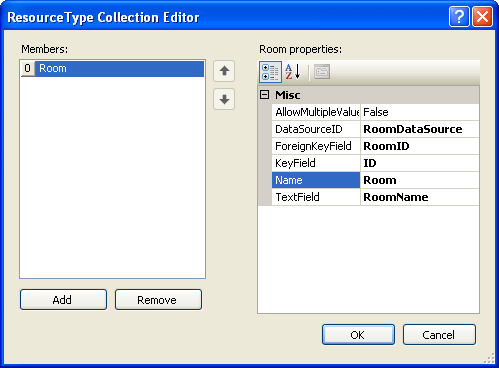

# Resource Type Collection Editor

The Resource Type Collection Editor lets you define custom resources for additional information you add to appointments. The resources you define in the Resource Type Collection Editor act like enumerated values, with a set of possible values that users can choose from a drop-down list.

To display the Resource Type Collection Editor, open the property pane for **RadScheduler** and click the ellipsis button on the **ResourceTypes** property.

>note The resources you define in the Resource Type Collection Editor are not used if **RadScheduler** gets its data from a[data provider](). When using a data provider, **RadScheduler** gets information about the available data from the provider instead.
>

## Resource Type Collection Editor

* Click the **Add** button to append a new resource type to the collection.

* Use the up and down arrow buttons to rearrange the resource types in the collection. This order determines the order the resources appear in the appointment edit form.

* Select a resource type and click the **Remove** button to delete it from the list.

* Select individual resource types to change the properties that tell the scheduler where to look up information about the resource type.

	

For each resource type,

* **AllowMultipleValues** indicates whether an appointment can select multiple values for the resource type, as opposed to a single instance of this resource type.

>caution Assigning multiple resources of the same type to an appointment requires maintaining a many-to-many relationship between resources and appointments. Because of this, **AllowMultipleValues** has no effect when binding to declarative data sources. To use multiple values, the scheduler must use a custom provider that is capable of storing the relationships.
>

* **DataSourceID** is the ID attribute of a DataSource component that the scheduler uses to look up possible values that can be assigned to resources of this type.

* **ForeignKeyField** indicates the name of the column in the Appointments data source that is used to link a particular appointment and resource. This column is usually constrained by a foreign key that points to the primary key of the Resource data source.

* **KeyField** is the field in the data source identified by **DataSourceID** that uniquely identifies a resource value.

* **Name** is the Name of the Resource Type. It that appears in the appointment edit form to prompt users to enter a resource of this type.

* **TextField** is the field in the data source identified by **DataSourceID** that holds a string representation of the resource value.

# See Also

 * [Custom Resources and Attributes]()

 * [Implementing a Provider That Supports Multi-Valued Resources]()

 * [Working with Resources]()
