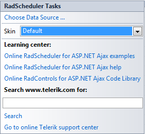

# Smart Tag

The **RadScheduler** Smart Tag allows easy access to frequently needed tasks.You can display the Smart Tag by right clicking on a **RadScheduler** control in the designwindow, and choosing **Show Smart Tag**. Using the **RadScheduler**Smart Tag you can perform the following:

## RadScheduler Tasks

* **Choose Data Source** opens the [ Data Source Configuration Wizard](), where you can bind the RadScheduler to a data source and specify thefields that provide data for appointment properties.

* **Resource Types** opens the [ResourceType Collection Editor](), where you can define custom resources to store additional information with appointments,such as rooms, users, etc.

* **Skin** lets you select from a list of available [ skins]() to customize the look of your **RadScheduler**.

## Learning Center

Links navigate you directly to RadScheduler examples, help, or support forums.You can also search the Telerik web site for a given string.

