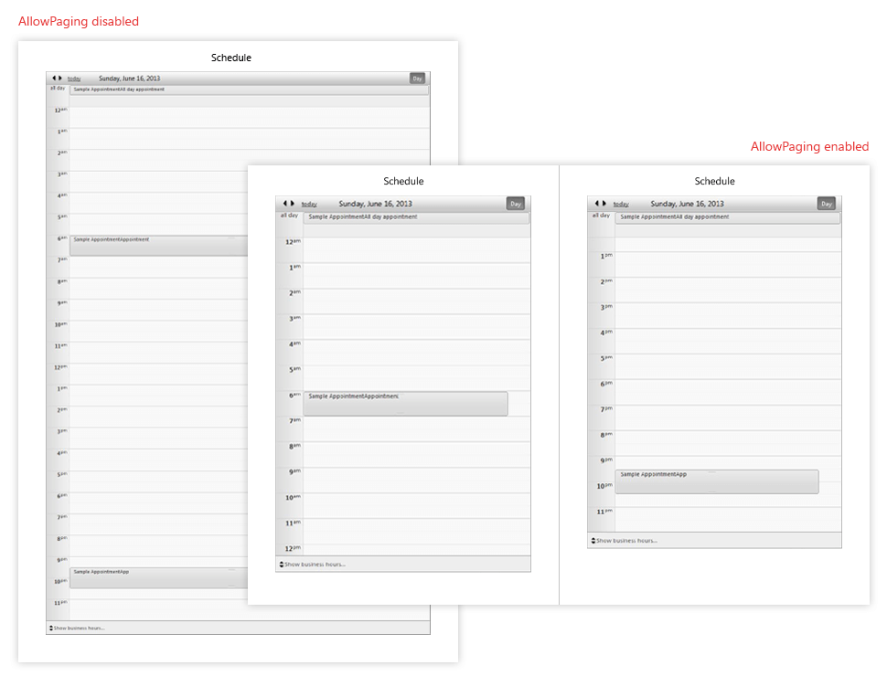
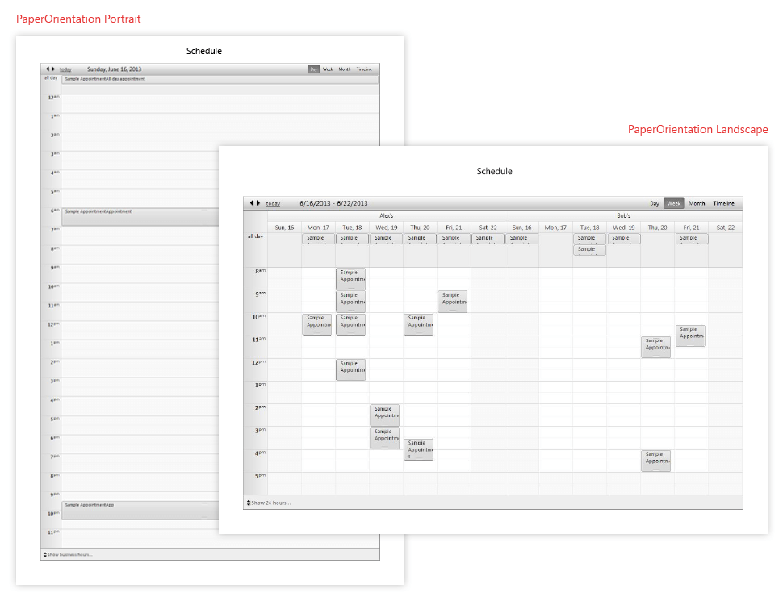

# Page Settings


This help article shows all properties and settings related to the Page dimensions, orientation and the paging functionality that the RadScheduler PDF export functionality offers.

## Paging

As of Q3 2013 SP1 we introduced the **AllowPaging** property, which allows you to split the **RadScheduler** into pages for more detailed view.

>note Please note that by default the RadScheduler control is exported to a single page. In this case the RadScheduler is scaled to fit the page size( width and height are taken if the RadScheduler Overflow property is set to "Expand"). When AllowPaging property is enabled the width of the RadScheduler is stretched to align to the document width and print the content on pages.
>


The following example shows the differences when the exported to PDF RadScheduler has paging enabled and when the AllowPaging property is set to false (see Figure 1).

````ASPNET
<ExportSettings OpenInNewWindow="true" FileName="SchedulerExport">
	<Pdf 
		PageTitle="Schedule" 
		Author="Telerik"

		AllowPaging="true"

		Creator="Telerik" 
		Title="Schedule"
		PaperSize="A4">
	</Pdf>                    
</ExportSettings>
````


Figure 1:



## Page Orientation

Page Orientation shows what kind of page layout will be used for exporting the RadScheduler control. User can choose between the default **Portrait** and **Landscape**.

The following example shows the differences between the exported document when the RadScheduler property **PaperOrientation** is set to Landscape or Portrait (see Figure 2).

````ASPNET
<ExportSettings OpenInNewWindow="true" FileName="SchedulerExport">
	<Pdf 
		PageTitle="Schedule" 
		Author="Telerik"

		PaperOrientation="Portrait"

		PaperSize="A4"                    
		Creator="Telerik" 
		Title="Schedule">
	</Pdf>                    
</ExportSettings>
````


Figure 2:



## Page Size

Page size dimensions give user ability to control the page margins, width or height when exporting the RadScheduler control. and the **Portrait**.

>note Please note that the all dimensions used for the page layout ( PageRightMargin, PageLeftMargin and etc.) should be set in same type (mm or inch).
>


The following example shows how you can set left, right, upper and bottom margin and an "A5" format for the page standard.

````ASPNET
<ExportSettings OpenInNewWindow="true" FileName="SchedulerExport">
	<Pdf 
		PageTitle="Schedule" 
		Author="Telerik"

		PaperSize="A5"
		PageLeftMargin="40mm"
		PageRightMargin="40mm"
		PageBottomMargin="40mm"
		PageTopMargin="40mm"

		Creator="Telerik" 
		Title="Schedule">
	</Pdf>                    
</ExportSettings>
</telerik:RadScheduler>
````


