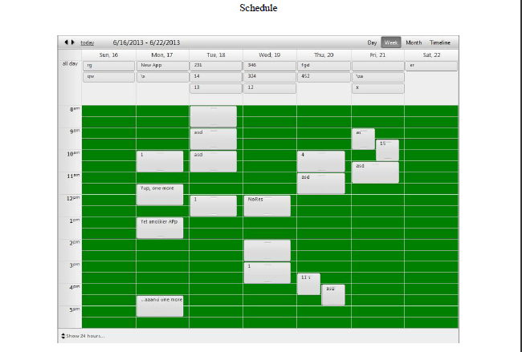

# Using Custom Style Sheet Files


## Overview

As of Q3 2013 SP1 we introduced the property StyleSheets of the RadScheduler **ExportSettings**.Its main purpose is to set custom styles by excluding the skin styles (by default the skin styles are applied to the exported RadScheduler).

>note Please note that this property allows you to use a relative path and absolute path to the style sheet file. You are absolutely free to combine relative and absolute paths for different files when you want to include more style sheet files.
>


Please find the below example that show how you can include to your ExportSettings two different stylesheet files to your ExportSettings - one with relative path and one with absolute (styles will be loaded from the resource files).On Figure 1 is shown that the green background color form the external sheet is applied to the exported document.

````ASPNET
	            <ExportSettings OpenInNewWindow="true" FileName="SchedulerExport">
	                <Pdf 
	                    PageTitle="Schedule" 
	                    Author="Telerik"
	
	                    StyleSheets="StyleSheet.css, http://yourUrlGoesHere"
	
	                    Creator="Telerik" 
	                    Title="Schedule">
	                </Pdf>                    
	            </ExportSettings>
````


````ASPNET
	        .rsContentTable td {
	            background-color: #008000 !important;
	         }
````


**Figure 1**


