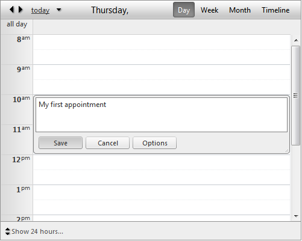
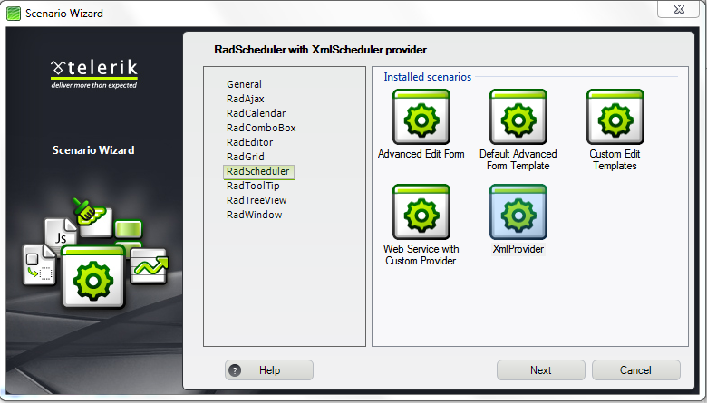

# Getting Started


This tutorial will walk you through creating a **RadScheduler** and shows how to:

* Bind the RadScheduler to a custom provider - **XmlSchedulerProvider**.

* Use the scheduler to add, update, and delete appointments.

* Configure the appearance of the scheduler.

* Add resources and custom attributes to a RadScheduler.

* Jump start your work using Telerik VS extentions to create working sample of the above steps.

## Binding RadScheduler to XmlSchedulerProvider

Firstly, you need to add an .xml file which will act as a repository for allappointments that are created and displayed.

1. Download the Appointments.xml file from the App_Data folder in the local path where your RadControls areinstalled. For example: **C:\Program Files (x86)\Telerik\RadControls for ASP.NET AJAX Q3 2010\Live Demos\App_Data.**

1. In the Solution Explorer, right click on the App_Data folder and paste the downloaded file.

1. Open the Toolbox window and drag a RadScheduler control. Please make sure you haveRadScriptManager or ScriptManager on the same page as this is a requirement for the ASP.NET AJAX Telerik controls.

1. Subscribe to the **Page_Init** event and put the following code in the handler:


````C#
	
protected void Page_Init(object sender, EventArgs e)
{
	RadScheduler1.Provider = new XmlSchedulerProvider(Server.MapPath("~/App_Data/Appointments.xml"), true);
}
	
	
````
````VB.NET
Protected Sub Page_Init(ByVal sender As Object, ByVal e As EventArgs)
	RadScheduler1.Provider = New XmlSchedulerProvider(Server.MapPath("~/App_Data/Appointments.xml"), True)
End Sub
````
This code creates and sets a new provider to RadScheduler. Please note that you'll need to replace "RadScheduler1" with the ID of your RadScheduler instance. Also replace the name of the .xml file with the name of your .xml file. The second parameter in the **XmlSchedulerProvider** constructor is of type **boolean** and is called **persistChanges**. Please set it to **"true"** if you need any changes to be committed to the xml file.

1. Now taht everything is set, press **Ctrl+F5** to run tha application.

## Using RadScheduler to manage Appointments

1. In your running application, double-click on a row to add an Appointment. The inline editor appears.

1. Enter a description of the appointment:

1. Click the **"Save"** button to close the inline editor. Your scheduler now displays the new appointment.

1. Click on the appointment in the schedular and drag it to expand the end time. You have just rescheduled your new appointment.

1. Put your mouse over the grabber at the center of the bottom edge of the appointment:

1. When the cursor turns into a two-headed arrow, drag the edge of the appointment to change its duration.

1. Double-click on the appointment to bring up the Advanced Edit form for editing the appointment. In the Advanced Edit form, check the "All day" check box, and then click "Save" to preserve your changes.The appointment now moves to the All Day row at the top of the row region.

1. Click on the little red "X" in the corner of the appointment to delete the appointment from the schedule.

1. Close the application.

## Customizing the Scheduler

1. In the designer, select the **RadScheduler**, and in the properties pane, choose a new Skinfrom the drop-down list. Try setting various values of skin from the list and observe the changes to the lookof the scheduler. Set **Skin** to "Office2007".

1. Change the **ShowFullTime** property to **True**.

1. Set the **ShowFooter** property to **False**.

1. Set the **StartInsertingInAdvancedForm** property to **True**.

1. Change the **StartEditingInAdvancedForm** property to **False**.

1. Change the **MinutesPerRow** property to 15.

1. Run the application. Note the new look. Note that you have a 24-hour view, and no footer to changeto a business hours view. Each row is now 15 minutes, with a label for every half hour instead of every hour.

1. Double click to add an appointment, and note that the Edit form comes up rather than the in-line editor. In the Advanced form there is a check box labeled Recurrence. Check this box. In the expanded section, choose Daily, and set the appointment to every 5 days:

1. Close the editor by choosing Save.

1. Double-click the appointment to edit it. Note that this time, you get a choice of editing only this occurrence orediting the entire series.

1. Choose to edit this occurrence. Note that you get the in-line editor rather than the edit form.

1. Switch to Month view. Note that the recurring appointment now appears every 5 days in the calendar.

1. Close the application.

## Adding custom attributes and resources

To further customize your scheduler - you can use custom attributes and/or resources.

**Custom attributes:**

Custom attributes are text values that are associated with the appointment. The user can enter any string as the value of a custom attribute. To define custom attributes - you need to set thethe **CustomAttributeNames**property. For example if we want to add Materials custom attribute - you'll need to set the property: **CustomAttributeNames**= "Materials". For more than one custom attributes you'll need to separate the values with comma e.g: **CustomAttributeNames**= "Materials, Stocks". Custom attributes create TextBoxes in the Advanced Form where you can put their values. To be able to see and edit custom attribute values -**EnableCustomAttributeEditing** property must be set to true:


When RadScheduler is bound to XmlProvider, attributes as well as the appointment are kept in the .xml file. Here's a sample structure:

````XML
	 
<Appointment>
    <ID>3</ID>
    <Subject>My first appointment</Subject>
    <Start>2010-11-11T00:00Z</Start>
    <End>2010-11-12T00:00Z</End>
    <Attribute Key="Materials" Value="some materials" />
</Appointment>
	
````


**Resources:**

Custom resources let you associate additional information with your appointments, where the information for each field can be selected from a limited number of possibilities. That is, a custom resource acts like an enumerated type.Please follow this model when you create Resources in your .xml file:

````XML
<Resources>
    <Calendar>
        <Key>1</Key>
        <Text>Development</Text>
    </Calendar>
    <Calendar>
        <Key>2</Key>
        <Text>Marketing</Text>
    </Calendar>
    <Calendar>
        <Key>3</Key>
        <Text>Personal</Text>
    </Calendar>
</Resources>
	
````


Custom resources are represented by a combobox in the Advanced Form. You can change the control that wraps resources by customizing the Advanced Form described in: [this help topic.]()


Based on the resources you can customize the appearance of appointments or perform custom actions. To group appointments by a custom resource, set the **GroupBy** property to the name of the custom resource.

## Add RadScheduler Scenario

The purpose of Scenario Templates is to let you quickly start using RadControls in your existing projects. Follow these steps to add a RadScheduler scenario:

1. Right-click on the Web site name in Solution Explorer window. Select "RadControls for ASP.NET AJAX". From the submenu choose "Add RadScheduler Scenario".

1. **Scenario Wizard** appears with different scenarios. Choose **"XmlProvider"**:

1. Follow the wizard by pressing **"Next"** button and finally press **"Finish"**. A new .aspx page will be added to your project, depending on your choice in the Scenario Wizard. All necessary references will be added to your project.

1. Press **Ctrl+F5** and run the application.
