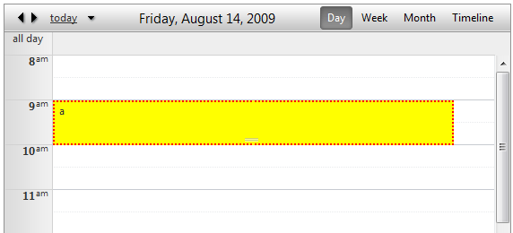
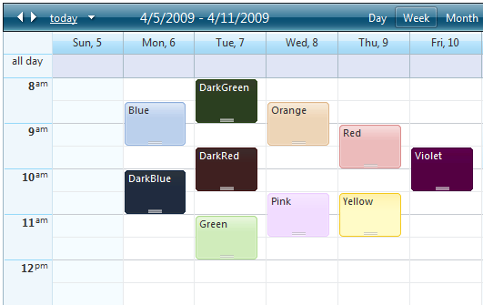

# Set Different Styles to Appointments 


If you are ready to give up the gradient and rounded corners, with Q2 2009 SP1 we have exposed four new properties which allow you to customize the appointment's appearance:

* **BackColor**

* **BorderColor**

* **BorderStyle**

* **BorderWidth**

For example:




````C#
	
protected void RadScheduler1_AppointmentDataBound(object sender, SchedulerEventArgs e)
{
	e.Appointment.BackColor = System.Drawing.Color.Yellow;
	e.Appointment.BorderColor = System.Drawing.Color.Red;
	e.Appointment.BorderStyle = BorderStyle.Dotted;
	e.Appointment.BorderWidth = Unit.Pixel(2);
}
	
````
````VB.NET
	
Protected Sub RadScheduler1_AppointmentDataBound(ByVal sender As Object, ByVal e As SchedulerEventArgs)
	e.Appointment.BackColor = System.Drawing.Color.Yellow
	e.Appointment.BorderColor = System.Drawing.Color.Red
	e.Appointment.BorderStyle = BorderStyle.Dotted
	e.Appointment.BorderWidth = Unit.Pixel(2)
End Sub
	
````


Alternatively, you can take advantage of the 10 predefined, skin-independent CSS styles that we offer with Q1 2009 SP1. RadScheduler will automatically recognize the following class names:

* rsCategoryDarkBlue

* rsCategoryBlue

* rsCategoryDarkGreen

* rsCategoryGreen

* rsCategoryDarkRed

* rsCategoryOrange

* rsCategoryPink

* rsCategoryRed

* rsCategoryViolet

* rsCategoryYellow


Here is how each style looks like:



You can handle the **AppointmentDataBound** event and use a custom condition based on attributes, resources or any other property of the Appointmentobject to set the appointment **CssClass** property. For example, the above screenshot can be replicated with the following code:


````C#
	
	
protected void RadScheduler1_AppointmentDataBound(object sender, Telerik.Web.UI.SchedulerEventArgs e)
{
	e.Appointment.CssClass = "rsCategory" + e.Appointment.Subject;
}
	
````
````VB.NET
	
Protected Sub RadScheduler1_AppointmentDataBound(ByVal sender As Object, ByVal e As Telerik.Web.UI.SchedulerEventArgs) Handles RadScheduler1.AppointmentDataBound
	e.Appointment.CssClass = "rsCategory" + e.Appointment.Subject
End Sub
	
````


This code causes RadScheduler to render the value of the CssClass property that you set in the **AppointmentDataBound** event to the **rsApt** div of the appointments.Here is the resulting html output for the "Green" appointment:

````HTML
	
<div class="rsWrap" style="z-index: 14;">
   <div id="RadScheduler1_22_0" class="rsApt rsCategoryGreen" style="height: 46px; width: 90%;
	   left: 0%;" title="Green">
	   <div class="rsAptOut">
		   <div class="rsAptMid">
			   <div class="rsAptIn">
				   <div class="rsAptContent">
					   Green <a class="rsAptDelete" href="#" style="visibility: hidden;">delete</a>
				   </div>
			   </div>
			   <div class="rsAptResize" style="z-index: 80;">
			   </div>
		   </div>
	   </div>
   </div>
</div>      
	
````


The style is applied to the appointment thanks to the following CSS rule which is loaded automatically from the embedded Scheduler.css base stylesheet from the Telerik assembly:

````CSS
	
.RadScheduler .rsCategoryGreen .rsAptContent,
.RadScheduler .rsCategoryGreen .rsAptMid .rsAptIn,
.RadScheduler .rsCategoryGreen .rsAptMid,
.RadScheduler .rsCategoryGreen .rsAptOut
{
  background-image: url('Scheduler/rsAppointmentGreenBg.png');
}       
	
````


Similar css rules are loaded for the other 9 styles.

## Resource style mapping

The CssClass property can be set declaratively for resources using the new **ResourceStyleMapping** feature of RadScheduler:

````ASPNET
	
<ResourceStyles>
 <telerik:ResourceStyleMapping Type="User" Text="Alex" ApplyCssClass="rsCategoryBlue" />
 <telerik:ResourceStyleMapping Type="User" Text="Bob" ApplyCssClass="rsCategoryOrange" />
 <telerik:ResourceStyleMapping Type="User" Text="Charlie" ApplyCssClass="rsCategoryGreen" />
</ResourceStyles>  
	
````


An illustration of this method can be seen in the [Defining Resources](http://demos.telerik.com/aspnet-ajax/scheduler/examples/resources/defaultcs.aspx) demo.This is just a neater way of setting the CssClass property from code-behind and it is equivalent to the following:


````C#
	
protected void RadScheduler1_AppointmentDataBound(object sender, Telerik.Web.UI.SchedulerEventArgs e)
{
	if (e.Appointment.Resources.GetResourceByType("User") != null)
	{
		switch (e.Appointment.Resources.GetResourceByType("User").Text)
		{
			case "Alex":
				e.Appointment.CssClass = "rsCategoryBlue";
				break;
			case "Bob":
				e.Appointment.CssClass = "rsCategoryOrange";
				break;
			case "Charlie":
				e.Appointment.CssClass = "rsCategoryGreen";
				break;
			default:
				break;
		}
	}
}
	
````
````VB.NET
	
Protected Sub RadScheduler1_AppointmentDataBound(ByVal sender As Object, ByVal e As Telerik.Web.UI.SchedulerEventArgs)
	If e.Appointment.Resources.GetResourceByType("User") <> Nothing Then
		Select Case e.Appointment.Resources.GetResourceByType("User").Text
			Case "Alex"
				e.Appointment.CssClass = "rsCategoryBlue"
				Exit Select
			Case "Bob"
				e.Appointment.CssClass = "rsCategoryOrange"
				Exit Select
			Case "Charlie"
				e.Appointment.CssClass = "rsCategoryGreen"
				Exit Select
			Case Else
				Exit Select
		End Select
	End If
End Sub
	
````


## Going beyond the predefined styles

If you need to use your own custom style for the appointments, here is how to proceed:

1. Create your custom background image and add it to your application. Let's assume you have used a folder called "Scheduler".

2. Include the following css rule in the head of your page:

	**CSS**
	
		<style type="text/css">
		   .RadScheduler .MyCustomAppointmentStyle .rsAptContent,
		   .RadScheduler .MyCustomAppointmentStyle .rsAptMid .rsAptIn,
		   .RadScheduler .MyCustomAppointmentStyle .rsAptMid,
		   .RadScheduler .MyCustomAppointmentStyle .rsAptOut
		   {
			background-image: url('Scheduler/MyCustomBackgroundImage.png');
		   }
		   .RadScheduler .MyCustomAppointmentStyle .rsAptContent
		   {
			/*font style*/
			color: Blue;
		   }
		</style>  
				
3. Set the appointment **CssClass** property:

	**C#**
	
		protected void RadScheduler1_AppointmentDataBound(object sender, Telerik.Web.UI.SchedulerEventArgs e)
		{
			e.Appointment.CssClass = "MyCustomAppointmentStyle";
		}  
	    

	**VB**
			
		Protected Sub RadScheduler1_AppointmentDataBound(ByVal sender As Object, ByVal e As Telerik.Web.UI.SchedulerEventArgs) Handles RadScheduler1.AppointmentDataBound
			e.Appointment.CssClass = "MyCustomAppointmentStyle"
		End Sub
	

The background images for the appointment styles can be found in your local installation of the Telerik.Web.UI suit -> *Skins\Common\Scheduler* and the cssrules are defined in **Scheduler.css** in the Skins folder.
