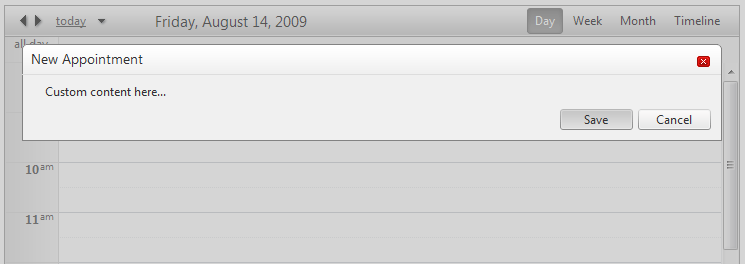

# Use Custom Modal Advanced Template


## 

When the advanced form is modal (<AdvancedForm Modal="true" />), it relies on a special CSS class to be displayed properly - **rsAdvancedEdit**. When using the advanced templates, you need to make sure that you wrap your content within a container which has this class. There are also other CSS classes which you can reuse such as rsAdvInnerTitle or rsAdvEditClose. Here is an example:



````ASPNET
	    <AdvancedEditTemplate>
	   <div class="rsAdvancedEdit rsAdvancedModal" style="position: relative">
	       <div class="rsModalBgTopLeft">
	       </div>
	       <div class="rsModalBgTopRight">
	       </div>
	       <div class="rsModalBgBottomLeft">
		   </div>
	       <div class="rsModalBgBottomRight">
	       </div>     
	       <div class="rsAdvTitle">          
	           <h1 class="rsAdvInnerTitle">
	               <%# Container.Appointment.Owner.Localization.AdvancedEditAppointment %></h1>
	           <asp:LinkButton runat="server" ID="LinkButton1" CssClass="rsAdvEditClose"
	               CommandName="Cancel" CausesValidation="false" ToolTip='<%# Container.Appointment.Owner.Localization.AdvancedClose %>'>
	<%# Container.Appointment.Owner.Localization.AdvancedClose%>
	           </asp:LinkButton>
	       </div>
	       <div class="rsAdvContentWrapper">
	           <telerik:RadTextBox ID="SubjectTextBox" runat="server" Text='<%# Bind("Subject") %>'
	               Label='<%# Container.Appointment.Owner.Localization.AdvancedSubject%>'>
	           </telerik:RadTextBox>
	           <p>
	               Custom content here...
	           </p>
	           <asp:Panel runat="server" ID="Panel1" CssClass="rsAdvancedSubmitArea">
	               <div class="rsAdvButtonWrapper">
	                   <asp:LinkButton CommandName="Update" runat="server" ID="LinkButton2" CssClass="rsAdvEditSave">
	<span><%# Container.Appointment.Owner.Localization.Save%></span>
	                   </asp:LinkButton>
	                   <asp:LinkButton runat="server" ID="LinkButton3" CssClass="rsAdvEditCancel" CommandName="Cancel"
	                       CausesValidation="false">
	<span><%# Container.Appointment.Owner.Localization.Cancel%></span>
	                   </asp:LinkButton>
	               </div>
	           </asp:Panel>
	       </div>
	   </div>
	</AdvancedEditTemplate> 
````


````ASPNET
	    <AdvancedInsertTemplate>
	   <div class="rsAdvancedEdit rsAdvancedModal" style="position: relative">
	       <div class="rsModalBgTopLeft">
	       </div>
	       <div class="rsModalBgTopRight">
	       </div>
	       <div class="rsModalBgBottomLeft">
		   </div>
	       <div class="rsModalBgBottomRight">
	       </div>     
	       <div class="rsAdvTitle">          
	           <h1 class="rsAdvInnerTitle">
	               <%# Container.Appointment.Owner.Localization.AdvancedNewAppointment %></h1>
	           <asp:LinkButton runat="server" ID="AdvancedEditCloseButton" CssClass="rsAdvEditClose"
	               CommandName="Cancel" CausesValidation="false" ToolTip='<%# Container.Appointment.Owner.Localization.AdvancedClose %>'>
	<%# Container.Appointment.Owner.Localization.AdvancedClose%>
	           </asp:LinkButton>
	       </div>
	       <div class="rsAdvContentWrapper">
	           <telerik:RadTextBox ID="SubjectTextBox" runat="server" Text='<%# Bind("Subject") %>'
	               Label='<%# Container.Appointment.Owner.Localization.AdvancedSubject%>'>
	           </telerik:RadTextBox>
	           <p>
	               Custom content here...
	           </p>
	           <asp:Panel runat="server" ID="ButtonsPanel" CssClass="rsAdvancedSubmitArea">
	               <div class="rsAdvButtonWrapper">
	                   <asp:LinkButton CommandName="Update" runat="server" ID="UpdateButton" CssClass="rsAdvEditSave">
	<span><%# Container.Appointment.Owner.Localization.Save%></span>
	                   </asp:LinkButton>
	                   <asp:LinkButton runat="server" ID="CancelButton" CssClass="rsAdvEditCancel" CommandName="Cancel"
	                       CausesValidation="false">
	<span><%# Container.Appointment.Owner.Localization.Cancel%></span>
	                   </asp:LinkButton>
	               </div>
	           </asp:Panel>
	       </div>
	   </div>
	</AdvancedInsertTemplate> 
````


