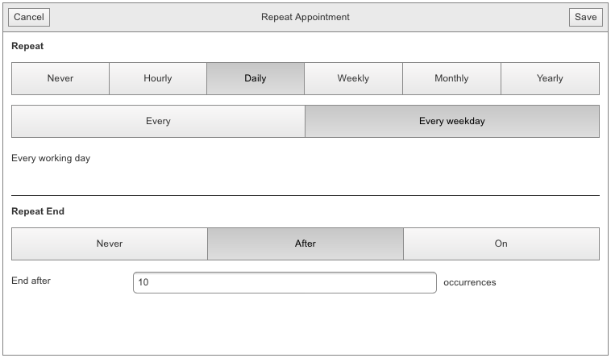

# Advanced Form

## Advanced Form

This help article will guide you through the process of creating or editing an appointment using the RadScheduler advanced form. In general you will use the advanced form in the same manner as with the default render mode. The difference is the form layout structure which is now more convenient for use on smaller screens. The following image shows the default advanced insert form. The subject, start and end fields are mandatory in order to create an appointment. When you are ready to insert or save changes to your appointment you can simply click on save button located in the upper right corner. The cancel button will close the advanced form without inserting/editing the appointment. One difference in the AdvancedEditForm is the addition of a delete button.
>caption Figure 1. Advanced Edit Form

## Recurrence editor

One important aspect of creating an appointment is the recurrence option. The recurrence editor in mobile render mode is completely redesigned in order improve the usability on mobile devices. The recurrence editor is now a separate popup, instead of an extension to the advanced form, and the options are organized in easy to use tabs and panels. The following screenshot belowwill show a sample flow of setting daily recurrence option to your appointment that will recur every working day and end after 10 occurrences. image
>caption Figure 2. Recurrence Editor

