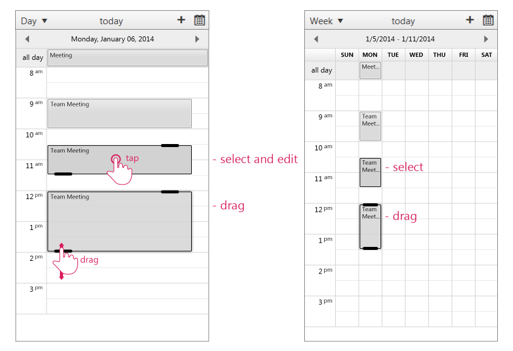
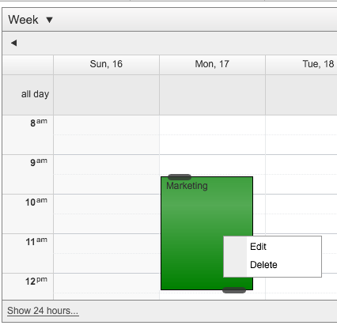

# Appointment Interaction

This help article contains information about the main appointment interactions available with the RadScheduler.

>caution Please note that the RadScheduler mobile rendering rely on native input elements (input type = “date|time|number”) and could not work properly on browser that does not support them.
>

## Selecting, Resizing and dragging appointments

The following image shows how you can select and resize an appointment:
>caption Figure 1. Select and resize an appointment

A major change from the previous behavior in mobile devices is that the Appointment is not immediately draggable. In order to drag or resize an appointment, you now have to select it first. When you select an appointment the new resize handles (optimized for touch screens) are shown, and you can now drag and resize it freely.

To edit an appointment the user can tap and hold on it. Depending on the configuration of the Scheduler, one of the following things will happen:

* If an AppointmentContextMenu is set, it will be opened.
>caption Figure 2. Appointment context menu is shown.

* If there’s no context menu, the InlineEdit or AdvancedEdit form will be opened, depending on the StartEditingInAdvancedForm property.
>caption Figure 3. Advanced Edit Form

