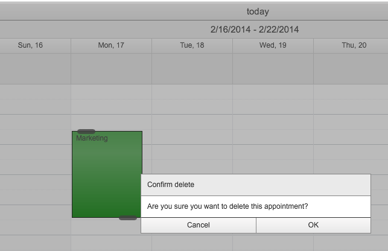
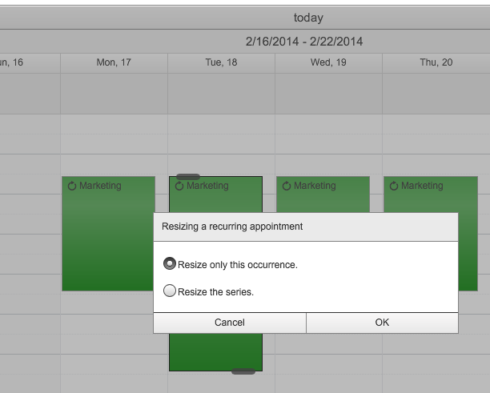
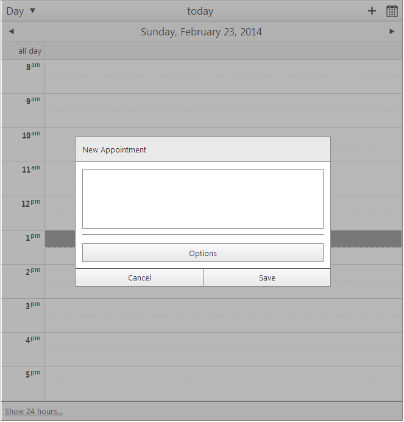

# Dialogs

## Dialogs

The RadScheduler confirmation dialogs are used to prevent accidently deleting an appointment or just to choose whether you want to delete/modify the selected occurrence or the whole series of appointments.

In the next few paragraphs you will see most of dialogs you can come across while using the RadScheduler control:

* Confirmation for deleting a not recurrence appointment.
>caption Figure 1. Delete a not recurring appointment confirmation dialog

* Confirmation for editing a recurring appointment. If you choose to edit this occurrence only it will create an exception appointment marked differently on the calendar. More info about exception appointments here.
>caption Figure 2. Edit a recurring appointment confirmation dialog

* Confirmation for modifying a recurring appointment (including moving or resizing a recurring appointment). If you choose to modify this occurrence only it will create an exception appointment marked differently on the calendar. More info about exception appointments here.
>caption Figure 3. Resize a recurring appointment confirmation dialog

* Confirmation for deleting a recurring appointment. You will be asked whether you want to delete only this occurrence or the whole series of appointments.
>caption Figure 4. Delete a recurring appointment confirmation dialog

* Reminder dialog - snoozing the reminder will show additional dialog with some additional options to choose from.
>caption Figure 5. Reminder dialog

* Inline Insert/edit dialog - quick insert or edit an appointment.
>caption Figure 6. Inline Insert Form

