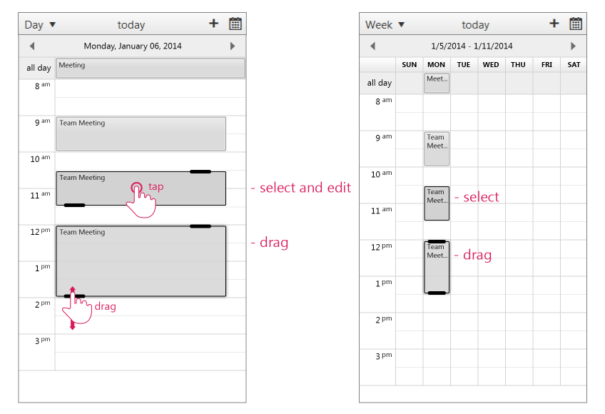
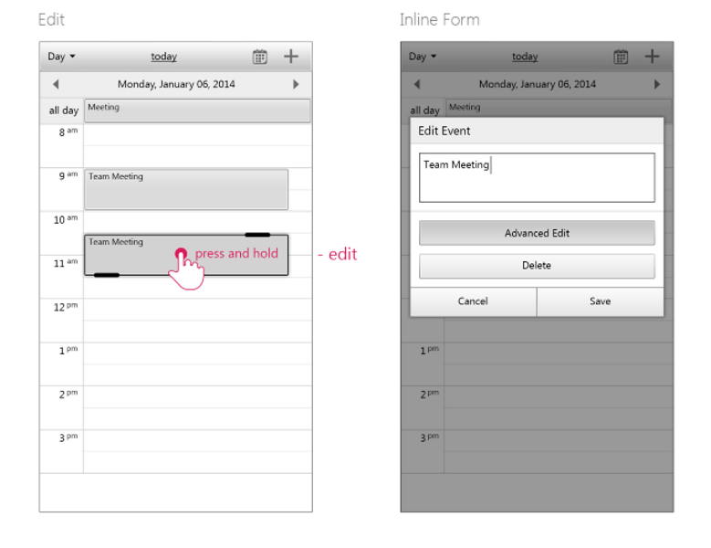

# Gestures Support

## 

**RadScheduler** handles gestures from touch enabled screens. You can use the tap, drag and tap and hold gestures to perform the following actions:

* **Select an appointment** — In order to select an appointment please **tap** on the appointment element.

* **Modify the start or end time of an appointment** — In order to modify the start or end time of an appointment either **drag the appointment top resize handle** or **drag the appointment bottom resize handle**.

* **Edit an appointment** — In order to edit an appointment you can **tap and hold on the appointment element**.

**Figure 1** illustrates how to use touch device gestures on **RadScheduler** for selecting and resizing an appointment.
>caption Figure 1: RadScheduler handles tap and drag gestures on touch devices.

**Figure 2** illustrates how to use touch device gestures on **RadScheduler** for editing an appointment.
>caption Figure 2: RadScheduler handles tap and hold gestures on touch devices.

# See Also

 * [Appointment Interaction]()
