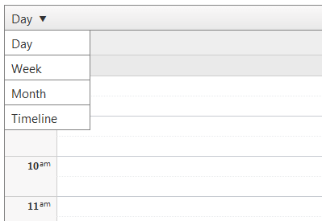
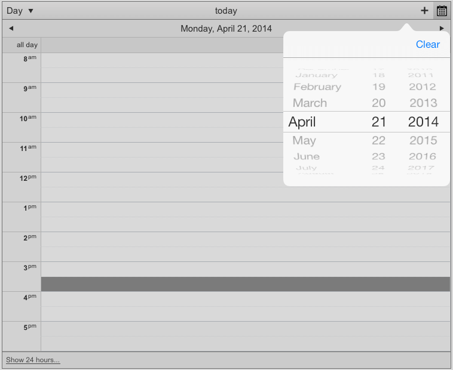
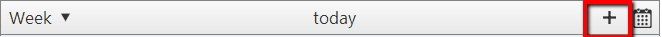
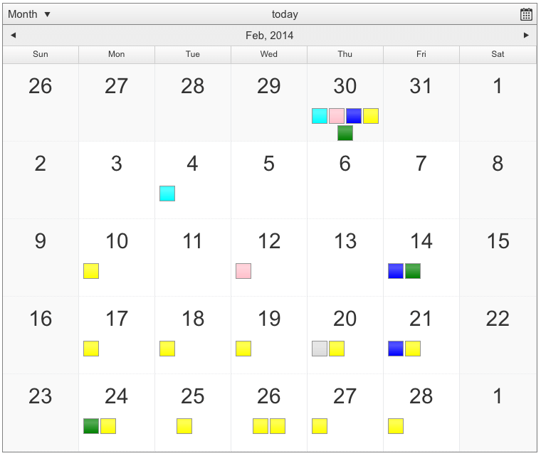

# Views

In our RadScheduler mobile rendering the header section and the month view are completely redesigned. In this help article we will focus on these components and provide some guidelines on how to use them.

## Header

Alongside the changed layout of the Header, intended to be optimized for small screens, there are a few changes to the header components:

* A new way of selecting (changing) the current view using a dropdown instead a horizontal tabs list (in the default rendering).
>caption Figure 1. List with available views

* The calendar is changed for a default input type=”date”, triggered by a calendar icon.
>caption Figure 2. Header Calendar

* A new feature for the mobile rendering is - a button for creating a new appointment. Unlike the well-known time slot click approach now you will have the opportunity to use a button to open the insert form and schedule and add your appointment.
>caption Figure 3. Button for insert appointment

>note You can find more information about the scheduling/editing an appointment in the[Advanced form section]().
>

## Month View

The mobile rendering offers completely different look of appointments in the month view.

The view is now designed to offer only a quick overview of the days, without overwhelming the UI. Clicking/Touching on a particular day slot will navigate to the respective DayView.
>caption Figure 4. Month view

