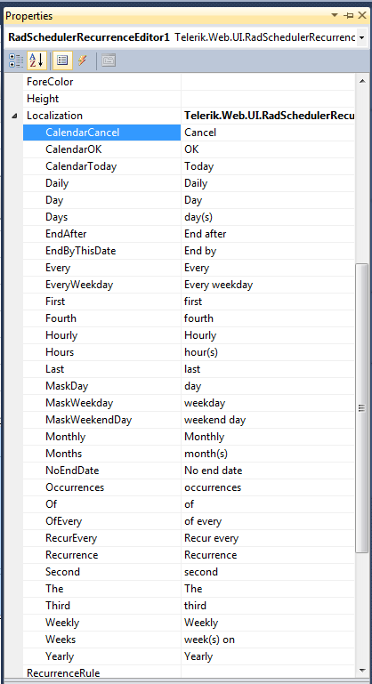
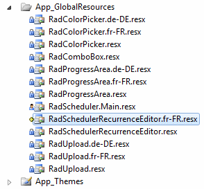

# Translating Strings


The localization support for RadSchedulerRecurrenceEditor lets you completely translate the user interface.

## Localization Property

The **Localization** property specifies the strings that appear in the runtime user interface of the control. By changing the values of each named sub-property, you change the string the control uses:

````ASPNET
<telerik:RadSchedulerRecurrenceEditor ID="RadSchedulerRecurrenceEditor1" runat="server">  
	<Localization AdvancedDay="Tag"  />
</telerik:RadSchedulerRecurrenceEditor>
````



>note technique is useful when customizing some of the messages of a particular instance. The messages are not shared between control instances. A complete translation using this approach is not appropriate.
>


## Global Resource Files

The primary means for localization in ASP.NET is to use resource files. Resource files are simple XML files that canbe easily edited and transferred to other applications. You can use resource files to change the default (English) localizationthat is stored in the Telerik.Web.UI assembly.

To create a global resource file to localize the control:

1. Create the **App_GlobalResources** folder in the root of your web application.

1. Copy the default resource **RadSchedulerRecurrenceEditor.resx** file into it. This file canbe found in the App_GlobalResources folder of the directory where you installed the RadControls.

1. Make a copy of the file and rename the copy so that its name contains the Culture Identifier. The resourcefiles used by control follow a strict naming convention:**RadSchedulerRecurrenceEditor.<Culture Identifier>.resx**
>note The **Culture Identifier** consists of a language code followed by a dash and thecountry code.Example: “en-US”, “fr-CA” and so on.<br />
For example RadSchedulerRecurrenceEditor.fr-CA.resx. Both files should be present in the App_GlobalResources folder:<br />

1. Edit the strings using the Visual Studio editor or your favorite text editor. Customize strings just as you would setthe **Localization** property.


You can now switch the scheduler so that it uses your new resource file by setting the active culture:

