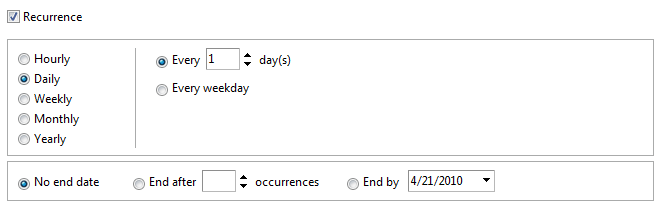

# Recurrence Editor Overview

## 

The __RadSchedulerRecurrenceEditor__ is a lightweight control that encapsulates all of the User Interface elements needed to display and edit RadScheduler recurrence rules.

This control is used internally from RadScheduler and in the [Advanced Template customization example](http://demos.telerik.com/aspnet-ajax/scheduler/examples/advancedformtemplate/defaultcs.aspx).
