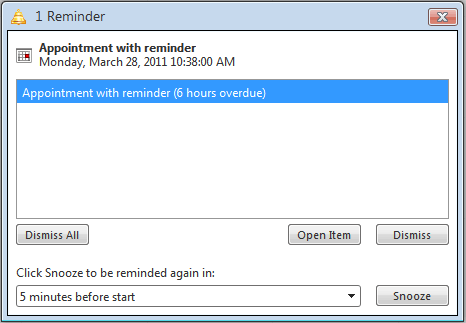

# Reminders Overview

## 

Starting with the Q2 2010 release, RadScheduler offers integrated support for appointment reminders.

Starting with the 2013 Q1 SP1 release RadScheduler supports reminder appointments to expire after certain time period and not to show a reminder notification.

The Reminders.MaxAge property keeps your reminder appointments "alive" for a specific time period. Any appoinments beyond that time span will not show a reminder notification.

Users can configure reminders through the advanced edit form. Due reminders are shown in a dialog familiar to Microsoft Outlook users dialog. The dialog allows the user to dismiss and snooze reminders.

>caution  **Reminders require browser cookies to operate properly!** 
>

When the appointment is saved with reminder – the reminder icon ( ) appears.

Dismissing a reminder removes it from the appointment and stores the changes to the data-source provider.

The Snooze operation is local to the user and does not update the appointment. Snoozed reminders are persisted as browser cookies and will reappear if the page is opened by another user or with different browser.

You can store reminders in the database via the **DataReminderField**. **DataReminderField** writes a string in the database using a subset of the **RFC2445** (**iCalendar**) specification. For example here's what will be written in the database for the [Reminders Demo](https://demos.telerik.com/aspnet-ajax/scheduler/examples/reminders/defaultcs.aspx) when you press "Create Appointment with Reminder" button:

BEGIN:VALARM

TRIGGER:-PT30M

X-TELERIK-UID:d1f02b03-82f2-4267-b24e-89baeb9170e3

END:VALARM

For more information on the **RFC 2445**( **iCalendar** ) specification, please see the [Wikipedia article](https://en.wikipedia.org/wiki/ICalendar)

# See Also

 * [Adding a Reminder Field]()
