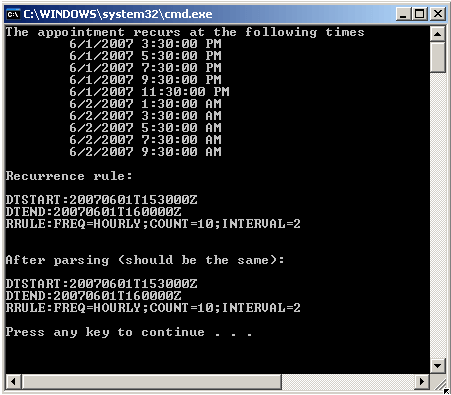

# Working with Recurring Appointments


__RadScheduler__ includes support for recurring events on hourly, weekly, daily, monthly and yearly basis. Exceptions to the recurrence rules are also permitted. To support this recurrence behavior, the __Appointment__ class includes the __RecurrenceRule__, __RecurrenceParentID__ and __RecurrenceState__ properties. When an appointment is promoted into a recurring event its __RecurrenceState__ changes to __RecurrenceState.Master__ and the __RecurrenceRule__ is populated with the string representation of the recurrence rule.

The recurrence master is stored in the database and its occurrences are generated on the fly with __RecurrenceState__ set to __RecurrenceState.Occurrence__.

If the user modifies an individual appointment occurrence, this creates an exception. The __RecurrenceRule__ of the master is modified to include the date and time of the exception so that no occurrence is generated for the exception occurrence. Then the exception is stored in the database and its __RecurrenceParentID__ property is set to reference the original master. This way the exception is still linked to the original recurrence series.

The __RecurrenceRule__ class is the engine for creating and evaluating recurrence rules. It serves as a base class to several specialized classes and cannot be instantiated directly. The specialized classes are:

* HourlyRecurrenceRule

* DailyRecurrenceRule

* WeeklyRecurrenceRule

* MonthlyRecurrenceRule

* YearlyRecurrenceRule

Using the specialized classes makes it easier to define recurrence rules because only relevant parameters are specified intheir constructors.

## Example

Here is an example using the __HourlyRecurrenceRule__ class:


>tabbedCode

````C#
	     
	using System;
	using Telerik.Web.UI;
	namespace RecurrenceExamples
	{
	  class ParsingExample
	  {
	       static void Main()
	      {
	           // Create a sample appointment that starts at 6/1/2007 3:30 PM and lasts half an hour.
	           Appointment recurringAppointment =
	             new Appointment("1",
	               Convert.ToDateTime("6/1/2007 3:30 PM").ToUniversalTime(),
	               Convert.ToDateTime( "6/1/2007 4:00 PM").ToUniversalTime(),
	               "Sample appointment");
	           // Create a recurrence range, that specifies a limit of 10 occurrences for the appointment.
	           RecurrenceRange range = new RecurrenceRange();
	           range.Start = recurringAppointment.Start;
	           range.EventDuration = recurringAppointment.End - recurringAppointment.Start;
	           range.MaxOccurrences = 10;
	           // Create a recurrence rule to repeat the appointment every 2 hours.
	           HourlyRecurrenceRule rrule = new HourlyRecurrenceRule(2, range);
	           Console.WriteLine("The appointment recurs at the following times");
	           foreach (DateTime occurrence in rrule.Occurrences)
	           {
	              Console.WriteLine( "\t{0}", occurrence);
	           }
	           Console.WriteLine();
	           // Prints the string representation of the recurrence rule:
	           string rruleAsString = rrule.ToString();
	           Console.WriteLine("Recurrence rule:\n\n{0}\n", rruleAsString);
	           // The string representation can be stored in a database, etc.
	           // ...
	           // Then it can be reconstructed using TryParse method:
	           RecurrenceRule parsedRule;
	           RecurrenceRule.TryParse(rruleAsString, out parsedRule);
	           Console.WriteLine("After parsing (should be the same):\n\n{0}", parsedRule);
	      }
	  }
	} 
				
````


````VB.NET
	
	    Imports System
	    Imports Telerik.Web.UI
	    Namespace RecurrenceExamples
	        Class ParsingExample
	            Shared Sub Main()
	                ' Create a sample appointment that starts at 6/1/2007 3:30 PM and lasts half an hour.
	                Dim recurringAppointment As New Appointment("1", Convert.ToDateTime("6/1/2007 3:30 PM").ToUniversalTime(), Convert.ToDateTime("6/1/2007 4:00 PM").ToUniversalTime(), "Sample appointment")
	                ' Create a recurrence range, that specifies a limit of 10 occurrences for the appointment.
	                Dim range As New RecurrenceRange()
	                range.Start = recurringAppointment.Start
	                range.EventDuration = recurringAppointment.[End] - recurringAppointment.Start
	                range.MaxOccurrences = 10
	                ' Create a recurrence rule to repeat the appointment every 2 hours.
	                Dim rrule As New HourlyRecurrenceRule(2, range)
	                Console.WriteLine("The appointment recurs at the following times")
	                For Each occurrence As DateTime In rrule.Occurrences
	                    Console.WriteLine("" & Chr(9) & "{0}", occurrence)
	                Next
	                Console.WriteLine()
	                ' Prints the string representation of the recurrence rule:
	                Dim rruleAsString As String = rrule.ToString()
	                Console.WriteLine("Recurrence rule:" & Chr(10) & "" & Chr(10) & "{0}" & Chr(10) & "", rruleAsString)
	                ' The string representation can be stored in a database, etc.
	                ' ...
	                ' Then it can be reconstructed using TryParse method:
	                Dim parsedRule As RecurrenceRule
	                RecurrenceRule.TryParse(rruleAsString, parsedRule)
	                Console.WriteLine("After parsing (should be the same):" & Chr(10) & "" & Chr(10) & "{0}", parsedRule)
	            End Sub
	        End Class
	    End Namespace
	
````


>end

The __RecurrenceRange__ class specifies the time frame for the recurrence. It consists of the start timeof the event, it's duration and optional limits.

The __Occurrences__ property returns an enumerator that can be used to retrieve all the occurrences defined by the rule.

The __RecurrenceRule__ class supports the __ToString__ and __TryParse__methods that __RadScheduler__ uses for storing and retrieving the recurrence rules instances. The format is a subset of the standard iCalendar format. The example above produces the following output: 
