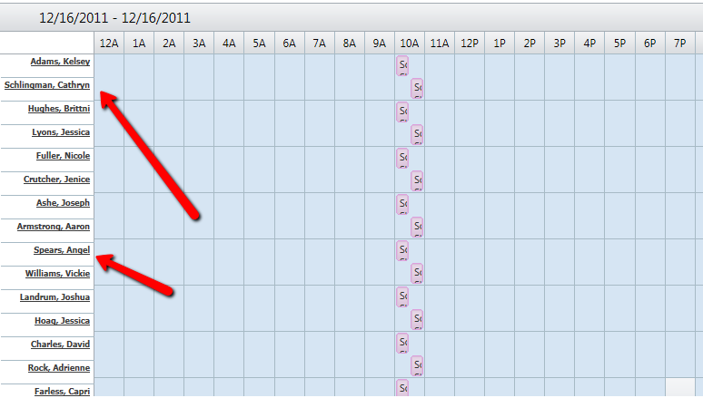

# Misalignments


This article shows how to handle with some known issue with misalignments in the RadScheduler and the code that is fixing them.

## If the TimeLabelSpan property for Timeline view is set, the time slots will be misaligned with respect to the date headers in IE9.(Fixed in Q3 2012)

Here is how it usually looks like in the discribed scenario:


````ASPNET
<style type="text/css">
	.rsHidden
	{
		display: block !important;
	}
</style>
````


## In Browser Mode Compatibility IE9 the time slots of the RadScheduler twist to the left.

Here is how it usually looks like in the discribed scenario:


You need to add the following **CSS** to improve this behavior:

````ASPNET
<style type="text/css">
	div.RadScheduler .rsHorizontalHeaderTable, div.RadScheduler .rsContentTable, div.RadScheduler .rsAllDayTable
	{
		width: /*\**/ 100%\9 !important;
	}
	* + html div.RadScheduler .rsHorizontalHeaderTable, * + html div.RadScheduler .rsContentTable, * + html div.RadScheduler .rsAllDayTable
	{
		width: auto !important;
	}
	
	.RadScheduler .rsTopWrap tr.rsHidden
	{
		display: block;
	}
	
	* + html .RadScheduler .rsVerticalHeaderTable tr.rsMainHeader div.rsMainHeader
	{
		width: auto;
	}
</style>
````


## Timeline resources vertical formatting issue.(Fixed in Q3 2012)

This issue is observed sometimes when the **RadScheduler** is grouped by resources vertically, ExactTimeRendering is set "true" and more than one appointments are situated in same time slot.



Here bellow is shown a possible workaround with **JavaScript**:

````JavaScript
<script type="text/javascript">
	function pageLoad() {
		var $ = $telerik.$;
		var rsVerticalHeaderTableTh = $(".rsVerticalHeaderTable th");
		var rsAllDayTableTr = $(".rsAllDayTable tr");
		rsAllDayTableTr.each(function(index, elem) {
			var h = $(elem).height() - 1;
			rsVerticalHeaderTableTh[index].style.cssText = "height:" + h + "px";
		});
	}
</script>
````


