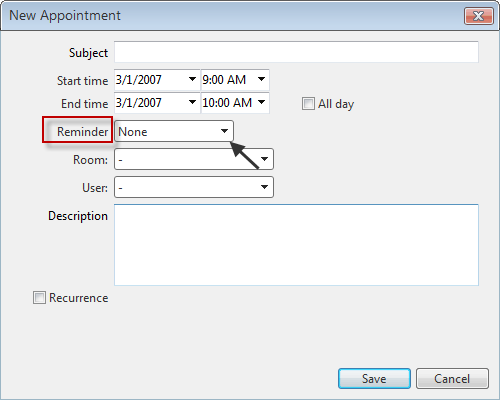
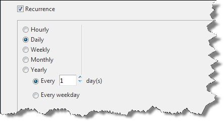
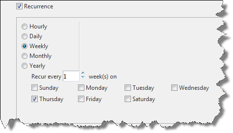
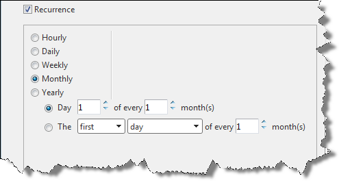

# Adding Appointments

## 

To create an appointment using __RadScheduler__:

1. Double-click on the time when you want the appointment to occur. In Day, Week, or MultiDay view, you can double-click on a specific starting time, or you can double-click in the All Day row to create an all-day event. In Month and Timeline view, appointments always start out as all-day events.

1. 

* If the __StartInsertingInAdvancedForm__ property is __False__ (the default), the in-line editor appears:

* If the __StartInsertingInAdvancedForm__ property is __True__, the advanced insert form appears instead:

1. Enter the subject of the appointment in the in-line editor or insert form that appears.

1. If you are done, click “__Save__” button to insert the appointment.

1. If you want to cancel the appointment creation, click the “__Cancel__” button.

1. If you are in the in-line editor and want to add more details to the appointment, click on the “__Options__” button. This displays the advanced insert form.

1. In the advanced insert form, you can

* Enter or change the description by typing in the textbox control.

* Enter or change additional information about the appointment in the description multi-line textbox. By default it is hidden. If you want to use it set the __EnableDescriptionField__ to__True__.

* Change the starting and ending times of the appointment. You can type in new dates or times, or, to change the date, you can click on the down arrow to bring up a calendar control.

* Specify that the appointment is an all-day event using the "__All day event__" check box. If you specify an all-day event, you do not need to specify starting and ending times.(all-day appointments start at __12:00 AM__ one day and end at __12:00 AM__ on the other day)

* Enter values for any [custom resources and attributes](). In the advanced insert form shown above, you can enter a user and a room for the appointment.

* Enter values for reminders. By default reminders are disabled. To enable them you need to set __< Reminders Enabled=”true”/>__

* To create a recurring appointment, check the box labelled "__Recurrence__". The advanced insert form expands to show the recurrence section:

1. Specify how often the appointment recurs. Recurrence can be __Hourly__, __Daily__, __Weekly__, __Monthly__, or __Yearly__.

* For hourly appointments, indicate the number of hours between each recurrence:

* For daily appointments, you can specify the number of days between each recurrence, or indicate that the appointment recurs every weekday:

* For weekly appointments, indicate the number of weeks between each repeat, and the days of the week on which the appointment occurs for each repeat:

* For monthly appointments, specify which day of the month the appointment occurs, and the number of months between each recurrence:

* For yearly appointments, specify the day and month of each year that the appointment occurs:

1. Indicate when the recurrence ends:

1. When you complete the advanced insert form, click the "__Save__" button. If you want to cancel the appointment, click the "__Cancel__" button.If the appointment is marked recurrent, an  icon appears at the top left corner of the appointment.

# See Also
 
 * [Editing Appointments]()

 * [Resizing Moving and Deleting Appointments]()

 * [OnClientAppointmentInserting]()

 * [AppointmentInsert]()
