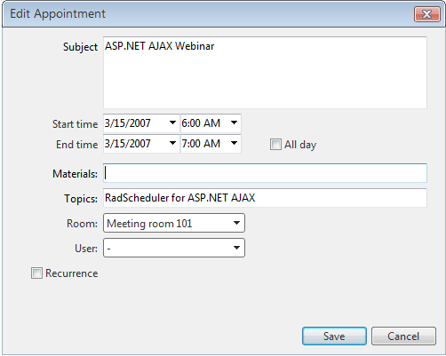
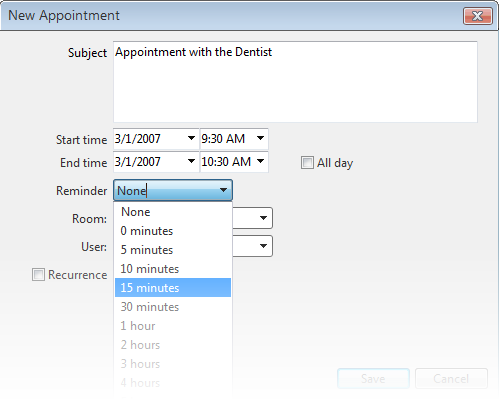
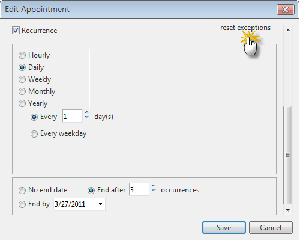

# Editing Appointments

To edit an appointment once it has been created:

1. Double-click an appointment.

1. If the appointment is recurring, the "Editing a recurring appointment" pop-up appears, where you can specifywhether you want to edit only the selected occurrence of the appointment, or edit the entire series:Choose which you want to edit, and press OK. You can also press Cancel to cancel the edit entirely.

1. An editor appears where you can edit the appointment:

* If the **StartEditingInAdvancedForm** property is **True** (the default),the edit form appears:You can specify reminder for each appointment. Make sure that **“Reminders-Enabled”** property of the RadScheduler is set to **“True”**. That way you can specify the time for the reminder from the dropdown:When the appointment is saved with reminder - the reminder icon (  ) appears.

* If the **StartEditingInAdvancedForm** property is **False**, the in-line editor appears:

1. Make the desired changes to the appointment and click **"Save"** to preserve the changes or Cancel to cancel them.

## Exceptions to recurring appointments

When you edit a single instance of a recurring appointment, you create an exception. On exceptions, the recurring appointment icon (  ) is replaced by an exception symbol:  . This indicates that the appointment is still part of a recurring sequence, but that it differs in some details from the master recurring appointment.Exceptions can reflect any change to the appointment including its subject, time, duration, or any custom resources or attributes. The first appointment in the recurring series is called “Master”. You can remove all exceptions of the master appointment bydouble-clicking on the master and in the opened advanced form select the “ **reset exceptions**” link: 

# See Also

 * [Adding Appointments]()

 * [Resizing Moving and Deleting Appointments]()

 * [OnClientAppointmentEditing]()

 * [AppointmentUpdate]()

 * [AppointmentCancelingEdit]()

 * [Working with Recurring Appointments]()
