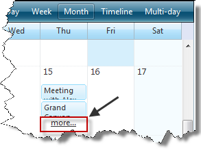
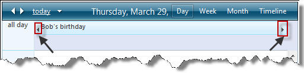

# Navigating RadScheduler

## 

At runtime, **RadScheduler** contains a number of controls for navigating between views, modes, and dates:

* To change the current view, **RadScheduler** has five view tabs in the upper right corner for Day, Week, Month, Timeline and Multi-day view. The current view appears highlighted. Clicking on a tab changes the current view. The **SelectedView** property controls which view the scheduler starts in.

>note The **UserSelectable** property of the **Multi-Day** view is **false** by default. To display the tab for this view in the navigation pane, you need to set MultiDayView-UserSelectable="true".
>

* Another way to switch from Month view to Day view is to click the "more..." link in a cell that contains more appointments than the **MonthView-VisibleAppointmentsPerDay** property specifies.

* To change between full time mode and business hours, the lower left corner of the footer contains a link that says either "Show 24 hours" or "Show business hours". Clicking this link button toggles the row region between the two modes. Note that the **DayStartTime** and **DayEndTime** properties control which rows appear when the **RadScheduler** control is showing business hours.

* To change the dates that **RadScheduler** displays, the upper left corner of the header contains a navigation panel with four controls. The left arrow switches the display to an earlier time: in Day view, it switches the display to the previous day; in Week view, it switches the display to the previous week; in Month view, it switches the display to the previous month. Similarly, the right arrow switches to the next day, week, or month. The link labeled "today" brings the view back to the current day, week, or month. The down arrow pops up a calendar for quick navigation.

* To change to the previous day or next day of an appointment that spans multiple days,click the forward or back arrows that appear on the appointment in the scheduler:

* To see the appointments that are not currently visible - click on the visual clue:

# See Also

 * [Views]()

 * [NavigationCommand]()

 * [NavigationComplete]()
