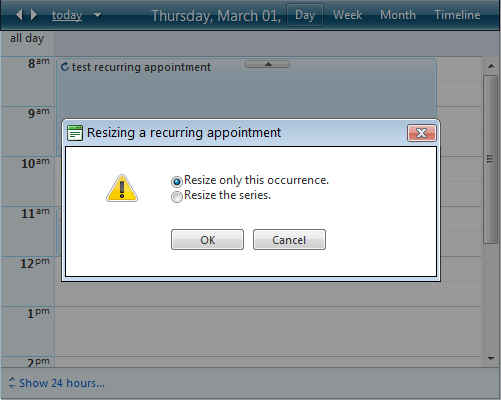
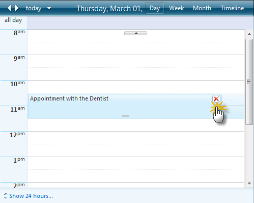
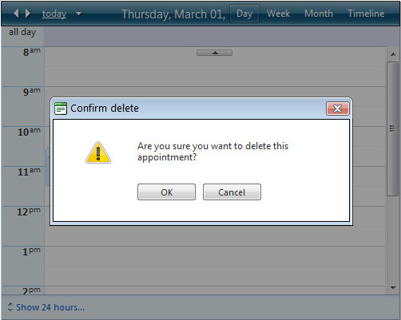
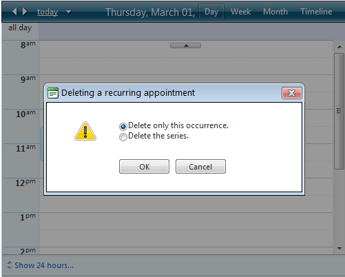

# Resizing Moving and Deleting Appointments

You can make simple changes to the appointments that **RadScheduler** displays without bringing up the edit form or in-line editor.

Starting Q1 2013 SP1 users have the ability to resize appointments horizontally in Week and Multi-day view.

## Resizing Appointments

To change the duration of an appointment, select the grabber at the bottom of the appointment and pull it up or down to resize the appointment.

The appointment is automatically updated to reflect the new duration. If you attempt to resize a recurring appointment, the **"Resizing a recurring appointment"** popup appears, so that you can indicate whether the new duration applies to the single occurrence or to the entire series:

## Moving Appointments

You can move appointments by dragging them on the desired timeslot and dropping them. If you attempt to move a recurring appointment it becomes an exception. However you can customize whether the edit applies to the single occurrence or to the entire series by setting the **DisplayRecurrenceActionDialogOnMove** property to **“True”**. The **"Moving a recurring appointment"** popup appears:

## Deleting Appointments

All appointments can be deleted by clicking on the icon in the top right corner which appears on hover of the appointment:

After clicking on the icon the **“Delete confirmation”** popup appears so that you can cancel the operation if the icon is clicked by mistake:

You can prevent the appearance of this popup by setting the DisplayDeleteConfirmation property to **“False”**. If you attempt to delete a recurring appointment, the **"Deleting a recurring appointment"** popup appears, so that you can indicate whether to delete the single occurrence or the entire series:

# See Also

 * [OnClientAppointmentResizeStart]()

 * [OnClientAppointmentResizing]()

 * [OnClientAppointmentResizeEnd]()

 * [OnClientAppointmentDeleting]()

 * [AppointmentDelete]()
