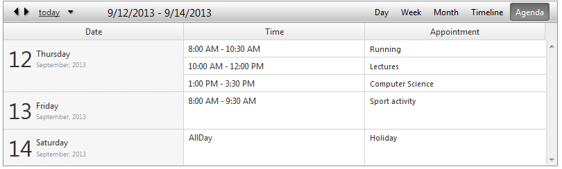
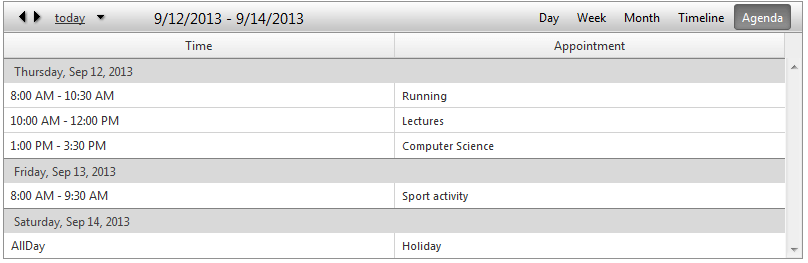
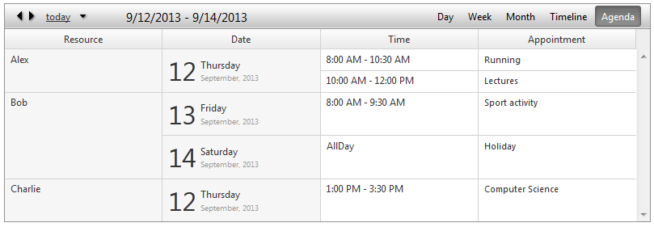
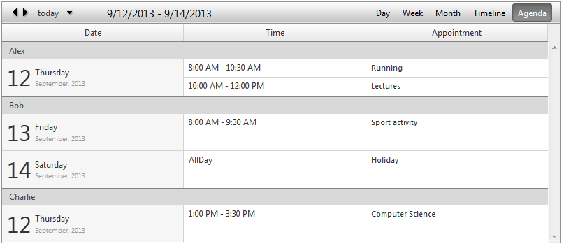
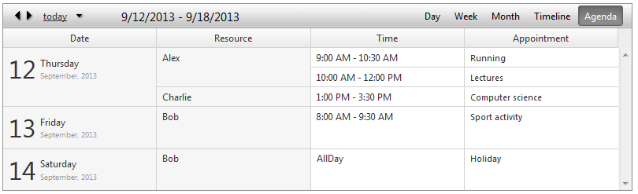
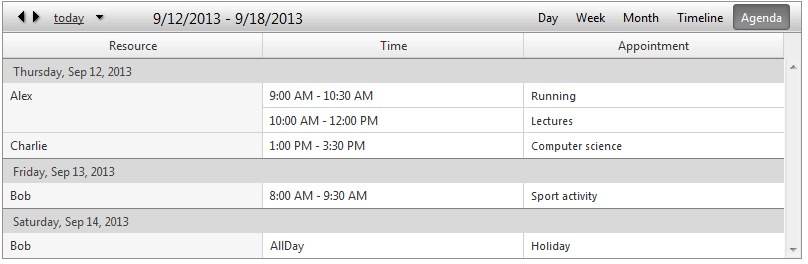

# Agenda View

As of Q3 2013 the new **Agenda View** is introduced for the **RadScheduler** control.

The **Agenda View** is a table structured like a simple list, which lists appointments for a specific period of time that is defined by the property **NumberOfDays**.

>note Please note that each Appointment represents a separate row. Unlike the other available views in the **RadScheduler** , it doesn’t have empty rows/cell representing timeslots since days with no appointments are not shown. Therefore user is not able to insert, move or resize appointments . However, editing is allowed and a delete operation could be achievedby using the delete handler shown on hover.
>

## Agenda View Settings:

* **ResourceMarkerType** - This property will be an enumeration with three values – **None** (default) , **Block** and **Bar**. Combined with Resource style mappings, this will enable the appointments to show a colored square or bar at the beginning of the appointment to indicate it’s resource.

* **ResourceColumnWidth** - Sets the resource column's width when the **RadScheduler** is grouped by resource.

* **DateColumnWidth** - Sets the date column's width.

* **TimeColumnWidth** - Sets the width of the column showing the appointment start and end time.

* **ShowColumnHeaders** - Shows/hides the header text of all **AgendaView** columns.

* **NumberOfDays** - Indicates number of days to be displayed. For example if you want to show a week you can set it that value to 7.

## Grouping

**Agenda View** will provide full support for Resource and Date grouping, namely:

* Basic look (**Horizontal** grouping)

* Basic look (**Vertical** grouping)

* Grouped by Resource (**Horizontal**)

* Grouped by Resource (**Vertical**)

* Grouped by Date, Resource (**Horizontal**)

* Grouped by Date, Resource (**Vertical**)

     
