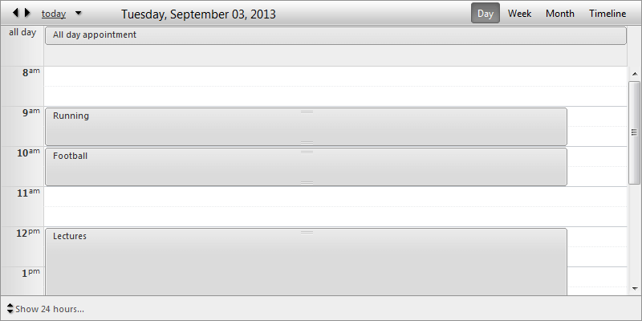
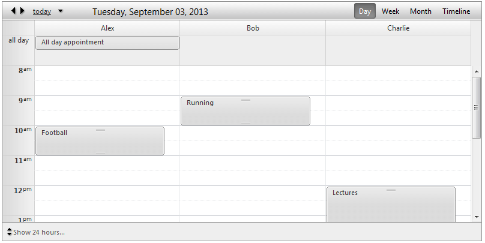
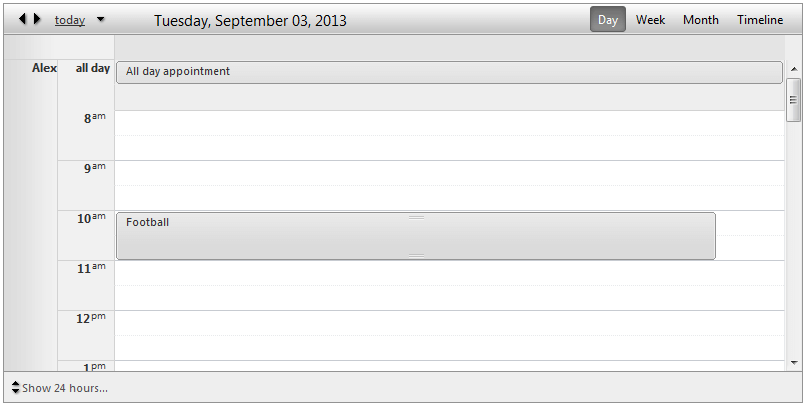

# Day View

The **Day View** is a standard table list, which shows all appointments for a specific day. Each row represents a time span controlled by **MinutesPerRow** property. One specific feature in **Day** and **Week View** is the **All day** row. This is a special row positioned at the top of the calendar area (when enabled) to show the appointments for the entire day. This is an easy and quick access to your all day appointments without occupying the entire calendar area.

## Day View Settings:

* **DayStartTime** - Sets the day start time of the current view.

* **DayEndTime**- Sets the day end time of the current view.

* **WorkDayStartTime**- Sets the day start time of the business hours.

* **WorkDayEndTime**- Sets the day end time of the business hours.

* **ShowAllDayRow**- Shows/hides the **all day** row for all day appointments on the top of the calendar area.

* **EnableExactTimeRendering**- When it is enabled, the appointment does not occupy the entire time slot if its start/end time does not match the time slot start/end time. The default value is **false**, so the advanced edit form is the only way to determine what is exact appointment start/end time.

* **ShowAllDayInsertArea**- When enabled, it keeps an extra space in the **all day** row where user to double click and have the ability to add an appointment.

* **ShowHiddenAppointmentsIndicator**- Indicates whether there is an appointment in current non-visible area. Clicking on that indicator will navigate to that area in order to show the appointment.

* **ShowInsertArea**- When enabled, it keeps an extra space in each row where user to double click and have the ability to add an appointment.

* **ShowFullTime**- When enabled, it shows entire day hours (complete 24 hours) instead of the business hours which is the default behavior (9am to 5 pm).

## Grouping

**Day View** will provide full support for Resource and Date grouping, namely:

* No grouping (Basic look)

* Grouped by Resource (**Horizontal**)

* Grouped by Resource (**Vertical**)

>note Please note that the **DateGrouping** in **DayView** (both **Horizontal** and **Vertical** ) actually has no difference from the **Horizontal** Resource Grouping. If you are looking for DateGrouping in **DayView** please refer to the layout Horizontal Resource Grouping.
>

