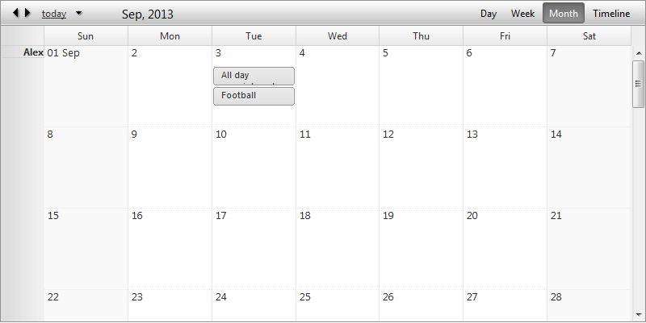
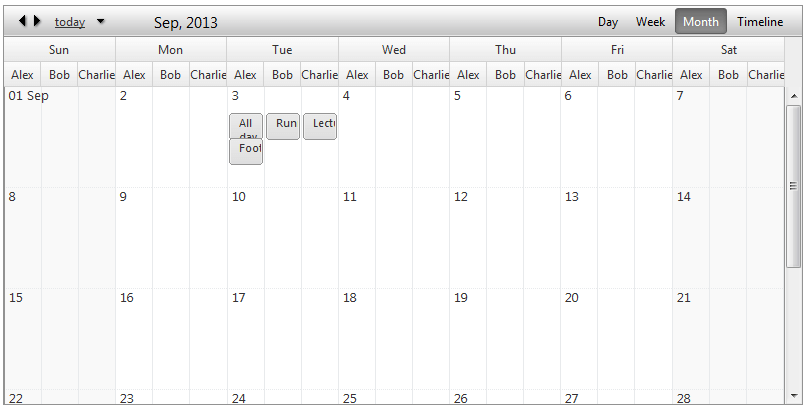

# Month View

The **Month View** is a standard cell list, which shows all appointments for a specific month. Each cell represents a separate day.

## Month View Settings

* **AdaptiveRowHeight**- Increase the cell height when containing appointments and reduces its height if there are no appointments for that specific day.

* **DayHeaderDateFormat**- Sets the date format for each cell header.

* **FirstDayHeaderDateFormat**- Sets the date format only for first day of the current month.

* **MinimumRowHeight**- Sets the minimum cell height.

* **VisibleAppointmentsPerDay**- Indicates how many appointments could be listed for a day. When there are more appointments for a specific day a "more" link will be placed at the bottom of the day cell and will navigate to the day view if clicked.

## Grouping

**Month View** will provide full support for Resource and Date grouping, namely:

* No groping (Basic look)

* Grouped by Resource (**Horizontal**)

* Grouped by Resource (**Vertical**)

* Grouped by Date, Resource (**Horizontal**)

* Grouped by Date, Resource (**Vertical**)
