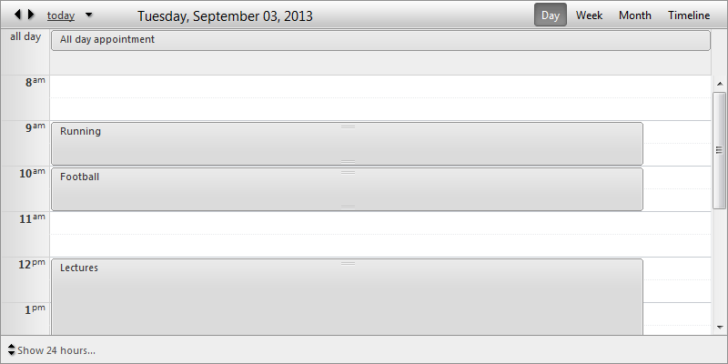
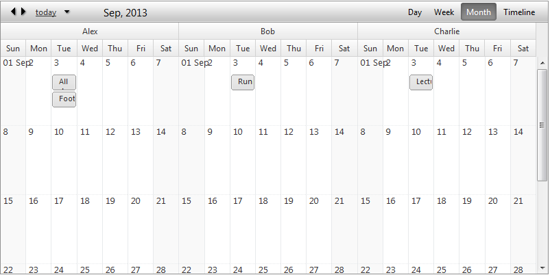

# Month View

## Month View

The __Month View__ is a standard cell list, which shows all appointments for a specific month. Each cell represents a separate day.

## Month View Settings

* __AdaptiveRowHeight__- Increase the cell height when containing appointments and reduces its height if there are no appointments for that specific day.

* __DayHeaderDateFormat__- Sets the date format for each cell header.

* __FirstDayHeaderDateFormat__- Sets the date format only for first day of the current month.

* __MinimumRowHeight__- Sets the minimum cell height.

* __VisibleAppointmentsPerDay__- Indicates how many appointments could be listed for a day. When there are more appointments for a specific day a "more" link will be placed at the bottom of the day cell and will navigate to the day view if clicked.

## Grouping

__Month View__ will provide full support for Resource and Date grouping, namely:

* No groping (Basic look)

* Grouped by Resource (__Horizontal__)

* Grouped by Resource (__Vertical__)

* Grouped by Date, Resource (__Horizontal__)

* Grouped by Date, Resource (__Vertical__)
