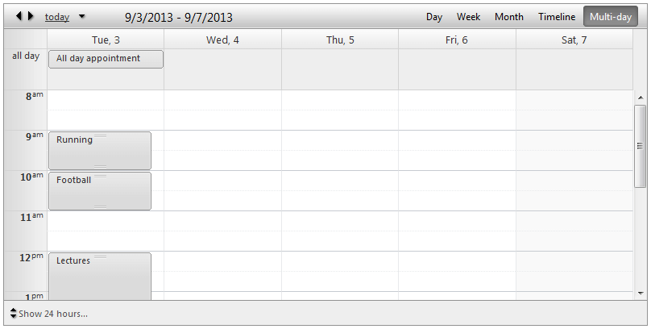
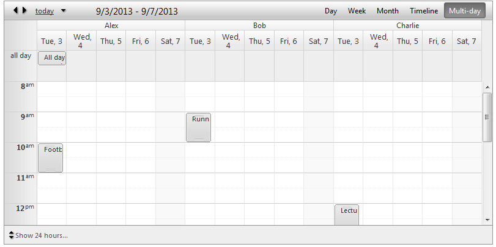
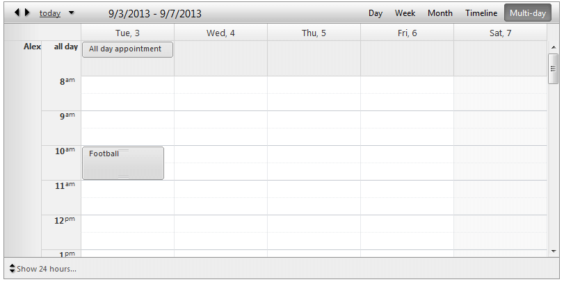
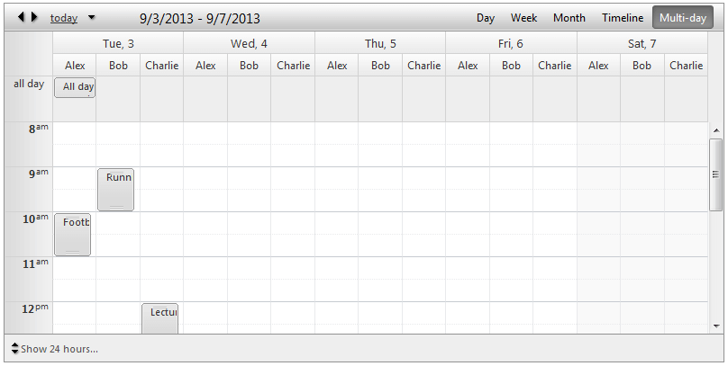

# Multi-Day View

The **Multi-Day View** allows you to display a variable number days controlled by the property **NumberOfDays**.

## Multi-Day View Settings:

* **DayStartTime** - Sets the day start time of the current view.

* **DayEndTime** - Sets the day end time of the current view.

* **WorkDayStartTime** - Sets the day start time of the business hours.

* **WorkDayEndTime** - Sets the day end time of the business hours.

* **ShowAllDayRow** - Shows/hides the **all day** row for all day appointments on the top of the calendar area.

* **EnableExactTimeRendering** - When it is enabled the appointment does not occupy the entire time slot if its start/end time does not match the time slot start/end time. The default value is **false** so the advanced edit form is the only way to determine what is exact appointment start/end time.

* **ShowAllDayInsertArea** - When enabled it keeps an extra space in the **all day** row where user to double click and have the ability to add an appointment.

* **ShowHiddenAppointmentsIndicator** - Indicates whether there is an appointment in current non-visible area. Clicking on that indicator will navigate to that area in order to show the appointment.

* **ShowInsertArea** - When enabled it keeps an extra space in each row where user to double click and have the ability to add an appointment.

* **NumberOfDays** - Indicates number of days to be displayed. For example if you want to show a week you can set it that value to 7.

* **ShowHoursColumn** - Indicates whether to show the hour labels on the left.

## Grouping

Multi-Day View will provide full support for **Resource** and **Date** grouping, namely:

* No groping (Basic look)

* Grouped by Resource (**Horizontal**)

* Grouped by Resource (**Vertical**)

* Grouped by Date, Resource (**Horizontal**)

* Grouped by Date, Resource (**Vertical**)
