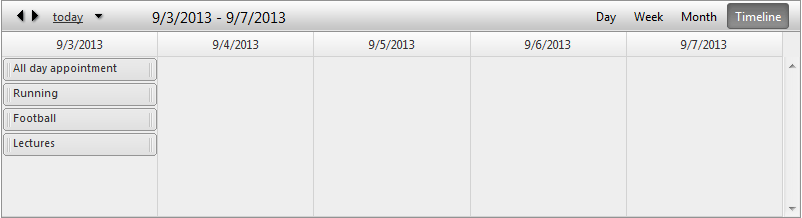

# Timeline View

## Timeline View

The **Timeline View** allows you to display a variable number of slots and define the duration of those slots. You can also group time slots under the same column header using the **Time label span** property.

## Timeline View Settings:

* **Slot duration**- Sets each time slot (vertical column) duration.

* **Time label span**- Indicates how many subsequent time slots are sharing same header.

* **Number Of Slots**- Sets how many time slots are rendered in the calendar area.

* **EnableExactTimeRendering**- When it is enabled the appointment does not occupy the entire time slot if its start/end time does not match the time slot start/end time. The default value is **false** so the advanced edit form is the only way to determine what is exact appointment start/end time.

* **ShowInsertArea**- When enabled it keeps an extra space in each row where user to double click and have the ability to add an appointment.

* **SortingMode**- Specifies the sorting mode to use when rendering the appointments. The value **PerSlot** sorts appointments individually for each slot, but **Global** will sort the appointments as a single list. The default value is **PerSlot**.

## Grouping

**Timeline View** will provide full support for Resource and Date grouping, namely:

* No groping (Basic look)

* Grouped by Resource (**Horizontal**)

* Grouped by Resource (**Vertical**)

* Grouped by Date, Resource (**Horizontal**)

* Grouped by Date, Resource (**Vertical**)
